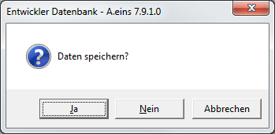
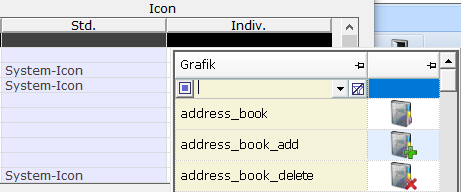
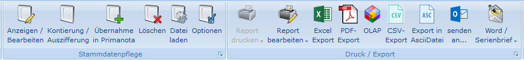

# Generelle Programmbedienung

A.eins vereinigt alle bewährten Bedienmöglichkeiten unter einer gemeinsamen Benutzeroberfläche.

Diese sind:

- Aufruf der Programme mittels klassischer Menütechnik über die Tastatur
- direkter Funktionsaufruf über Tastatureingabe eines Kürzels (Direktsprung)
- Anwahl mittels Maus
- Anwahl über Drop Down bzw. Popup Menü

Darüber hinaus kann die Bedieneroberfläche an die Anforderungen der Betriebe, einzelner Abteilungen oder Mitarbeiter angepasst werden.

Dies kann so weit gehen, dass einige Mitarbeiter nur wenige Programmfunktionen angezeigt bekommen, während andere das komplette Programmangebot nutzen können.

Nachfolgend wird jedoch vom Standardauslieferungsumfang ausgegangen. Es können sich somit im Einzelfall Abweichungen zur vorliegenden Installation ergeben.

## Der A.eins Startbildschirm

Zum Anmelden: Den Kurznamen als auch das Passwort eines Benutzers eingeben (Erstellung eines Logins unter: Bediener Modul).

Zum schnellen Anmelden: Die Tastenkombination: **(Alt + A)** benutzen.

## Der A.eins Grundbildschirm

A.eins unterstützt mehrere [Hauptmenü-Varianten](../zusatzprogramme/menue/index.md)

## Programmstart

Durch ein ausgeklügeltes Schutzsystem wird sichergestellt, dass nur autorisierte Benutzer A.eins bedienen können und welche Funktionen ein Anwender zur Verfügung gestellt bekommt. Im System ist hinterlegt, welche Funktionen einem Anwender mit einem bestimmten Passwort bei einem Mandanten erlaubt sind. Erst die korrekte Eingabe dieser Kombination öffnet die Tür zur Anwendung.

Beim Anwählen des A.eins - Systems muss zuerst die Benutzerkennung - so wie sie im Bedienerstamm angelegt wurde - und anschließend das Passwort eingegeben werden.

## Programmende

Um das Programm zu verlassen muss man alle Funktionen, Auswallisten und andere Dialoge verlassen. Dies geschieht in der Regel mit ESCAPE. Drück man anschließend m Menü von A.eins erneut die ESCAPE-Taste, so öffnet sich eine Dialogmaske mit der Abfrage „Wollen Sie das Programm beenden?“. Bestätigt man dies mit OK, wird A.eins beendet.

## Bedienung über das Favoritenmenü

In Standarddarstellung des Menüs haben wir auf der linken Seite die Hauptauswahlbereiche, an oberster Stelle die Favoriten. Bei Auswahl eines Hauptbereiches werden auf der rechten Seite der Maske die zugehörigen Funktionen gezeigt. Zur Verwaltung der Favoriten dient die F2 Taste. Fahren Sie mit der Maus über die Funktionen der rechten Seite: Mit Auslösungen F2 fügen Sie die Funktion den Favoriten hinzu. Auf dem Favoritenmenü selbst nimmt F2 den Favoritenstatus zurück.

## Direktsprung

Beim Direktsprung handelt es sich um eine einfache und schnelle Möglichkeit ohne die Verwendung der Menüs eine weitere Anwendung zu öffnen. Bei dem Direktsprung handelt es sich um eine Kombination aus bis zu fünf Buchstaben, die einer Funktion/Anwendung zugeordnet ist. z.B. seht die Kombination [LIE] für „Lieferscheine Erfassen“. Gibt man also im Direktsprung-Dialog [LIE] ein, so wird sofort in die Anwendung „Lieferscheine erfassen“ verzweigt. Diese erreicht man ansonsten über das Menü „Warenverkauf“ in dem dann die Funktion „Lieferschein erfassen“ ausgewählt werden kann.

Wie gelangt man in den Direktsprung-Dialog?

Je nachdem, wo man sich im Programm befindet, existieren dafür unterschiedliche Möglichkeiten zu Verfügung. Die erste Möglichkeit über Shift+F4 hat sich als die praktikabelste erwiesen.

Tastenkombination **Umschalttaste+F4**

Kontextmenü und dann Funktion ***Direktsprung*** anwählen

Drück man im Menü sofort **F3** gelang man in den Direktsprung-Dialog und von dort sofort in die F3-Auswahl, in der dann alle Direktsprünge aufgelistet sind.

Im Menü kann man auch direkt durch Eingabe von Zeichen (a-z) in den Direktsprung-Dialog gelangen. Diese Eingabe wird als Vorgabe in den Direktsprung-Dialog übernommen.

In der Praxis hat sich gezeigt, dass bereits nach kurzer Zeit der Arbeit mit A.eins diese Methode überwiegend genutzt wird.

Funktionen im Direktsprung-Dialog

Beim Direktsprung-Dialog handelt es sich um eine Dialog-Maske, die nur ein Eingabefeld enthält.

Dort kann dann der Direktsprung (soweit er bekannt ist) eingegeben werden. Nach Bestätigung mit der Eingabetaste **ENTER** wird dann in die Anwendung weiterverzweigt. Oder man drückt **F3** um in die F3-Auswahl zu gelangen. Dort werden dann alle Direktsprünge aufgelistet. Es existieren dort zwei Varianten. Die erste Variante ist nach dem Direktsprung sortiert und im Eingabefeld wird der Direktsprung abgefragt. Bei der zweiten Variante ist die Bezeichnung das Sortier- und Auswahlkriterium. Hat man die Direktsprünge noch nicht im Kopf, kann man hier dann nach einem Stichwort, dass in der Funktionsbezeichnung vorkommen muss suchen:

Wo findet man die Direktsprung-kürzel

Es gibt verscheiden Möglichkeiten herauszufinden, wie ein Direktsprung zu einer Anwendung in A.eins lautet.

Der erste ist die oben vorgestellte Möglichkeit im Direktsprung-Dialog die F3-Auswahl aufzurufen.

Zusätzlich werden im Menü die Direktsprünge angezeigt, wenn man mit der Maus über die Funktion fährt.

Im Drop Down Menü werden alle Direktsprünge hinter der Funktion angezeigt.

In der Dokumentation der einzelnen Anwendung ist der Direktsprung in eckigen Klammern vermerkt. Beispiel:

## Drop Down Menü 

Die Menüzeile am oberen Bildschirmrand bietet die Möglichkeit, eine Programmfunktion aufzurufen, ohne die bisherige Arbeit abbrechen zu müssen.

So kann z.B. während der Belegerfassung aus dem Auswahlbildschirm heraus durch Anwahl von ***Stammdaten > Artikel*** ein Artikel neu erfasst werden, ohne dass der Auswahlbildschirm Belegerfassung verlassen werden muss.
Auch dieses Menü kann sowohl mit der Maus als auch der Tastatur bedient werden:

Mit der Maus den gewünschten Programmpunkt, z.B. ***Stammdaten*** anklicken, es öffnet sich ein Untermenü, das entsprechend bedient wird

Mit der Taste ***ALT*** auf die Menüzeile umschalten, dort mit ↓↑ und ***Eingabe*** den Programmpunkt anwählen oder

Mit der **ALT**-Taste auf die Menüzeile umschalten und mit **S*** den Punkt ***Stammdaten*** auswählen.

Mit der Maus, bei Markieren eines mit  gekennzeichnetem Feld wird das Untermenü angezeigt. (hier Stammdaten, Firma, Firmenkonstanten Filialstamm FLST)

Mit den Pfeiltasten rauf/runter innerhalb eines Menüs

Und mit rechts/links zu den Untermenüs, wenn ein  davor steht und zum nächsten Menü nur wenn kein  vor dem Menüpunkt steht.

Mit den unterstrichenen Anfangsbuchstaben innerhalb des Menüs, ohne zusätzlich die **Alt**-Taste zu drücken.

## Abbruch einer Funktion, Rückkehr aus einem Menü

Die Taste **ESC** erlaubt es auf Menüebene jederzeit, auf die Ebene zurück zu gelangen, von der diese Funktion aufgerufen wurde.
Auf Funktionsebene, z.B. Stammdatenerfassung, bewirkt **ESC** das Überspringen weiterer Abfragefelder mit der Möglichkeit, die Erfassung anschließend komplett abzubrechen oder die Daten der Standardvorbelegung zu speichern.

## Sicherheitsabfragen

Alle Eingaben in das A.eins-System werden automatisch auf Korrektheit geprüft bzw. es wird abgefragt, ob die Erfassung so korrekt war. Wird eine Anwendung mit ESCAPE verlassen, wird unter anderem geprüft, ob die Daten bereits gespeichert wurden. Ist dies nicht der Fall wird noch abgefragt, ob gespeichert werden soll. Es erscheint dann folgender Dialog:

Bei **Ja** werden die Daten gespeichert und die Anwendung verlassen.

Bei **Nein** wird die Anwendung ohne Speichern verlassen.

Bei **Abbruch** wird in die Erfassung zurückgesprungen, damit ggf. Werte korrigiert werden können.

Es können jedoch auch Abfragen in anderer Form erscheinen. Z.B. werden auch Test vor Auswertungen vorgenommen, ob Daten bereits so in korrekter Form vorliegen. Beispiel:

Bei **OK** wird die Liste gedruckt, bei Abbruch wird der Vorgang beendet.

Diese und ähnliche Abfragen kommen an allen Stellen in A.eins vor. Aus diesen Dialogen herraus sind keine Direktsprünge möglich.

## Fehlermeldungen

Verschiedene Arten der Fehlermeldung können erfolgen. So reagiert das System z.B. bei der Eingabe von Buchstaben in ein Feld, das eindeutig numerisch ist (z.B. das Mengeneingabefeld), mit einem Piepton und verlangt eine korrekte Eingabe.
Bei Eingabe eines technisch korrekten, jedoch inhaltlich falschen Wertes (z.B. eine nicht vorhandene Steuergruppe), werden automatisch die zulässigen Alternativen angezeigt:

## Wichtige Funktionstasten

> [!IMPORTANT]
> In bestimmten Anwendungen (z.B. der Vorgangserfassung) werden, um die Arbeit zu beschleunigen, die Funktionstasten zum Aufruf von Fakturierfunktionen sehr intensiv genutzt. Sie besitzen in diesen Fällen teilweise eine abweichende Bedeutung.

Folgende Funktionstasten werden in A.eins eingesetzt:

Allgemeine Bedienungsfunktionen

 
| Taste | Beschreibung |
| :--- | :--- |
| **ESC** | Abbruch eines Vorganges |
| **ALT** | Umschalten zwischen Bildschirmarbeitsbereich und Menüzeile |
| **F1** | Aufruf der Online-Hilfe |
| **F2** | Mit F2 lässt sich in der Auswahlliste die Bereichsauswahl aktivieren. |
| **F3** | Hier wird eine Liste der Daten, die für das Feld, in dem die Schreibmarke steht, möglich sind aufgerufen. |
| **Eingabe / ENTER** | Bestätigung einer Eingabe und springt in das nächste Feld. |
| **Shift+F4** | Ermöglicht die Direkteingabe eines Direktsprunges. |
| **Shift+F2** | Anzeige und Änderungsmöglichkeit für die dieser Maske zugrunde liegenden Erfassungsparameter (EPA, siehe dort) Positionieren in einer Datei oder einem Zeichensatz |
| **Ende** | Steht man in einem Eingabefeld, wird die Schreibmarke ans Ende des Textes positioniert. |
| **Shift+Ende** | Steht man in einem Eingabefehl, dann wird die Schreibmarke ans Ende des Textes positioniert und der Text markiert. |
| **Strg+Ende** | 
In der Auswahlliste wird in die letzte Zeile gesprungen.

In einem Stammdatenpfleger wird der letzte markierte Datensatz aufgerufen.
 |
| **Pos1** | Setzt die Schreibmarke an die erste Stelle des Eingabefeldes |
| **Shift+Pos1** | Steht man in einem Eingabefeld, wird die Schreibemarke an den Anfang positioniert und alle Zeichen ab der letzten Position der Schreibmarke werden markiert. |
| **Strg+Pos1** | 
In der Auswahlliste wird in die erste Zeile gesprungen.

In einem Stammdatenpfleger wird der erste markierte Datensatz aufgerufen.
 |
| **TAB** | Vorwärts bewegen in einer Tabelle, z.B. den Feldern des Kundenstamms |
| **Shift+TAB** | Rückwärts bewegen in einer Tabelle, z.B. den Feldern des Kundenstamms |
| **Strg+TAB** | Wenn auf einer Maske ein Register vorhanden ist, wird mit Strg+TAB von einer Registerkarte zur nächsten geblättert. |
| **Shift+ Strg+TAB** | Wenn auf einer Maske ein Register vorhanden ist, wird mit Shift+Strg+TAB von einer Registerkarte zur vorherigen geblättert. |
| **Strg+→** | Wenn man sich in einem Stammdatenpfleger befindet, so kann man mit Strg + Pfeiltaste Abwärts in den in der Auswahlliste markierten Daten vorwärts blättern. |
| **Strg+←** | Wenn man sich in einem Stammdatenpfleger befindet, so kann man mit Strg + Pfeiltaste Aufwärts in den in der Auswahlliste markierten Daten rückwärts blättern. |
| **Strg+A** | In der Auswahlliste werden alle Datensätze markiert oder entmarkiert. |
| **Strg+E** | Wenn die Schreibmarke in einer Datentabelle steht, dann können die Daten schnell mit Strg+E so wie sie in A.eins zu sehen sind, nach Excel bzw. dem mit CSV-Dateien verbundenem Programm übertragen werden. Diese Funktion muss erst im Schutzsystem freigeschaltet werden. Die Funktion lautet „GRIDDATATOCSV“. |
| **Shift+Strg+Einfg** | Zeilenbedienung in Datentabellen: fügt eine neue leere Zeile in einer Datentabelle ein |
| **Shift+Strg+Entf** | Zeilenbedienung in Datentabellen: löscht die aktuelle Zeile (in welcher der Cursor steht) in einer Datentabelle |

## F3-Auswahl 

Bei der F3-Auswahl handelt es sich um einen Bildschirm, in dem die Daten, die für die Eingabe zur Verfügung stehen aufgelistet werden. Man erkennt Felder, in denen eine F3-Auswahl bereitgestellt wird, daran, dass in der Statuszeile der Text „Eine Auswahl kann mit der Taste F3 abgerufen werden“ eingeblendet wird. In der F2-Bereichsauswahl sind diese Felder zusätzlich mit einem Button  versehen.

Der Einsatzbereich erstreckt sich über alle Bereiche in A.eins. Das hat den mit dem Vorteil, dass auch die Bedienung immer gleich ist. Der Bildschirm besteht aus einem **Anzeigebereich**, in dem die zur Verfügung stehenden Daten angezeigt werden. Die möglichen Suchvarianten erreicht man über die rechte Maustaste. Diese könne auch privatisiert werden. Man kann zwischen den Varianten entweder mit der Maus wechseln oder über die Tastatur. Dazu gibt man die Nummer ein, die vor der Variante steht, gefolgt von einem Punkt. Will man also zur zweiten Variante wechseln, so gibt man „2.“ ein. Es werden dann nach Bestätigung mit der Eingabetaste alle Daten in der angegebenen Reihenfolge aufgelistet.

Die Liste aller Funktionen, die hier aufgerufen werden können, erreicht man über die rechte Maustaste. Dort sind sie im Untermenü **Funktionen** zu finden. Sämtliche Funktionen können über das Schutzsystem einzelnen Benutzergruppen zugeordnet werden.

Wenn sich die F3-Auswahl öffnet, ist die erste Spalte leicht eingefärbt. Die Farbe lässt sich im Bedienerstamm einstellen.

Man kann die Spalte mit der TAB-Taste (Shift-Tab springt in die andere Richtung) oder mit der Maus wechseln. In der so markierten Spalte kann direkt gesucht werden. Die eingegebenen Werte erscheinen in der Statusleiste unten links. Dabei steht vor der Eingabe der Name der Spalte, in der gerade gesucht wird. Bei der Suche wird unterschieden, ob es sich um Texte, Zahlen oder um Datumsfelder handelt. Bei Texten werden immer alle Daten ausgewählt, die den eingegebenen Text enthalten. Bei Zahlen und Datum werden immer die Daten ausgegeben, die größer oder gleich dem eingegebenen Wert sind. Dies kann aber geändert werden. Um die Art zu bestimmen, wie bei Zahlen und Datum gesucht werden soll stehen folgende Tasten zur Verfügung:

| Symbol | Bedeutung |
| :--- | :--- |
| > | größer oder gleich |
| < | kleiner oder gleich |
| = | gleich |
| ! | ungleich |

Die Ausgewählte Suchoption wird hinter der Bezeichnung der Spalte in der Statuszeile angezeigt.

Man kann auch in mehreren Spalten gleichzeitig suchen. Dazu gibt man einfach in der ersten Spalte den Wert ein und wechselt zur nächsten Spalte und gibt dort den nächsten Wert ein. Alle Suchkriterien stehen in der Statuszeile. Man kann diese mit der Taste „ENTF“ alle auf einmal zurücksetzen.

## Die Auswahlliste

Die [Auswahlliste](../zusatzprogramme/auswahlliste20/index.md) wurde auf eine neue Oberfläche umgestellt.

## Einrichterparameter (Pfleger)

In allen Funktionsmenüs steht die Funktion Einrichterparameter zur Verfügung. Auf dieser sind drei Registerkarten zur Einrichtung der jeweils aktuellen Maske.

Parameter

Auf dieser Registerkarte werden alle Parameter der aktuellen Maske angezeigt. Änderungen werden nur für die angezeigte Bedienerklasse übernommen. Eine Übersicht alle Masken kann auf der Seite Einrichterparameter gefunden werden. Dort werden auch die Parameter der jeweiligen Maske beschrieben.

Bedienerklassenzuordnung

Auf dieser Registerkarte können die Parameter für andere Bedienerklassen übernommen werden. Um die Parameter für eine Bedienerklasse zu übernehmen, muss in der jeweiligen Zeile die Spalte „Übernehmen“ den Wert „Ja“ erhalten.

Um die Parameter für alle Bedienerklassen zu übernehmen, kann man die Funktion „Alle Bedienerklassen markieren“ aus der Optionbox auswählen. Damit wird für jede Bedienerklasse der Wert auf „Ja“ gestellt.

Nachdem die Auswahl für die entsprechenden Bedienerklassen auf „Ja“ gestellt wurde, können die Parameter mit der Funktion „Für Bedienerklasse übernehmen“ endgültig übernommen werden.

| Felder | Beschreibung |
| :--- | :--- |
| Übernehmen | Legt fest ob die Parameter für die Bedienerklasse übernommen werden sollen. |
| Bedienerklasse | Zeigt die Nummer der Bedienerklasse an. |
| Bezeichnung | Zeigt die Bezeichnung der Bedienerklasse an. |
| Benutzer | Zeigt eine Liste der Benutzer der Bedienerklasse an. (Liste ist auf 255 Zeichen gekürzt) |

Maskenfelder

Zuweilen sind Begriffe in A.eins je nach Arbeitsbereich oder Einsatzort der Firma abweichend zu benennen. Hier können Bezeichnungen von Feldern individualisiert werden.

In der Spalte „Standard Feldbezeichnung“ wird der Originaltext angezeigt, in der Spalte „Eigene Feldbezeichnung“ kann eine individuelle Bezeichnung angegeben werden. Diese ist dann Systemweit, also für alle Anwender gültig.

Dynamisch generierte Felder wie UFLD-Felder oder AIS-Felder können hier nicht abgeändert werden. Diese erscheinen mit dem Text „nicht änderbar“ in der Spalte „Eigene Feldbezeichnung“.

## Dieses Menü

In allen Funktionsmenüs findet man diese Standardfunktion als letzten Eintrag.

Die Funktionalitäten dieser Anwendung ergeben sich aus einer spezialisierten Anwendung des Rollenkontextes. Weitere Informationen unter [Rollenkontext/Dieses Menü.](../firmenstamm/firmenkonstanten/fkt_zu_bdkl/rollenkontext/dieses_menue.md)

### Private Sortierung / Tasten

Jedes Funktionsmenü > Dieses Menü > Private Sortierung/Tasten

Es öffnet sich ein Dialog, in dem die in blau hinterlegten Feldern die Standardeinstellungen von A.eins angezeigt werden. Zusätzlich gibt es Spalten, in denen man die Gestaltung der Funktionsmenüs teilweise individuell anpassen kann. Damit die Änderungen wirksam werden, ist nach dem Speichern die entsprechende Auswahlliste oder Maske neu aufzurufen.

| Felder | Beschreibung |
| :--- | :--- |
| Sortierung | Die Sortierung wird mit Hilfe einer aufsteigenden Zahl festgelegt. Ändert man die Sortierung wird diese sofort im unteren Bereich dargestellt. |
| Funktionstaste | Die zulässigen Funktionstasten können mittels der F3-Auswahl ausgewählt werden. Wird eine Funktionstaste, die bereits in diesem Menü verwendet wurde, vergeben, so überschreibt die private Funktionstaste die Standardfunktionstaste. |
| Doppelklick (nur für die Auswahlliste) | In Auswahllisten kann man eine Zeile mit Doppelklick anwählen. Welche Funktion dann ausgelöst wird, kann hier eingestellt werden. Dabei wird eine Zahl angegeben, die die Priorität der Funktionen festlegt. Steht die Funktion, bei der eine 1 hinterlegt wurde z.B. wegen Rechtevergabe nicht zur Verfügung, wird bei Doppelklick auf die Zeile die Funktion mit der 2 ausgeführt usw. Wenn man also die Funktion ***Ändern*** **F5** mit einer 1 versehen hat und ***Ansehen*** **F6** mit einer 2, so haben automatisch alle Anwender, die zwar Daten nicht ändern dürfen, aber sich die Daten Anzeigen lassen können, die Funktion ***Ansehen*** auf der Doppelklickfunktionalität. |
| Untermenü | Alle Funktionsmenüs können auch über die rechte Maustaste aufgerufen werden. Diese „rechte Maustastenmenüs“ können Untermenüs haben. In der Auswahlliste sind z.B. alle ***Standardfunktionen*** in einem Untermenü Standardfunktionen zusammengefasst. Diese Untermenüs kann man selbst festlegen. In der Spalte mit der Überschrift „Indiv.“ trägt man dann die Bezeichnung, die im Menü erscheinen soll, ein. Menüeinträge mit derselben Bezeichnung werden automatisch in einem Untermenü zusammengefasst. Lässt man die Bezeichnung leer (mit Pünktchen dargestellt), so wird die Vorbelegung von A.eins verwendet. Um diese Vorbelegung zu entfernen, also um eine Funktion aus dem Untermenü ins Menü zu verschieben muss man ein „X“ eintragen |
| Icon | 
Voraussetzung: Es wird die 64-Bit Version von A.eins benötigt.

Hier können die Icons von Funktionen auf der Auswahlliste 2.0 oder auf Masken mit einem Menü-Band geändert werden. Dazu wird in der Spalte „Indiv.“ unter der Überschrift „Icon“ die gewünschte Grafik ausgewählt. Mithilfe der F3-Taste erhält man hier einen Überblick über alle verfügbaren Icons. Neben der Bezeichnung wird hier auch die dazugehörige Grafik angezeigt:

Verfügt eine Funktion standardmäßig über ein Icon, so ist in der Spalte „Std.“ der Name des Icons oder „System-Icon“ eingetragen. Diese Icons lassen sich für einfache Buttons ersetzen oder entfernen. Wird in der Spalte „Indiv.“ ein Icon ausgewählt, so wird das Standard-Icon mit dem ausgewählten Icon im Menü-Band ersetzt. Wird „_no_icon“ ausgewählt, so wird die Funktion aus dem Menüband entfernt und stattdessen dem „ausklappbaren“ Menü zugewiesen. Bei Menüs wie z.B. „Report drucken“, „Report bearbeiten“ oder „Word Serienbrief“ hat „_no_icon“ keine Auswirkung.

Hat eine Funktion standardmäßig kein Icon, so ist die Spalte „Std.“ zu der Funktion leer. Wird in der Spalte „Indiv.“ ein Icon eingetragen, so wird die Funktion mit der entsprechenden Grafik dem Menü-Band hinzugefügt. Dabei wird die Funktion aus dem „ausklappbaren“ Menü entfernt.

Um die Standardeinstellungen wiederherzustellen, ist der Eintrag aus dem Feld „Indiv.“ zu entfernen.

Beispiel:

In diesem Beispiel soll die Funktion ***Kontoauszug*** in der Anwendung **[ECL]** dem Menü-Band hinzugefügt werden.

Um die Funktion dem Menü-Band hinzuzufügen, wird die Funktion ***Dieses Menü*** aufgerufen. In der Auswahlliste wird das entsprechende Funktionsmenü ausgewählt und die Funktion ***Private Sortierung/Tasten*** aufgerufen. In dem Feld „Indiv.“ unter dem Punkt „Icon“ wird in der Zeile mit der Funktion Kontoauszug die Grafik „printer“ ausgewählt.

Die Anwendung **[ECL]** wird neugestartet. Die Funktion ***Kontoauszug*** erscheint jetzt im Menü-Band.
 |

## Hinweise zum Hilfesystem

A.eins öffnet bei Betätigen der F1-Taste die Aeins-Hilfe.

Das A.eins-Arbeitstationssetup richtet standardmäßig das Szenario „Standard“ ein.

| Mögliche Szenarien |    |
| :--- | :--- |
| Bin-Verzeichnis | A.eins sucht im Bin-Verzeichnis nach der Datei aeins.chm und öffnet diese zur Ansicht. |
| Standard | 
Wird in dem durch Windows vorgesehenen Ordner für „CommonProgramFiles“ (\*) und dort im Ordner Aeins eine Datei *aeins.chm* gefunden, so präferiert A.eins diese.

(\*) der Ordner kann von Rechner zu Rechner anders lauten; ist abhängig vom Betriebssystem und etwaigen Updates der Systeme.

Weitere Programmunterstützung bzw. Hinweise sind unter Besondere Systemordner verfügbar.
 |
| Online | 
Durch den Steuerparameter 921 („Onlinehilfe“) kann konfiguriert werden das die A.eins-Onlinehilfe unter [www.amic.de/hilfe](https://www.amic.de/hilfe) verwendet wird.

Die Szenarien „Standard“ und „Lokal“ sind nicht aktiv, wenn die Online-Hilfe aktiviert ist.
 |
 