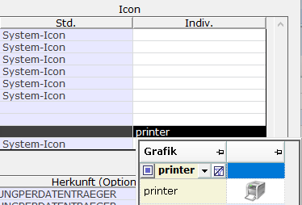
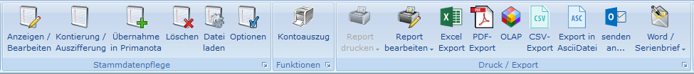
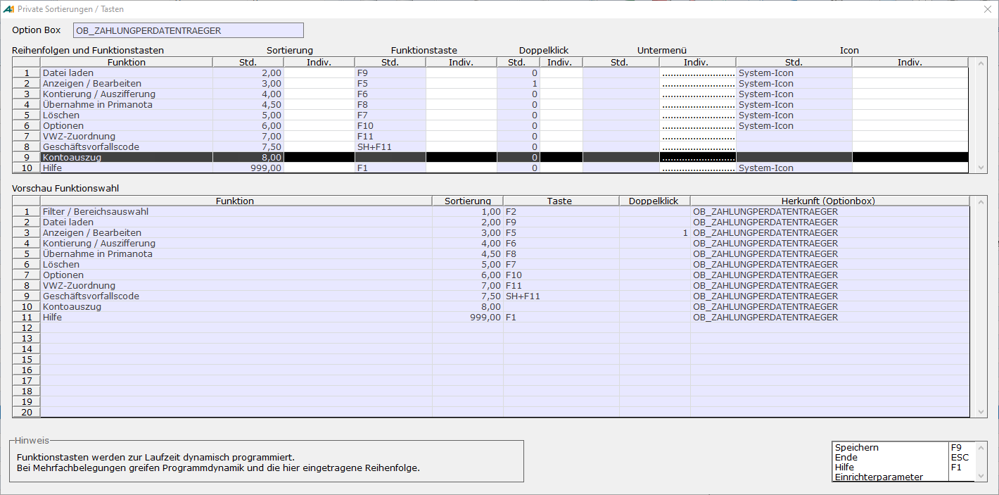

# Private Sortierung/Tasten

<!-- source: https://amic.de/hilfe/_privsorttast.htm -->

Jedes Funktionsmenü > Dieses Menü > Private Sortierung/Tasten

Es öffnet sich ein Dialog, in dem die in blau hinterlegten Feldern die Standardeinstellungen von A.eins angezeigt werden. Zusätzlich gibt es Spalten, in denen man die Gestaltung der Funktionsmenüs teilweise individuell anpassen kann. Damit die Änderungen wirksam werden, ist nach dem Speichern die entsprechende Auswahlliste oder Maske neu aufzurufen.

| Felder | Beschreibung |
| --- | --- |
| Sortierung  
 | Die Sortierung wird mit Hilfe einer aufsteigenden Zahl festgelegt. Ändert man die Sortierung wird diese sofort im unteren Bereich dargestellt.  
 |
| Funktionstaste  
 | Die zulässigen Funktionstasten können mittels der F3-Auswahl ausgewählt werden. Wird eine Funktionstaste, die bereits in diesem Menü verwendet wurde, vergeben, so überschreibt die private Funktionstaste die Standardfunktionstaste.  
 |
| Doppelklick (nur für die Auswahlliste)  
 | In Auswahllisten kann man eine Zeile mit Doppelklick anwählen. Welche Funktion dann ausgelöst wird, kann hier eingestellt werden. Dabei wird eine Zahl angegeben, die die Priorität der Funktionen festlegt. Steht die Funktion, bei der eine 1 hinterlegt wurde z.B. wegen Rechtevergabe nicht zur Verfügung, wird bei Doppelklick auf die Zeile die Funktion mit der 2 ausgeführt usw. Wenn man also die Funktion Ändern F5 mit einer 1 versehen hat und Ansehen F6 mit einer 2, so haben automatisch alle Anwender, die zwar Daten nicht ändern dürfen, aber sich die Daten Anzeigen lassen können, die Funktion Ansehen auf der Doppelklickfunktionalität.  
 |
| Untermenü  
 | Alle Funktionsmenüs können auch über die rechte Maustaste aufgerufen werden. Diese „rechte Maustastenmenüs“ können Untermenüs haben. In der Auswahlliste sind z.B. alle Standardfunktionen in einem Untermenü Standardfunktionen zusammengefasst. Diese Untermenüs kann man selbst festlegen. In der Spalte mit der Überschrift „Indiv.“ trägt man dann die Bezeichnung, die im Menü erscheinen soll, ein. Menüeinträge mit derselben Bezeichnung werden automatisch in einem Untermenü zusammengefasst. Lässt man die Bezeichnung leer (mit Pünktchen dargestellt), so wird die Vorbelegung von A.eins verwendet. Um diese Vorbelegung zu entfernen, also um eine Funktion aus dem Untermenü ins Menü zu verschieben muss man ein „X“ eintragen  
 |
| Icon | **Voraussetzung: Es wird die 64-Bit Version von A.eins benötigt.**  
   
Hier können die Icons von Funktionen auf der Auswahlliste 2.0 oder auf Masken mit einem Menü-Band geändert werden. Dazu wird in der Spalte „Indiv.“ unter der Überschrift „Icon“ die gewünschte Grafik ausgewählt. Mithilfe der F3\-Taste erhält man hier einen Überblick über alle verfügbaren Icons. Neben der Bezeichnung wird hier auch die dazugehörige Grafik angezeigt:  
  
   
Verfügt eine Funktion standardmäßig über ein Icon, so ist in der Spalte „Std.“ der Name des Icons oder „System-Icon“ eingetragen. Diese Icons lassen sich für einfache Buttons ersetzen oder entfernen. Wird in der Spalte „Indiv.“ ein Icon ausgewählt, so wird das Standard-Icon mit dem ausgewählten Icon im Menü-Band ersetzt. Wird „_no_icon“ ausgewählt, so wird die Funktion aus dem Menüband entfernt und stattdessen dem „ausklappbaren“ Menü zugewiesen. Bei Menüs wie z.B. „Report drucken“, „Report bearbeiten“ oder „Word Serienbrief“ hat „_no_icon“ keine Auswirkung.  
Hat eine Funktion standardmäßig kein Icon, so ist die Spalte „Std.“ zu der Funktion leer. Wird in der Spalte „Indiv.“ ein Icon eingetragen, so wird die Funktion mit der entsprechenden Grafik dem Menü-Band hinzugefügt. Dabei wird die Funktion aus dem „ausklappbaren“ Menü entfernt.  
Um die Standardeinstellungen wiederherzustellen, ist der Eintrag aus dem Feld „Indiv.“ zu entfernen.  
   
**Beispiel:**  
In diesem Beispiel soll die Funktion Kontoauszug in der Anwendung **[ECL]** dem Menü-Band hinzugefügt werden.  
  
   
Um die Funktion dem Menü-Band hinzuzufügen, wird die Funktion Dieses Menü aufgerufen. In der Auswahlliste wird das entsprechende Funktionsmenü ausgewählt und die Funktion Private Sortierung/Tasten aufgerufen. In dem Feld „Indiv.“ unter dem Punkt „Icon“ wird in der Zeile mit der Funktion Kontoauszug die Grafik „printer“ ausgewählt.  
  
   
Die Anwendung [ECL] wird neugestartet. Die Funktion Kontoauszug erscheint jetzt im Menü-Band.  
  
 |

