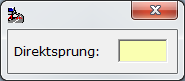
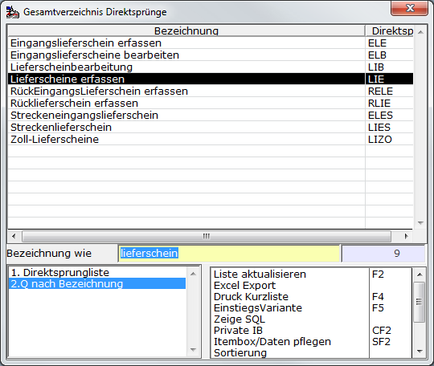
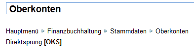

# Direktsprung

<!-- source: https://amic.de/hilfe/_direktsprung1.htm -->

Beim Direktsprung handelt es sich um eine einfache und schnelle Möglichkeit ohne die Verwendung der Menüs eine weitere Anwendung zu öffnen. Bei dem Direktsprung handelt es sich um eine Kombination aus bis zu fünf Buchstaben, die einer Funktion/Anwendung zugeordnet ist. z.B. seht die Kombination [LIE] für „Lieferscheine Erfassen“. Gibt man also im Direktsprung-Dialog [LIE] ein, so wird sofort in die Anwendung „Lieferscheine erfassen“ verzweigt. Diese erreicht man ansonsten über das Menü „Warenverkauf“ in dem dann die Funktion „Lieferschein erfassen“ ausgewählt werden kann.

Wie gelangt man in den Direktsprung-Dialog?

Je nachdem, wo man sich im Programm befindet, existieren dafür unterschiedliche Möglichkeiten zu Verfügung. Die erste Möglichkeit über Shift+F4 hat sich als die praktikabelste erwiesen.  
    

Tastenkombination Umschalttaste+F4

Kontextmenü und dann Funktion Direktsprung anwählen

Drück man im Menü sofort F3 gelang man in den Direktsprung-Dialog und von dort sofort in die [F3-Auswahl](./f3_auswahl.md), in der dann alle Direktsprünge aufgelistet sind.

Im Menü kann man auch direkt durch Eingabe von Zeichen (a-z) in den Direktsprung-Dialog gelangen. Diese Eingabe wird als Vorgabe in den Direktsprung-Dialog übernommen.  
    

In der Praxis hat sich gezeigt, dass bereits nach kurzer Zeit der Arbeit mit A.eins diese Methode überwiegend genutzt wird.

Funktionen im Direktsprung-Dialog

Beim Direktsprung-Dialog handelt es sich um eine Dialog-Maske, die nur ein Eingabefeld enthält.

  
    

Dort kann dann der Direktsprung (soweit er bekannt ist) eingegeben werden. Nach Bestätigung mit der Eingabetaste ENTER wird dann in die Anwendung weiterverzweigt. Oder man drückt F3 um in die [F3-Auswahl](./f3_auswahl.md) zu gelangen. Dort werden dann alle Direktsprünge aufgelistet. Es existieren dort zwei Varianten. Die erste Variante ist nach dem Direktsprung sortiert und im Eingabefeld wird der Direktsprung abgefragt. Bei der zweiten Variante ist die Bezeichnung das Sortier- und Auswahlkriterium. Hat man die Direktsprünge noch nicht im Kopf, kann man hier dann nach einem Stichwort, dass in der Funktionsbezeichnung vorkommen muss suchen:  
    

Wo findet man die Direktsprung-kürzel

Es gibt verscheiden Möglichkeiten herauszufinden, wie ein Direktsprung zu einer Anwendung in A.eins lautet.

Der erste ist die oben vorgestellte Möglichkeit im Direktsprung-Dialog die F3-Auswahl aufzurufen.

Zusätzlich werden im Menü die Direktsprünge angezeigt, wenn man mit der Maus über die Funktion fährt.

Im [Drop Down Menü](./drop_down_menue.md) werden alle Direktsprünge hinter der Funktion angezeigt.

In der Dokumentation der einzelnen Anwendung ist der Direktsprung in eckigen Klammern vermerkt. Beispiel:  

