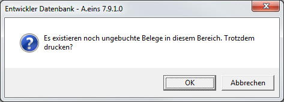

# Sicherheitsabfragen

<!-- source: https://amic.de/hilfe/_sicherheitsabfragenu.htm -->

Alle Eingaben in das A.eins-System werden automatisch auf Korrektheit geprüft bzw. es wird abgefragt, ob die Erfassung so korrekt war. Wird eine Anwendung mit ESCAPE verlassen, wird unter anderem geprüft, ob die Daten bereits gespeichert wurden. Ist dies nicht der Fall wird noch abgefragt, ob gespeichert werden soll. Es erscheint dann folgender Dialog:

Bei **Ja** werden die Daten gespeichert und die Anwendung verlassen.

Bei **Nein** wird die Anwendung ohne Speichern verlassen.

Bei **Abbruch** wird in die Erfassung zurückgesprungen**,** damit ggf. Werte korrigiert werden können.

Es können jedoch auch Abfragen in anderer Form erscheinen. Z.B. werden auch Test vor Auswertungen vorgenommen, ob Daten bereits so in korrekter Form vorliegen. Beispiel:

Bei **OK** wird die Liste gedruckt, bei **Abbruch** wird der Vorgang beendet.

Diese und ähnliche Abfragen kommen an allen Stellen in A.eins vor. Aus diesen Dialogen herraus sind keine Direktsprünge möglich.
