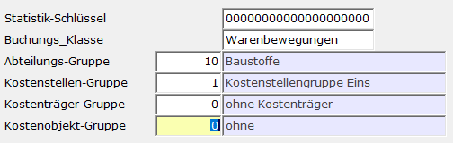
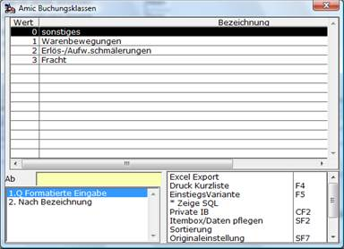

# Kostenstellen / Statistik / Abteilung

<!-- source: https://amic.de/hilfe/_kostenstellenstatist.htm -->

Dem Artikel kann hier ein Statistik-Schlüssel, die Buchungsklasse, eine Abteilungsgruppe sowie eine Kostenstellen-Gruppe, Kostenträger-Gruppe und Kostenobjekt-Gruppe zugeordnet werden.

Der Statistik-Schlüssel dient Auswertungszwecken. Z.Z. existiert keine Standard­aus­wertung, so dass ggf. eine private Variante zu gestalten ist.

In Zusammenhang mit den Erlöskennziffern (die dem Artikel zugeordnet wurde) bewirkt die Buchungsklasse bei der Erlöskennziffernzuordnung [EKZZ] folgende Variations­mög­lichkeiten: Bei gleicher Erlöskennziffer werden die Erlöse in Abhängigkeit der Buchungsklasse unterschiedlichen Erlöskonten zugeordnet.

Bei Eintragung einer Abteilungsnummer wird dieser Artikel nur dieser zugeordnet. Vor Einrichtung solcher Varianten muss wegen der Komplexität mit dem System­betreuer Rücksprache gehalten werden.

Die Kostenstellen-Gruppe enthält je eine Kostenstellennummer für den Einkauf und eine für den Verkauf und steht hier nur bei vorhandener Kostenstellen-Lizenz als pflegbares Feld zur Verfügung.

Die Kostenträger-Gruppe enthält je eine Kostenträgernummer für den Einkauf und eine für den Verkauf und steht hier nur bei eingeschaltetem Steuerparameter **Kostenträgerrechnung angeschlossen** als pflegbares Feld zur Verfügung.

Die Kostenobjekt-Gruppe enthält je eine Kostenobjektnummer für den Einkauf und eine für den Verkauf und steht hier nur bei vorhandener Kostenobjekt-Lizenz als pflegbares Feld zur Verfügung.
