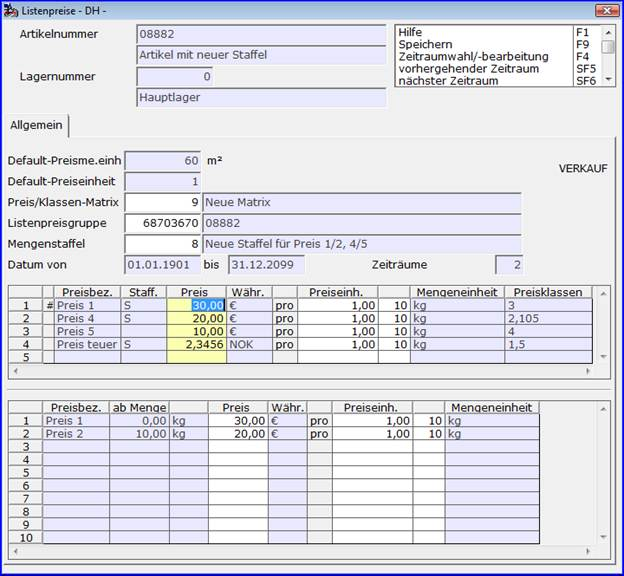

# Listenpreise Verkauf und Einkauf

<!-- source: https://amic.de/hilfe/_listenpreiseverkaufu.htm -->

Listenpreise stellen in vielen Fällen das zentrale Preisfindungssystem dar. Es beruht darauf, dass von Kunden (-klassen) unterschiedlich kalkulierte Preise au­to­­­matisch vom Programm gezogen werden. Dies ist auch in A.eins realisiert: Pro Arti­kel können im Prinzip beliebig viele Preise vergeben und Kunden zugeordnet wer­den. Grundlage des Verfahrens ist die Einrichtung einer oder mehrerer Preis­ma­trizen, die Zuordnung von Listenpreisklassen zu Kunden und die Eingabe von Listen­preisen beim Artikel. Auf die Einrichtung von Preismatrizen und ihrer Bedeutung wird im Rahmen der Preispflege eingegangen. Nachfolgend wird unterstellt, dass sie vor­handen ist und die Preise gepflegt werden sollen.

Sowohl in der Preisübersicht der Artikelmaske als auch im Preispflegemodul ist es möglich, mittels einer Datenbankprozedur die Sichtbarkeit und Pflegbarkeit von vorhandenen Preisen zu bestimmten Preislistennummern (Listenpreisbezeichnungen) für ausgewählte Bediener zu erlauben oder zu verbieten. Der Name der Datenbankprozedur wird dazu in der globalen Option ‚Listenpreispflegefilterprozedur‘ ohne Parameterangaben festgelegt. Die verwendeten Datenbankprozeduren müssen ein RESULT mit einem Attribut zurückliefern, dass praktischerweise vom Typ ‚integer‘ oder ‚smallint‘ sein sollte und den Wert 0 (Preis NICHT sichtbar/pflegbar) oder 1 (Preis sichtbar/pflegbar) enthält. Der Name des Ergebnisfeldes ist beliebig wählbar.

Die Parameter der DB-Prozedur werden mittels festgelegter Parameternamen bestimmt. Diese sind mit DEFAULT-Werten in der Parameterliste zu versehen. Aus der Liste der möglichen Parameter müssen nur die tatsächlich benötigten deklariert werden.

Die Parameter, die zur Laufzeit versorgt werden sind:

| Parameter | Typ | Beschreibung |
| --- | --- | --- |
| PAR_BEDIENERID | INTEGER | Dieser Parameter übergibt die ID des A.eins-Bedieners. |
| PAR_BEDIENERKLASSE | INTEGER | Dieser Parameter übergibt die Bedienerklasse des A.eins-Bedieners. |
| PAR_ARTIKELID | INTEGER | Dieser Parameter übergibt die Artikel ID des zugrundeliegenden Artikels. |
| PAR_EKVK | SMALLINT | Dieser Parameter übergibt den Wert ‚1‘ für Einkaufspreispflege bzw. den Wert ‚2‘ für Verkaufspreispflege. |
| PAR_PREISGRUPPE | INTEGER | Dieser Parameter übergibt die Listenpreisgruppe (Ein- bzw. Verkauf) des zugrundeliegenden Artikels. |
| PAR_MATRIXNUMMER | INTEGER | Dieser Parameter übergibt die Preismatrixnummer (Ein- bzw. Verkauf) des zugrundeliegenden Artikels. |
| PAR_PREISNUMMER | INTEGER | Dieser Parameter übergibt die Preislistennummer des zugrundeliegenden Artikels. |

Beispiel einer privaten Datenbankprozedur, die für Bediener, die der Bedienerklasse 15 oder 20 angehören, die Sicht- und Pflegbarkeit der Preise mit den Preislistennummern 21 und 22 im Verkauf unterbinden ( Voraussetzung ist der Eintrag ‚p_listenpreisfilter‘ in der globalen Option ‚ Listenpreispflegefilterprozedur‘ ) :

```sql
CREATE procedure
p_listenpreisfilter (
 in PAR_BEDIENERKLASSE integer DEFAULT -1,
 in PAR_EKVK integer DEFAULT -1,
 in PAR_PREISNUMMER integer DEFAULT -1
)
RESULT ("ergval" integer)
BEGIN
 declare erlaubt integer;
 set erlaubt = 1;
 if ( PAR_EKVK = 2 )
 then
 if ( PAR_BEDIENERKLASSE = 15 or
PAR_BEDIENERKLASSE = 20 )
 then
 if ( PAR_PREISNUMMER = 21 or PAR_PREISNUMMER = 22
)
 then
 set erlaubt = 0;
 end if;
 end if;
 end if;
 if ( erlaubt = 0 )
 then
 select 0 from dummy;
 else
 select 1 from dummy;
 end if;
END;
```

Die Bedienung des Preispflegemoduls ist für Ein- und Ver­kauf identisch.

Bei Aufruf des Punktes Listenpreise Verkauf erscheint folgende Maske:



Folgende Werte müssen dazu eingegeben werden:

<p class="just-emphasize">Preis/Klassen-Matrix</p>

Diese Matrix dient dazu, bestimmte Preise verschiedenen Kunden-Preisklassen zuzuordnen.

Bei einem Doppelklick auf die Nummer oder die Bezeichnung kann die ausgewählte Matrix bearbeitet werden.

<p class="just-emphasize">Listenpreisgruppe</p>

Verschiedene Artikel mit derselben Preis/Klassen-Matrix sollen auch verschiedene Preise zugeordnet werden. Um das zu erreichen, können verschiedene Listenpreisgruppen angelegt werden. Andersrum ist es natürlich auch möglich, verschiedene Artikel denselben Preis zuzuordnen, wenn sie dieselbe Listenpreisgruppe haben.

Bei einem Doppelklick auf die Nummer oder die Bezeichnung kann die ausgewählte Listenpreisgruppe bearbeitet werden.

<p class="just-emphasize">Mengenstaffel</p>

Über die Mengenstaffel kann geregelt werden, welche Preise ab einer bestimmten Menge gestaffelt werden. Ist das bei einem Preis der Fall, steht im oberen Grid in der Spalte „Staff.“ ein „S“, im unteren Grid sind die einzelnen Staffel-Preise pflegbar.

Bei einem Doppelklick auf die Nummer oder die Bezeichnung kann die ausgewählte Mengenstaffel bearbeitet werden. Dort werden auch die Mengen angegeben, an denen der Preis gestaffelt wird.

<p class="just-emphasize">Zeiträume</p>

Für eine Preisliste kann es beliebig viele Gültigkeitszeiträume mit unterschiedlichen Preisen geben. So ist es z.B. möglich neue Preise im Voraus einzupflegen und auto­matisch mit dem neuen Gültigkeitszeitraum zu aktivieren. Ein Gültigkeitszeitraum kann auch innerhalb des Gesamtzeitraums eines anderen liegen: Der vergebene Preis ist dann für dieses Intervall aktiv, danach wieder der alte.

<p class="just-emphasize">Spalten</p>

In der Spalte „Preis“ werden die Preise eingetragen, die Preiseinheit gibt an für wie viele Mengeneinheiten (also z.B. pro 1000) der Preis gültig sein soll und unter Mengeneinheit ist die gültige Mengeneinheit geführt.

Außerdem lässt sich bei einem Doppelklick auf eine Reihe in der Spalte „Preisklassen“ eine Maske öffnen, in der Kunden den jeweiligen Preisklassen zugeordnet werden können.

Die Listenpreise Einkauf bieten die gleichen Möglichkeiten. Sie können als Einkaufspreise beim (Haupt-) Lieferanten betrachtet werden. Zusätzlich besteht die Möglichkeit sie für kalkulatorische Zwecke einzusetzen: Bewertung des Einkaufs, der Produktion, etc.. Näheres findet sich in diesen Abschnitten.
