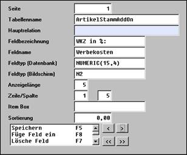
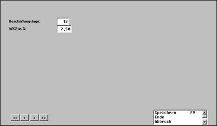
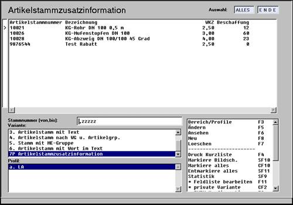

# Artikelstamm in der Relation „Artikelstammaddon“ über Artikelstammid

<!-- source: https://amic.de/hilfe/_artikelstamminderrel.htm -->

Hauptmenü > Administration > Formular / Abläufe > Tabellen/Anwendungserweiterungen

oder Direktsprung **[AO]**

Diese Felder stehen in eigenen Relationen (Artikeladdon, etc.) s.o. und sind über die id verknüpft (s.o.).

Am Beispiel des Artikelstamms wird nachfolgend die Einrichtung eigener Felder behandelt. Das Verfahren kann natürlich auf den Artikel übertragen werden.

<p class="just-emphasize">Erweiterung des Artikelstamms</p>

Der Artikelstamm soll um zwei Felder erweitert werden: Werbekostenzuschuss und Wiederbeschaffungszeit. Im Pfleger für AddOn-Daten (AO) werden die Eintragungen vorgenommen:



Mit **F8** wird die Neuanlage gestartet. Im Feld Tabellenname wird mittels **F3** „Artikelstammaddon“ ausgewählt. Die Feldbezeichnung ist der Darstellungstext während der Feldname den Namen in der Datenbank ergibt. Dieser muss also syntaktisch korrekt sein: keine Sonderzeichen etc.

Der Feldtyp wird wieder mit **F3** ausgesucht, in diesem Fall ein Feld mit zwei Nachkommastellen.

Die Eingabe von Zeile und Spalte wird derzeit noch nicht ausgewertet; die Anzeige erfolgt immer nach der Eingabereihenfolge.

Im Feld Item Box kann eine bestehende Item Box angegeben werden, die bei der Datenerfassung als Grundlage dienen soll (z.B. ib_ku wenn auf die Kunden Bezug genommen werden soll). In diesem Beispiel ist dies jedoch ohne Belang.

Nach Anlage beider Felder steht in der Auswahlliste Artikelstamm nach Anwahl von AddOn folgende Eingabemaske zur Verfügung:



**Auswertungen**

Die hier abgespeicherten Werte können natürlich ausgewertet werden:



**Exkurs: Definition eines Reports**

Grundlage des obigen Reports ist nachfolgendes SQL – Statement, das aus der Standardvariante „nach Nummern“ abgeleitet wurde. Die entscheidenden Zeilen wurden hervorgehoben:

```sql
// Auswahllistenfunktion :
ARTIKELSTAMM
TITLE Artikelstammauswahl
INFO Artikelstammauswahl
MASK AW_MASK
FIELD Artikelstammnummer,ArtiStamNummer,char,15
FIELD Bezeichnung,ArtiStamBezeich,char,40
FIELD
WKZ,Werbekosten,n2,10
⇦
FIELD
Beschaffung,Beschaffung,I4,8
⇦
SQL select ars.ArtiStamNummer,ars.ArtiStamBezeich,
SQL ars.ArtiStammId,ao.werbekosten, ao.beschaffung
SQL from artikelstamm ars, artikelstammaddon
ao    ⇦
SQL where ars.artistammid > 0
SQL and ars.ArtiStamNummer between ':VON[1]' and
SQL ':BIS[1]'
SQL and ars.ArtiStamLoeKennz = 0
SQL and ars.artistammid =
ao.artistammid
⇦
SQL order by ars.ArtiStamNummer
RETURN ars.artistammid
DELPROC DHARTF7,ARTIKELSTAMM,DHDELMSK
IDENT ars.artistammid
IDSQL select *
IDSQL from ars.artikelstamm
IDSQL where ars.artistammid
= :ID1
```

Natürlich kann obiges Beispiel jetzt um Selektionsbereiche etc. erweitert werden.
