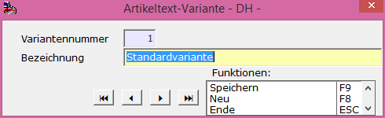

# Artikeltext-Varianten

<!-- source: https://amic.de/hilfe/_artikeltextvariante.htm -->

Hauptmenü > Stammdatenpflege > Konstanten Artikelstamm > Artikel-Text-Varianten

oder Direktsprung [ARTX]

Artikeltexte zu einem Artikelstamm können in mehreren Varianten erfasst werden, so dass zum Beispiel auf einem Ladeschein ein anderer Text zum Artikel als auf einer Rechnung ausgegeben werden kann.

Eine Artikeltext-Variante wird mit einer identifizierenden Variantennummer und einer Bezeichnung erfasst.

Artikeltext-Varianten werden im [Artikel](../artikel/index.md) als Standardtextvariante für diesen angegeben. Daneben können aber für [Vorgangsunterklassen](../../vorgangsabwicklung/formularzuordnung/formular_formularzuordnungen_zum_vorgang_unterklasse.md#ArtTxVariante) zu verwendende abweichende Artikeltext-Varianten bestimmt werden.

Zu beachten ist jedoch der Steuerparameter (SPA) [Artikeltext-Variante des Artikels (231)](../../firmenstamm/steuerparameter/vorgangsbearbeitung_warenposition/artikeltext_variante_des_artikels_spa_231.md) der Steuerparametergruppe „Vorgangsbearbeitung Warenposition“.
