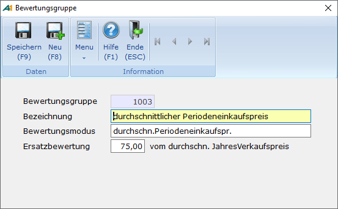
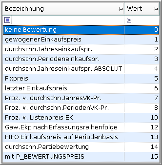

# Bewertungsgruppen

<!-- source: https://amic.de/hilfe/_bewertungsgruppen.htm -->

Hauptmenü > Stammdatenpflege > Konstanten Artikelstamm > Bewertungsgruppen

oder Direktsprung **[BWG]**

Verschiedene Verfahren zur Bestandsbewertung stehen zur Verfügung. Die Bewertungsgruppen dienen nun lediglich dazu, die im Unternehmen eingesetzten Methoden zu aktivieren und ihnen einen „Namen“ zu geben.

Bei der jeweiligen Bewertungsmethode sind jedoch die Prinzipien der kaufmännischen Vorsicht (Imparitätsprinzip) zu beachten.

In der mitgelieferten Basisdatenbank sind folgende Bewertungsgruppen bereits eingetragen:

- gewogener Einkaufspreis
- durchschnittlicher Jahreseinkaufspreis
- durchschnittlicher Periodeneinkaufspreis
- fixer Einkaufspreis
- letzter Einkaufspreis

Verschiedene Verfahren zur Bestandsbewertung stehen zur Verfügung. Und können in folgender Erfassungsmaske bearbeitet werden.

Die gewünschten Verfahren werden vom Anwender durchnummeriert und mit einem Text versehen, und die Bewertungsmethode zugeordnet. Für den Fall, dass das Ergebnis der Bewertungsmethode den Wert 0 ergibt, wird eine Ersatzbewertung mit einem hier festzulegenden Prozentsatz vom durchschnittlichen Jahres-Verkaufspreises durchgeführt, sofern der Prozentsatz nicht 0 und die Bewertungsmethode nicht mit *keine Bewertung* angegeben ist.

Die zur Verfügung stehenden Bewertungsmethoden sind:

**keine Bewertung:**

Der EK wird nicht bewertet

**gewogener Einkaufspreis:**

Er ergibt sich aus (alter Bestand x altem GEK) +(Zugang x EK)}dividiert durch den neuen Bestand

**durchschnittlicher Jahreseinkaufspreis:**

Die gesamten wertmäßigen Einkäufe dividiert durch die Gesamtmenge des laufenden Geschäftsjahres

**Durchschnittlicher Periodeneinkaufpreis:**

wie oben, jedoch bezogen auf einen eingegrenzten Zeitraum

**durchschnittlicher Jahreseinkaufspreis ABSOLUT:**

Berechnung wie beim **durchschnittlichen Jahreseinkaufspreis****, jedoch gehen negative Periodensummen von Einkaufswert und Einkaufsmenge positiv (Absolutwert-Verfahren) in die Berechnungssummen von Gesamteinkaufswert und Gesamteinkaufsmenge zur Durchschnittspreisberechnung ein. Dadurch werden zwar mathematisch korrekte aber semantisch schwer erklärbare (sehr große oder negative)** **Werte vermieden. Somit liefert diese Methode bei Vorliegen von Perioden, die ausschließlich positive Summen von Einkaufsmengen und Einkaufswerten aufweisen, dieselben Ergebnisse, wie die Methode** **durchschnittlicher Jahreseinkaufspreis.**

**Fixpreis**:

Die Bewertung erfolgt mit einem fest vorgegebenen Preis

**letzter Einkaufpreis:**

Der letzte EK-Preis wird zur Bewertung herangezogen

**Prozent vom durchschnittlichen Jahres-Verkaufspreis**

Ein anzugebender Prozent-Satz des Durchschnittlichen Jahres VK. Dieser dient als Bewertungspreis

**Prozent vom durchschnittlichen Perioden-Verkaufspreis**

Ein anzugebender Prozent-Satz des Durchschnittlichen Perioden VK  
Dieser dient als Bewertungspreis

**Prozent vom Listenpreis EK**

Ein anzugebender Prozent-Satz des Listenpreises laut ebenfalls anzugebender Preisliste dient als Bewertungspreis

**gewogener Einkaufspreis nach Erfassungsreihenfolge**

Der gewogene Einkaufspreis wird mit dieser Methode nach Erfassungsreihenfolge der Belege bestimmt.

**FIFO Einkaufspreis auf Periodenbasis**

Bestimmung der Bestandsbewertung nach dem FIFO-Prinzip (oder besser LILO-Prinzip).  
Ausgehend von der Input-Periode werden die kumulierten Periodenwerte (Artisummen) rückwärts gelesen.  
Es gilt, eine Bewertung für die Endmenge dieser Periode aus den Einkäufen dieser und vorangehender Perioden zu bestimmen. Und zwar wird so lange rückwärts gelesen, bis die Summe der Einkaufsmengen größer oder gleich der Zielmenge ist. Dabei werden die Einkaufsumsätze kumuliert.  
Aus der letzten Periode wird der Wert-Anteil herausgerechnet und der kumulierten Summe der Werte zugeschlagen. Damit hat man über ArtiSummen die Werte der letzten Einkäufe gefunden, aus denen die Bestandsmenge entstanden ist.  
Sonderbedingungen: Inventuren werden wie Einkäufe behandelt. Jahreswechsel ohne Inventur rufen rekursiv die Bestandsbewertung ab dem Stichtag auf

**Durchschnittliche Partiebewertung**

Es wird der Durchschnitt der Bewertungspreise des Artikels aller Partieartikel-Einträge dieses Artikels gebildet.

**mit P_BEWERTUNGSPREIS**

Der Bewertungspreis wird mittels der privaten Datenbankfunktion **P_BEWERTUNGSPREIS(in artiid integer, in jahr smallint, in periode integer)** berechnet.
