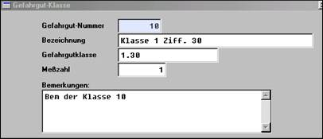
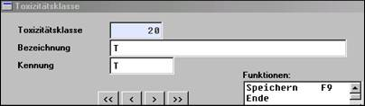
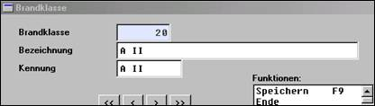

# Parameter der Gefahrgutabwicklung

<!-- source: https://amic.de/hilfe/_parameterdergefahrgu.htm -->

Die für die Gefahrgutabwicklung erforderlichen

• Gefahrgutklassen [GFK]

• Brandklassen [GFBK]

• Toxizitätsklassen [GFTK]

können hier mit den gesetzlich vorgeschriebenen Informationen angelegt werden.

Gefahrgutklasse:

Toxizitätsklasse:

Brandklasse:

Diese Informationen werden bei Gefahrgutartikeln im Artikelstamm ange­bun­den und ggf. dort noch mit weiteren Informationen versehen. Für die Auswertungen ist zu­sätz­lich das Grundgewicht pro Mengeneinheit im Artikelstamm erforderlich. Zusammen mit diesen Infor­mationen erwachsen daraus folgende Möglichkeiten.

Siehe auch:

- [Auswertung nach Gefahrgut](./auswertung_nach_gefahrgut.md)
- [Gefahrgut im Vorgang](./gefahrgut_im_vorgang.md)
