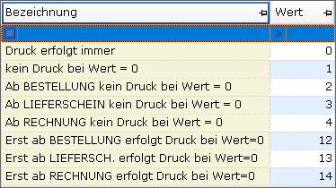

# Registerkarte Zusatz

<!-- source: https://amic.de/hilfe/_zusatzangaben.htm -->

In dieser Abteilung sind inhaltlich unterschiedliche Steuerungen zusammengefasst:

**Ausprägung:**

An diesem Parameter ist festgemacht, ob bei der Vorgangs­erfassung bei diesem Artikel ein Fenster zur Erfassung weiterer Merkmale (z.B. Serien­nummern) aufgeht. Näheres hierzu bei der Beschreibung der Seriennummernver­wal­tung.

**Belegdruck bei Wert = 0**

Hier wird festgelegt, ob und ab wann im Vorgang eine Position mit diesem Artikel gedruckt werden soll, wenn der Wert der Position 0 ist. Dies kann getrennt für Ein- Verkauf gepflegt werden. Folgende Fälle werden unterschieden:

**Aufmaße des Artikels:**

Die Maße des Artikels können hier hinterlegt werden. Eine Standardauswertung steht derzeit nicht zur Verfügung; bei Bedarf ist eine private Variante anzulegen.

**Nachkommastellen:**

Die maximale Anzahl der Nachkommastellen wird hier hinterlegt.

**CO2:**

Benötigt die Lizenz „CO2-Kostenaufteilung-Lizenz“.

| Feld | Bedeutung |
| --- | --- |
| CO2-Artikel | Nur wenn dieser Wert auf „Ja“ steht, wird im Formular etwas angedruckt  
 |
| Heizwert | Heizwert in Gj/t  
 |
| Emissionsfaktor | Emissionsfaktor in kg(CO2)/kWh  
 |
| Gewicht pro Me | Um eine Berechnung sicherzustellen, muss hier das Gewicht in kg pro Grundmengeneinheit eingegeben werden.  
 |
