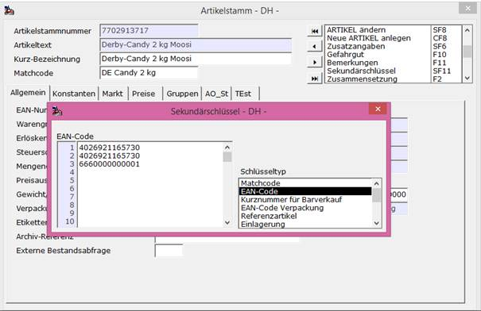

# Sekundärschlüssel

<!-- source: https://amic.de/hilfe/_sekundrschlssel.htm -->

Der eindeutige Suchbegriff für den Anwender ist die Artikelnummer. Als weitere se­kundäre Suchschlüssel stehen jeweils 99 Matchcodes, EAN-Nummern und Verpackungs-EAN-Nummern zur Verfügung, die über folgende Maske erfasst werden.

Die Ausnutzung dieser Möglichkeiten ist auch angesichts der textlichen Suchmöglichkeiten in das Ermessen des Anwenders gelegt. Vor Anlage der Suchbegriffe sollte auch überlegt werden, die Suchbegriffe in eine Abteilung zu legen: So könnte bei Hinterlegung in z.B. der Abteilung Matchcode hier sowohl nach Matchcode und nach EAN-Code gesucht werden!

Für die [Streckenerfassung](../../zusatzprogramme/streckenerfassung/index.md) hat der Schlüsseltyp „Referenzartikel“ eine besondere Bedeutung im Zusammenhang mit der [Planungsbelegeingabe](../../zusatzprogramme/streckenerfassung/planungsregister/belegeingabe.md).

Faktoren bei EAN-Codes

Wird bei EAN-Codes als Sekundärschlüssel ein Faktor eingegeben, so wird bei der Erfassung in der Kasse dieser Faktor beim Scan berücksichtigt.

Auf diese Weise kann eine EAN für die Umverpackung definiert werden, die z.B. die EAN für einen 10er Pack darstellt, so dass der Bediener nicht zehn einzelne Artikel scannen oder den Faktor manuell eingeben muss.

Die vorbelegte Menge wird mit dem Faktor 10 automatisch multipliziert.
