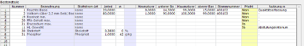

# Zusammensetzung

<!-- source: https://amic.de/hilfe/_zusammensetzung.htm -->

Häufig ist es erforderlich, zum Artikel zusätzliche qualitative Informationen sowie Bestandteilangaben zu führen und auszuwerten. Die für einen Artikelstamm zu berücksichtigenden Merkmale werden aus der Liste der definierten [Bestandteile](../konstanten_der_artikelverwaltung/bestandteile.md) entnommen (F3-Auswahl) und um die benötigten Angaben vervollständigt.

Die Merkmale können werden mit eine Anteilswert versehen werden. Bei stoffstrombilanzpflichtigen Bestandteilen (siehe [Stoffstrom-Bilanz-Daten](../../zusatzprogramme/stoffstrom_bilanz_daten/index.md)) wird die für den Anteil zu verwendende Mengeneinheit angegeben: Der Wert 0 bedeutet dabei immer, dass der Anteilwert eine prozentuale Angabe ist. Alternativ kann eine zur Stoffstrom-Ausweis-Mengeneinheit kompatiblen Mengeneinheit gewählt werden mit der Bedeutung ‚Anteil in Mengeneinheiten pro Grundmengeneinheit der Mengeneinheitsgruppe des Artikelstamms‘. Diese Möglichkeit kommt insbesondere bei inkompatiblen Mengeneinheiten von Stoffstrom-Komponente und Artikelstamm in Betracht (kg/hl).

Die Angabe in der Spalte *‚Nutzung in‘* legt die Berücksichtigung der Merkmale in diversen Anwendungen fest. So werden zum Beispiel in der Qualitätsauswertung (QAA) die Warenbewegungen hinsichtlich der Merkmalswerte ausgewertet, die an dieser Stelle den Wert ‚*Qualitätserfassung‘* tragen.
