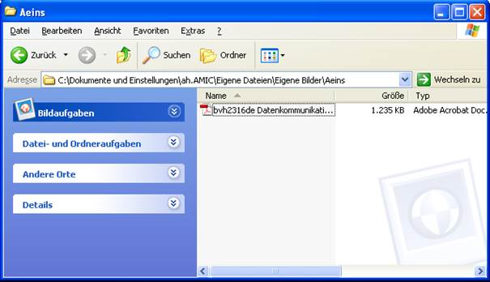
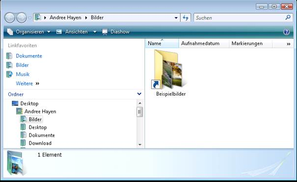
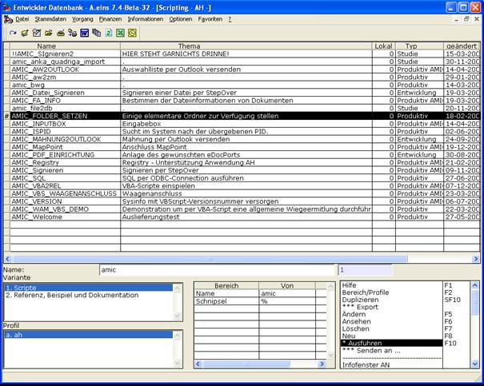
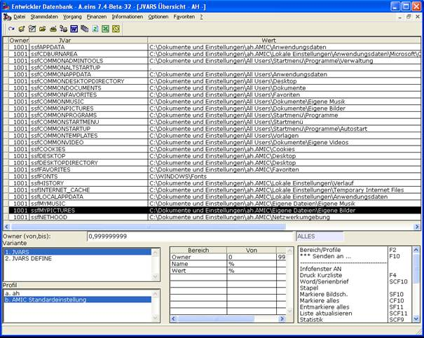
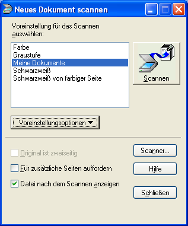
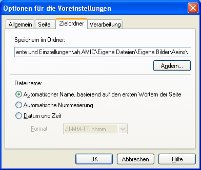
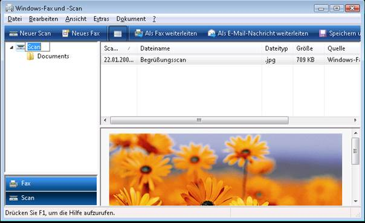
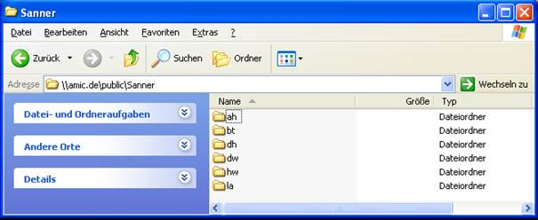
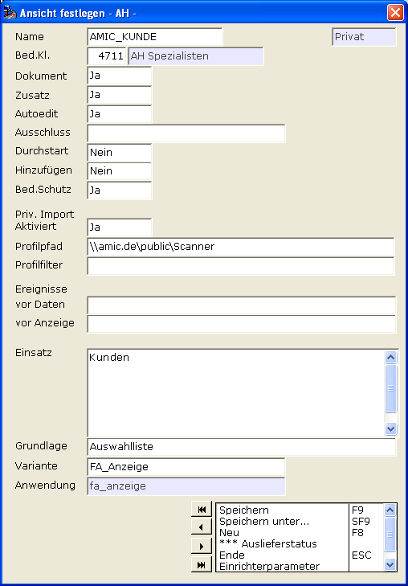
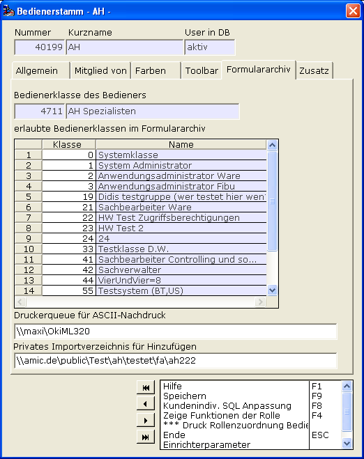

# Archiv: Privater Import

<!-- source: https://amic.de/hilfe/_archivprivaterimport.htm -->

Im Gegensatz zur zentralen Eingangsarchivierung besteht hier die Möglichkeit, eine dezentrale Eingangsarchivierung einzurichten. Man verwendet dies gerne wenn abzusehen ist, dass der Mandantenserver nicht zeitnah genug reagieren kann.

Um eine Ansicht für den dezentralen Einsatz einzurichten, reicht A.eins-seitig allein die Einstellung „Aktiviert“ = JA

A.eins arbeitet an dieser Stelle sehr intensiv mit dem zugrunde liegenden Windows-Betriebssystem zusammen und ermittelt automatisch die Lage des Windows-Ordners „Eigene Bilder“.

In meinem Falle (Windows XP Professional) ist es

auf meinem Vista-System

Sollte man sich unsicher sein, wo sich dieser Bereich auf seinem Computer befindet, gibt es noch die Möglichkeit A.eins zu befragen.

Dafür wechselt man in A.eins in die Anwendung „VBA“ und führt dort

das Script „AMIC_FOLDER_SETZEN“ aus.

Über die Anwendung „JVARS“ kann man nun den Wert ablesen

Nun ist verabredet, dass man in diesem Ordner einen Ordner „Aeins“ anlegt.

Führt man nun eine solche Ansicht aus („Privater Import“, Aktiviert = JA), dann durchsucht A.eins diesen Ordner bevor es die anzuzeigenden Belege recherchiert und fügt die gefunden Dateien vorher ins Archiv ein, so dass diese dann im Moment der Recherche im Archiv zur Verfügung stehen.

Werden Dokumente per Scanner zugeführt, dann muss man das entsprechende Scanner-Programm anweisen, die Dokumente im jeweiligen Bereich des Systems abzulegen.

Für das „Microsoft Office Document Scanning“ sehe es exemplarisch so aus:

Scanner, die keine direkte Windows-Unterstützung bieten, müssen entsprechend über die jeweilige Bedienungssoftware auf den jeweiligen Ordner gelegt werden.

Bei Vista-Systemen wird das dortige

in zukünftigen A.eins-Versionen eine direkte Unterstützung erfahren.

*Vorerst lässt sich z.B. C:\\Users\\ah\\Documents\\Scanned Documents\\Documents im Bedienerstamm hinterlegen.*

Im Ansichts-Dialog lässt sich auch das Szenario „Dezentraler Eingang von zentraler Ressource“ auf einfachste Weise etablieren.

Das Problem:

Beispiel hierfür ist der Einsatz von A.eins auf Terminalserver-Systemen. Hier besteht die Problematik darin, dass der A.eins-Client auf dem Terminalserver läuft, die Scanner-Software aber auf dem Computer auf dem der Terminalserver-Client läuft, also auf verschiedenen Computern, die unter Umständen keine weitere Verbindung außer RDP oder ICA haben.

Richten Sie eine zentrale Freigabe ein, die *für Ihre Scanner-Software erreichbar* sein muss. Ich nenne diese im folgenden **\\\\amic.de\\public\\Scanner**.

Sie müssen das nicht über DFS realisieren, selbstverständlich geht das auch über altbekannte normale Freigabe-Mechanismen im LAN.

Vorgabe ist das für jeden A.eins-Benutzer aus dem Bedienerstamm nun ein Unterverzeichnis angelegt wird.

Beispiel:

Die A.eins-Ansicht wird so konfiguriert:

Also „Priv. Import, Aktiviert = JA und Profilpfad = \\\\amic.de\\public\\Scanner.

Mehr nicht, und A.eins schaut nun statt in den „Bilder“-Ordner in die Netzwerkfreigabe des A.eins-Bedieners.

Anmerkung:

*Über LAN agierende Klienten sollten so problemlos versorgt werden können. Bei WAN, Router-Verbindungen, und ähnlichem lassen Sie sich durch ihr federführendes Systemhaus beraten, wie Sie in Ihrem speziellen Fall den Transport der Dokumente bewerkstelligen können. Möglicherweise bietet Ihr Citrix-System eingebaute Methoden, um zum Beispiel auch mit sogenannten „Thin-Clients“ die Transport-Aufgabe zu bewerkstelligen. Aber das hängt immer sehr von der speziellen Ausstattung vor Ort und muss DORT von Spezialisten beantwortet werden.*

Über den „Profilfilter“ lassen sich reguläre Muster angeben um die in Frage kommenden Dokument-Typen zu selektieren. Im Standard-Fall (keine Angabe) wird folgendes Muster verwendet: ((pdf)|(jpg)|(tif)|(doc.\*))$

Was im Grunde nichts anderes bedeutet dass standardmäßig pdf, jpg, tif und Word-Dokument und deren Erweiterungen herangezogen werden.

Mit folgender Einstellung im Bedienerstamm kann das Verzeichnis noch einmal „überschrieben“ werden. Diese Möglichkeit ist aber im Grunde nur in Sonderfällen relevant und sollte keinesfalls die erste Anlaufstelle sein.

