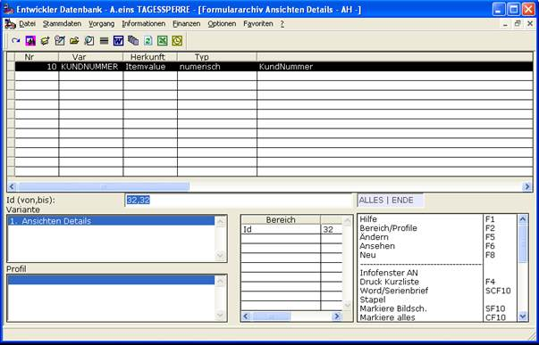
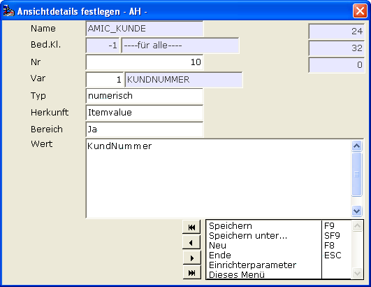
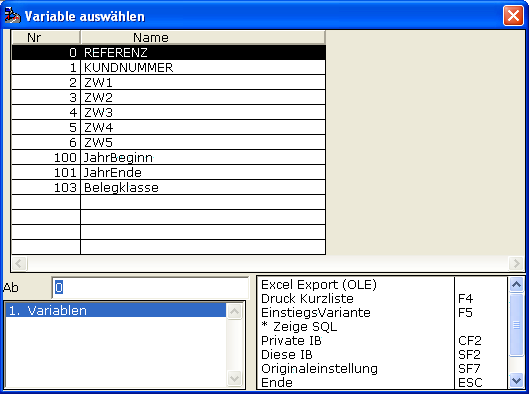
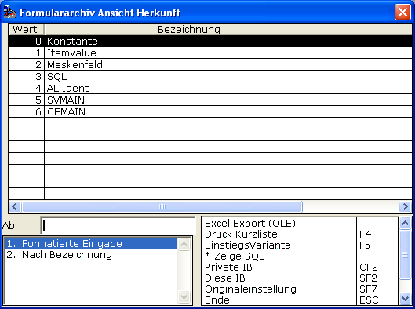
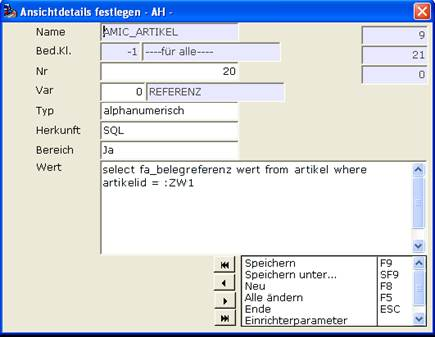

# Archiv-Ansichten Details

<!-- source: https://amic.de/hilfe/_archivansichtendetai.htm -->

Eine Ansicht zeichnet sich dadurch aus, dass sie in einem gewissen Kontext heraus aufgerufen wird. Dieser „Kontext“ wird mit Hilfe der Details ausgewertet.

Per Funktion ***Details…*** erreicht man folgende Auswahlliste



Und hier lässt sich detailliert sagen, wie die Kerndaten ermittelt werden.

Im Beispiel der Kundenauswahl-Listen erfolgt die Datenermittlung eben über diese Auswahllisten und das wird hier vermittelt.



<p class="just-emphasize">Nr</p>

Es werden also möglicherweise mehrere Rahmendaten ermittelt. Per „Nr“ lässt sich die Reihenfolge der Ermittlung steuern.

<p class="just-emphasize">Var</p>

Hier gibt man das zu ermittelnde „Kerndatum“ an.



Hier gibt es die zu diesem Zeitpunkt die möglichen Daten-Definitionen, die für eine erfolgreiche Abwicklung momentan verwendet werden können.

Kernpunkte sind Referenznummer und Kundennummer.

ZW1 bis ZW5 können für „Zwischenwert“-Ermittlungen herangezogen werden.

Jahrbeginn, Jahrende und Belegklasse für themenbezogene Eingrenzungen.

Bei Bedarf können weitere zur Verfügung gestellt werden.

<p class="just-emphasize">Wert</p>

Das Feld „Herkunft“ bestimmt, wie der Eintrag in Wert zu behandeln ist.

Im Beispiel der Kundenauswahllisten wird die KUNDNUMMER aus dem „ItemValue“ der jeweiligen zugrunde liegenden Auswahlliste ermittelt.

Der Name muss dazu in der RETURN-Klausel angelistet sein.

Also im Beispiel der Kundenauswahlliste

```text
ORDER BY :AUSW_9
S.KundNummer
RETURN S.KundId, S.KundNummer
IDENT S.KundId
```

<p class="just-emphasize">Herkunft</p>

Hiermit sagt man dem Programm, woher und wie die Daten ermittelt werden sollen.



| Wert | Beschreibung |
| --- | --- |
| Konstante | Fester Wert, Anwendung z.B. feste Belegklasse |
| ItemValue | Der Wert kommt aus der Returnliste |
| Maskenfeld | Der Wert soll aus einem Maskenfeld genommen werden. Klassisch in der Dialog-Situation |
| SQL | Der Wert wird per SQL ermittelt.<br> <br>Beispiel und Konvention:<br>Der Ergebnis-Wert des SQL muss per Alias „Wert“ ausgezeichnet sein!<br> |
| AL_Ident | Wieder aus Auswahlliste, diesmal die IDENT-Klausel |
| SV_MAIN | Programmtechnisch, der SVWARE-Kontext |
| CE_MAIN | Programmtechnisch, der Rohware-Kontext |
| OWNER | Unterstützt die Vorgabe eines Owner um dann aus diesen die verabredeten JVars zu ziehen.<br>Ein Beispiel für einen Controlstring ist<br><code>^jpl fa_view Profilname 0 47321</code><br> |

<p class="just-emphasize">Bereich</p>

Ob das ermittelte Datum „Bereichswirksam“ ist.

Um das richtig zu würdigen, führe man sich vor Augen, dass man zwar ein starkes Interesse an der vollständigen Ermittlung von Referenz und Kundennummer haben kann- z.B. für die 9000er-Behandlung - aber in einer Umgebung zunächst nur nach Referenz eingrenzen möchte, WEIL z.B. die Archiv-Daten gescannt EAN-ausgestattet eine Referenz liefern, aber keine Kundennummer…, würden also in der Situation NICHT angelistet werden. Eine eventuelle Vervollständigung per Bearbeiten soll dann aber gleichwohl den Luxus bieten, die Kundennummer vor zu belegen.
