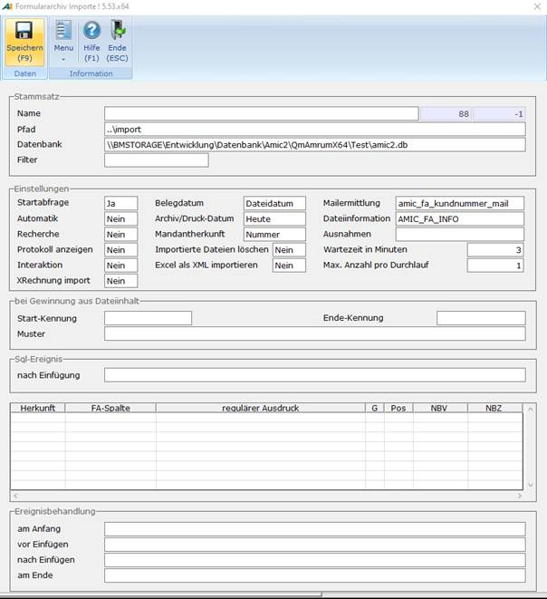

# Archiv-Import-Stammdatenpfleger: Formulararchiv Importe

<!-- source: https://amic.de/hilfe/sdi_archivimport.htm -->

Der Import beschreibt nun, wo die zu importierenden Daten erwartet werden dürfen, wie sie aussehen können, und wie aus ihnen geeignet die Verschlagwortung für das Formulararchiv gewonnen werden kann.

Anmerkung: Diese Profile können vom Mandantenserver abgewickelt werden. In der nachfolgenden Beschreibung als MSM (Mandantenservermodus) betitelt.

| Felder |
| --- |
| Name | Eindeutiger Name des Dokumenten-Import-Profils.  
 |
| Pfad | Legt den Pfad fast, an dem die Daten bereitgestellt werden.  
Eine Besonderheit ist, dass System-Umgebungsvariablen wie %TEMP%, etc. pp. ausgewertet werden. Zu beachten ist, dass der Pfad erwartungsgemäß aus Sicht des importdurchführenden A.eins-Clienten zu sehen ist.  
Für den Einsatz im Batch-Betrieb bietet das unter anderem die Möglichkeit, mit wechselnden Pfaden zu operieren.  
 |
| Filter | Regulärer Ausdruck der auf die zu verarbeitenden Dateinamen reagiert. Damit besteht die Möglichkeit ein Profil nur auf ganz bestimmte Dateien eines Pfades arbeiten zu lassen. Nämlich genau denen die dem regulären Ausdruck entsprechen.  
Standardmäßig werden alle Dateien des Pfades bearbeitet.  
Beispiel: ^01.\* verarbeitet nur die Dateien, die genau mit 01 beginnen.  
Anwendungsbeispiel ist **einen** Pfad zu haben in denen mehrere Mitarbeiter ihre Dokumente ablegen. Die jeweiligen Profile können dann alle auf diesem Pfad operieren.  
 |
| Protokoll anzeigen | Es wird ein Protokoll über den Import nach Beendigung dargestellt.  
Im MSM wird diese Einstellung nicht beachtet, also immer als NEIN behandelt.  
 |
| Importierte Dateien löschen | Dateien werden nach erfolgreichem Import gelöscht.  
Für die Testphase kann es nützlich sein, diesen Schalter vorerst auf NEIN zu lassen.  
Im Produktionseinsatz ist angeraten ein JA in Erwägung zu ziehen!  
 |
| Mandantherkunft | 0 = Sektion ( Sektionsname des Mandanten, z.B. aus amicconf.ini)  
1 = Kurztext ( Kurztext der Firma)  
2 = Nummer (Standard, Nummer der Firma)  
 |
| Import-Datenbank-Name | Siehe [Import-Datenbank-Name](../archiv_dokumenten_import.md#import_datenbank_name)  
 |
| Belegdatum | 0 = Heute (Datum zum Zeitpunkt des Imports)  
1 = Dateidatum (Standard)  
 |
| Archiv/Druckdatum | 0 = Heute (Standard, Datum zum Zeitpunkt des Imports)  
1 = Dateidatum  
 |
| Mailermittlung | Datenbank-Funktion die anhand der Mail-Adresse eine Kundennummer zu ermitteln versucht  
(Standard amic_fa_kundnummer_mail)  
 |
| Dateiinformation | Optionales VBA-Script  
(Standard ist AMIC_FA_INFO. Das Script holt aus den NTFS-Streams Datei-Informationen. NTFS-Streams sind daran beteiligt. Das sind eigenständige Objekte des NTFS-Dateisystems.' Sie sind nicht per Explorer oder "Datei-Merkmalen" greifbar)  
   
Bei NTFS-Systemen ist es möglich, dass das Betriebssystem direkt weitere Information zu einer Datei speichern kann.  
Es handelt sich um Angaben wie z.B. Titel, Autor, etc. pp.  
A.eins kann diese Daten auslesen und macht das standardmäßig per VBA-Script AMIC_FA_INFO.  
   
Ist dieses Verhalten nicht erwünscht, dann kann an dieser Stelle einfach keine Angabe eines Scriptes erfolgen, bzw. es lässt sich ein geändertes Script hinterlegen.  
   
Zur Laufzeit können bzw. werden somit die JVARS mit Owner 5000 befüllt:  
JVARS_FA_NTFS_FILE  
JVARS_FA_NTFS_AUTHOR  
JVARS_FA_NTFS_CATEGORY  
JVARS_FA_NTFS_COMMENTS  
JVARS_FA_NTFS_KEYWORDS  
JVARS_FA_NTFS_SUBJECT  
JVARS_FA_NTFS_TITLE  
 |
| Ausnahmen | Hier lässt sich eine Datenbank-Funktion angeben mit deren Hilfe die Ausnahmen bestimmt werden können.  
Beispiele sind die versteckten Dateien desktop.ini und thums.db.  
Aber auch Links (also Dateien mit der Extension lnk) sollen nicht importiert werden.  
   
Standard: amic_get_fai_ausnahmen  
 |
| Startabfrage | Ob beim Start des Imports eine Abfrage ausgeführt werden soll.  
Dort erhält man die Anzahl der vermutlich zu importierenden Dokumenten und hat eine Abbruch-Möglichkeit.  
Ist keine Startabfrage gewünscht, gibt es auch automatisch kein visuelles Protokoll!  
Im MSM wird diese Einstellung nicht beachtet, also immer als NEIN behandelt.  
 |
| Interaktion | Wenn Kriterien der Datenbank-Tabelle nicht ermittelt worden sind, öffnet sich dann bei Ja ein Abfrage-Dialog.  
 |
| Recherche | Es wird versucht, anhand von Kerndaten (bekannte Archiv-Referenz, Kundennummer) bestimmte Dinge aus den schon vorhandenen Daten im System zu ermitteln.  
 |
| Automatik | Ja = der Mandantenserver übernimmt den eigentlichen Import der Dokumente gemäß der Profileinstellungen.  
 |
| Excel als XML importieren  
 | Steht der Schalter „Excel als XML importieren“ auf „Ja“, so wird beim Import einer Excel-Datei zusätzlich der Dateiinhalt der Excel-Datei in ein XML gespeichert. Das XML findet man in der Spalte „FA_XMLErweiterung“ in der Relation Formulararchiv wieder. Auf das XML kann über eine [SQL-Nachlaufprozedur](./index.md#sql_ereignis) zugegriffen werden.  
Zum Auslesen des XMLs wird die SQL-Prozedur „amic_fa_get_XmlErweiterung_Excel“ empfohlen. Als Parameter werden die Fa_Id und die Fa_Mndnr erwartet. Die Prozedur gibt zu jeder nicht-leeren Excel-Zelle den Wert, die Spalte und Zeile sowie den Arbeitsblattnamen, in der sich die Zelle befindet, zurück.  
   
   
Hinweise:  
In der XML wird als Dezimaltrennzeichen immer ein Punkt (.) verwendet.  
Es werden nur die Dateiformat .xlsx und .xlsm unterstützt. So werden beim Import von z.B. .xls-Dateien keine XMLs generiert.  
   
Voraussetzung:  
Es wird die [Archivimport-Excel-Lizenz](../../../firmenstamm/steuerparameter/lizenzen/excel_archivimport_lizenz_spa1127.md) benötigt.  
 |
| Wartezeit in Minuten | Es existieren Scanner-Systeme die ihr Erzeugnis in mehreren Schritten erzeugen. Um diese „Reifezeit“ von A.eins zu unterstützen gibt es hier die Möglichkeit eine Wartezeit in Minuten anzugeben, bevor das A.eins-Archiv-Import-System die Datei verarbeitet. |
| Max. Anzahl pro Durchlauf | Da je nach Dateiaufkommen und -größe der allgemeine Mandantenserver-Betrieb in Stoßzeiten durch den Import behindert werden könnte gibt es hier die Möglichkeit die die Anzahl der zu importierenden Dateien zu konfigurieren. |
| eRechnung import | Steht dieser Schalter auf „Ja“, so werden importierte PDF oder XML-Dateien daraufhin geprüft, ob sie eine eRechnung im Format UBL oder CII enthalten und ggf. werden diese Dateien automatisch importiert. |

**Bei Gewinnung aus Dateiinhalt**

Hier kann ein Bereich des Dateiinhaltes festgelegt werden, der dann in der Datentabelle unter Herkunft **Dateiinhalt** zur Datenermittlung herangezogen werden kann (siehe auch [Zuordnung der Herkunft](./index.md#zuordnung_der_herkunft))

| Felder |
| --- |
| Start-Kennung | Siehe [Gewinnung aus Dateiinhalt](./gewinnung_aus_dateiinhalt.md)  
 |
| Ende-Kennung | Siehe [Gewinnung aus Dateiinhalt](./gewinnung_aus_dateiinhalt.md)  
 |
| Muster | |

**Sql-Ereignis**

| Felder |
| --- |
| nach Einfügung | Hier kann eine private Datenbank-Procedure hinterlegt werden.  
(Private Datenbank-Prozeduren beginnen mit einem „p_“)  
Die Erstanlage einer geeigneten Datenbank-Procedure wird durch die Anlage eines Templates unterstützt. (Funktion „**Sql-Ereignis nach Einfügung …**“)  
Mit Ihrer Hilfe lassen sich Aktionen auf der Datenbank ausführen, die nach der Einfügung z.B. in den Tabellen Formulararchiv und Archiv durchgeführt werden sollen.  
 |

**Datentabelle Verschlagwortungskriterien**

| Felder |
| --- |
| Herkunft | Siehe [Zuordnung der Herkunft](./index.md#zuordnung_der_herkunft)  
 |
| FA-Spalte | Siehe [Zuordnung der FA-Spalten](./index.md#zuordnung_der_fa_spalten)  
 |
| regulärer Ausdruck | |
| G | Gruppe  
 |
| Pos | Sortierkriterium  
 |
| NBV | (N)ach(B)earbeitung(V)orher  
 |
| NBZ | (N)ach(B)earbeitung(Z)iel  
 |

**Ereignisbehandlung**

| Felder |
| --- |
| am Anfang | Hier kann ein VBA-Skript angegeben werden, dass einmalig am Anfang des Archivimports ausgeführt wird (siehe [Ereignisbehandlung](./ereignisbehandlung.md)).  
 |
| vor Einfügen | Hier kann ein VBA-Skript angegeben werden, dass vor dem Einfügen jeder Datei ausgeführt wird (siehe [Ereignisbehandlung](./ereignisbehandlung.md)).  
 |
| nach Einfügen | Hier kann ein VBA-Skript angegeben werden, dass nach dem Einfügen jeder Datei ausgeführt wird (siehe [Ereignisbehandlung](./ereignisbehandlung.md)).  
 |
| am Ende | Hier kann ein VBA-Skript angegeben werden, dass einmalig am Ende des Archivimports ausgeführt wird (siehe [Ereignisbehandlung](./ereignisbehandlung.md)).  
 |

| Zuordnung der Herkunft |
| --- |
| 0 | Dateiname  
Die Datengrundlage für die Datenzeile ist der Dateiname  
   
Es ist durch geeignete Vorbereitungen Kerndaten im Dateinamen zu hinterlegen.  
Etwaige Scanner-Systeme bieten solche Möglichkeiten.  
   
Hier nun ist es möglich zu beschreiben, wie A.eins diese Daten zu interpretieren hat, wenn sie denn in einer solchen Form vorliegen. |
| 1 | Dateiinhalt  
Der Dateiinhalt kann eine spezifische Ausprägung vorweisen, die gezielt zur Daten-Gewinnung herangezogen werden kann.  
Es kann **ein** Dateninhalt über [Gewinnung aus Dateiinhalt](./gewinnung_aus_dateiinhalt.md) definiert werden.  
 |
| 2 | Konstante  
Für die Fälle, wo ein Kern-Datum fest vorgegeben bzw. vorbelegt werden soll. |
| 3 | Abfrage  
Es ist die interaktive Nachverschlagwortung vorgesehen und implementiert! |

| Zuordnung der Fa-Spalten | Formulararchiv-Spalte |
| --- | --- |
| 0 | Keine | |
| 1 | Belegklasse | fa_belegklasse  
Die Belegklasse des Beleges. Siehe FAKLASSE für mögliche Ausprägungen |
| 2 | BelegNummer | fa_belegnummer  
Belegnummer falls vorhanden |
| 3 | BelegReferenz | fa_belegreferenz  
Belegrefrenz |
| 4 | Kundennummer | fa_kundnummer  
Kundnummer |
| 5 | Mandant | fa_mandant |
| 6 | Belegtyptext | fa_belegtyptext  
Der Belegtyptext. Maßgeblich ist aber die Belegklasse! |
| 7 | Mailadresse | |
| 8 | Anleger | fa_neuanlagebediener |
| 9 | Bedienerklasse | fa_bedienerklasse  
Bedienerklasse des Belegerzeugers |
| 10 | Autor | fa_info_autor |
| 11 | Betreff | fa_info_betreff |
| 12 | Kategorie | fa_info_kategorie |
| 13 | Kommentar | fa_info_kommentar |
| 14 | Stichwörter | fa_info_stichwoerter |
| 15 | Titel | fa_info_titel |
| 16 | Barcode | fa_barcode |
| 17 | Dateiname | fa_dateiname |
| 18 | Klassifizierung | fa_klasse  
Klassifizierung |

| Funktion |
| --- |
| Sql-Ereignis nach Einfügung | Öffnet Editor zum Bearbeiten des Sql-Ereignisses. |
| Datenbank-Dateiname abstimmen | Füllt das Feld „Import-Datenbank-Dateinamen“ mit dem Datenbank-Datei-Namen des aktiven Mandanten aus. |

Siehe auch:

- [Funktion anlegen](./funktion_anlegen/index.md)
- [Gewinnung aus Dateiinhalt](./gewinnung_aus_dateiinhalt.md)
- [Muster](./muster.md)
- [Konstante](./konstante.md)
- [Nachbearbeitung](./nachbearbeitung/index.md)
- [Ereignisbehandlung](./ereignisbehandlung.md)
- [Zuordnung JVARS – Kriterien](./zuordnung_jvars_kriterien.md)
- [Interaktion während des Importvorgangs Archiv](./interaktion_waehrend_des_importvorgangs_archiv.md)
