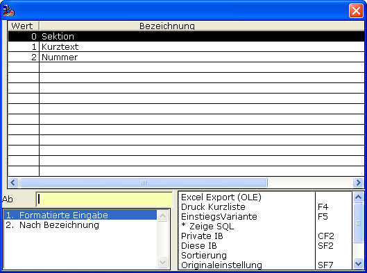
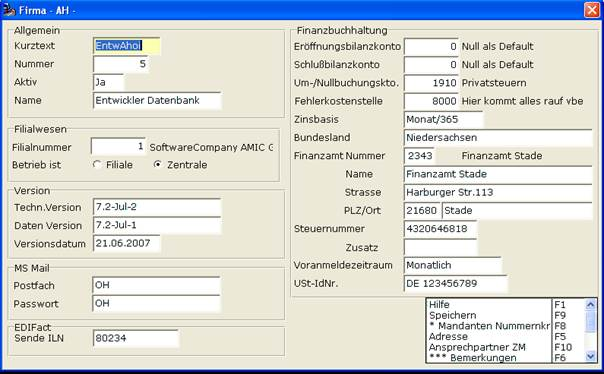

# Mandantherkunft

<!-- source: https://amic.de/hilfe/_mandantherkunft.htm -->

Das Formulararchiv arbeitet mandantenbasiert. Hier hat man nun die Möglichkeit den Mandanteneintrag im Formulararchiv auszuprägen.

• Sektion: Der Name des „Mandanten“ beim Programm-Start, also in aller Regel der Eintrag nach welcome: aeins.exe welcome mandantenname

• Kurztext: Eben der Kurztext, somit in diesem Beispiel „EntwAhoi“

• Nummer: Die obige Nummer, also in diesem Beispiel „5“

