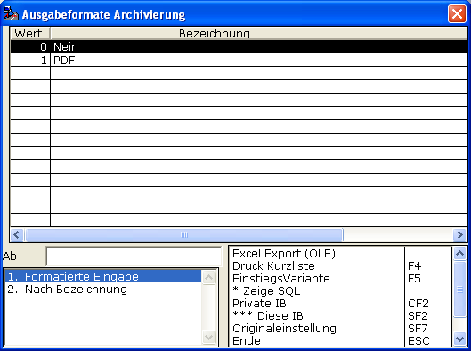
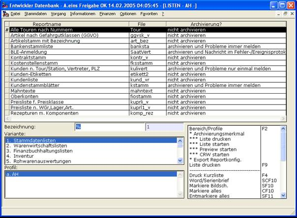
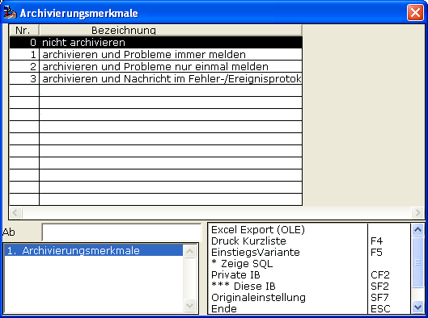

# Reportarchivierung ein/ausschalten

<!-- source: https://amic.de/hilfe/_reportarchivierungei.htm -->

Die Archivierung der Reporte lässt sich per

einstellen.

• NEIN: Es werden grundsätzlich keine Reporte archiviert.

• PDF: Wenn Reporte archiviert werden, dann im PDF-Format.

Die Auswahl, welcher Report archiviert wird, hängt auch davon ab, was in der Anwendung „LISTEN“

und dort bei „Archivierung?“ eingerichtet ist.

