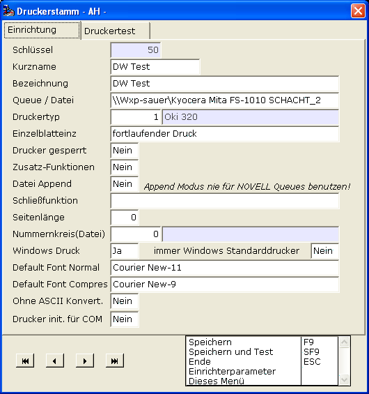
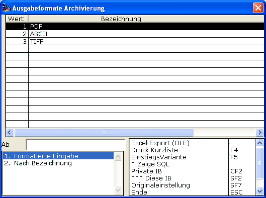

# Vorgangs-Druck

<!-- source: https://amic.de/hilfe/_vorgangsdruck.htm -->

Beim Vorgangsdruck wird zwischen ASCII- und Windowsdruck unterschieden.

ASCII-Druck wendet sich vornehmlich an Nadeldrucker und besticht durch geringe Datenmengen, die zur Aufbereitung notwendig sind.

Entscheidend ist der Drucker, auf den gedruckt wird.

Beachten Sie hier die Einstellung unter „Windows Druck“. Damit ist der obige Drucker als Windows-Drucker ausgewiesen und kann sich der Möglichkeiten des Formulararchivs bedienen.

Im Formulararchiv-Manager können Sie bestimmen, wie der Druck im Falle eines Windows-Druckers ins Archiv gelangen soll.

Es gibt dabei grundsätzlich 2 Ausprägungen: Entweder als „ASCII-Druck“ oder im aufwändigeren Binärformat, welches dann aber pixelgenau jedes Detail erfasst. Von letzterem sind 2 Varianten verfügbar, nämlich die gängigen Zielformate PDF und TIFF. Hat man die Wahl zwischen den Beiden, so ist A.eins-seitig PDF vorzuziehen, da es im Falle von Farbbeigaben der Originale effizienter ist und bei Verwendung von TIFF diesbezüglich weitere Einrichtungsschritte nötig sind.

Anzumerken ist das sowohl der PDF- als auch der TIFF-Druck eine umfassende interne Revision erfahren haben, so dass inzwischen bestmögliche „Originaltreue“ erreicht worden ist. Eingelagerte Grafiken und jedweiliger Windows-Font sind inzwischen kein wirkliches Problem mehr.

einstellen, im welchen Format der Vorgang beim Windows-Druck abgelegt werden soll.

• PDF: Hiermit lässt sich eine gute Detail-Genauigkeit erreichen. Bilder / Logos sind integriert.

• ASCII: Platzsparende Methode, gerade bei ASCII-Druck selbst, sicherlich die geeignete Wahl.

• TIFF : Ein weiteres (neben PDF) binäres Format

Beim Vorgangsdruck auf ASCII-Druckern lässt sich die Archivierung (vorerst) nur per ASCII-Methode durchführen.
