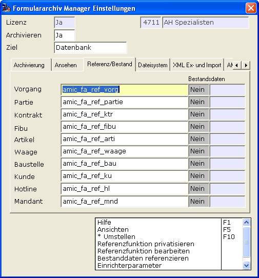
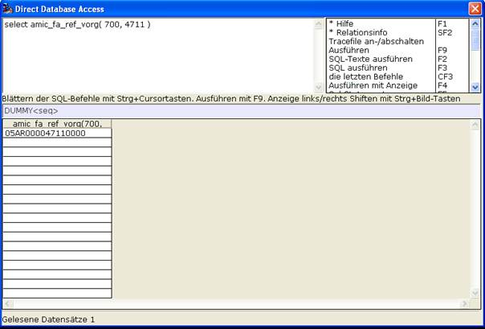

# Referenz

<!-- source: https://amic.de/hilfe/_referenz.htm -->

Ein wichtiger Punkt im Hinblick auf Einführung einer Archiv-Organisation in der Firma.



Bekanntlich werden Vorgänge, aber auch Partien, Kontrakte, Finanzbelege etc. pp. bei Neuanlage mit einer Archiv-Referenz-Nummer ausgestattet. Der Aufbau dieser Referenz-Nummer geschieht mit Datenbank-Funktionen.

Von AMIC werden Standard-Datenbankfunktionen ausgeliefert. Technisch kann man diese Funktionen so belassen, inhaltlich sollte man es in der Mehrheit der Fälle wohl nicht und sie auf die speziellen eigenen Gegebenheiten umrüsten.

Am Beispiel der amic_fa_ref_vorg wird das folgende erklärt.

```sql
CREATE FUNCTION AMIC_FA_REF_VORG
( IN
 v_KlassNummer  integer,
  IN
 v_NumNummer    integer,
  IN
in_uklassnummer integer default 0,
  IN
in_jahrnummer   integer default
0,
  IN
in_unternummer  integer default
0
   ) returns char(20)
BEGIN
  DECLARE
fetch_fa_belegreferenz char(20);
  select
right('00'||mandnummer,2)
         ||
         (
select left(formlstbezeich,2) from formatlist where
formlstkennung='af_vorgang' and
formlstwert = v_KlassNummer )
         ||
         right('00000000'|| v_NumNummer,8)
         ||
         right('0000'||
in_jahrnummer,4)
         into fetch_fa_belegreferenz
  from
mandantstamm;
  return
fetch_fa_belegreferenz;
 END
```



<p class="siehe-auch">Siehe auch:</p>

- [Manuelle Privatisierung der Datenbank-Funktion](./manuelle_privatisierung_der_datenbank_funktion/index.md)
- [Bestanddaten referenzieren](./bestanddaten_referenzieren/index.md)
- [Archivierung Dateisystem](./archivierung_dateisystem.md)
- [Reportarchivierung im Dateisystem](./reportarchivierung_im_dateisystem.md)
- [Quick-Reporte im Dateisystem (Archiv)](./quick_reporte_im_dateisystem_archiv.md)
- [Dateisystem-Pfad](./dateisystem_pfad/index.md)
- [Archiv Volltext-Recherche](./archiv_volltext_recherche.md)
