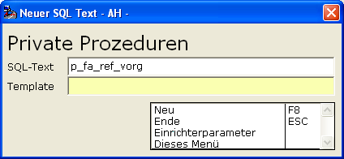
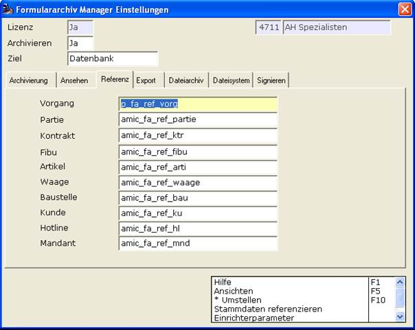

# Manuelle Privatisierung der Datenbank-Funktion

<!-- source: https://amic.de/hilfe/_manuelleprivatisieru.htm -->

Dazu kopiert man die am besten die ausgelieferte Datenbank-Funktion und legt diese unter einem eigenen anderen Namen in der Datenbank an. Den neuen Namen gibt man hier im Referenz-Dialog dem A.eins-System bekannt. Updates von A.eins werden dann nicht wieder den Original-Zustand herstellen.



```sql
CREATE FUNCTION
p_fa_ref_vorg
( IN  v_KlassNummer  integer,
  IN  v_NumNummer
integer,
  IN in_uklassnummer integer default 0,
  IN in_jahrnummer   integer default
0,
  IN in_unternummer  integer default 0
   ) returns char(20)
BEGIN
  DECLARE fetch_fa_belegreferenz char(20);
  select right('00'||mandnummer,2)
         ||
         (
select left(formlstbezeich,2) from formatlist where formlstkennung='af_vorgang'
and formlstwert = v_KlassNummer )
         ||
right('00000000'|| v_NumNummer,8)
         ||
right('0000'|| in_jahrnummer,4)
         into
fetch_fa_belegreferenz
  from mandantstamm;
  return fetch_fa_belegreferenz;
 END
```

Und verändert die nach jeweiliger Organisations-Vorgabe.

Nach Prüfung der Funktionalität und gewünschtem Verhalten z.B. per OSQL kann man dann diese Datenbank-Funktion als System-Referenz-Datenbank-Funktion für die Vorgänge in A.eins einsetzen.



Eine ähnliche Verfahrensweise führe man für die Rest-Identitäten Partie, Kontrakt, Fibu, … etc. durch.

<p class="siehe-auch">Siehe auch:</p>

- [Automatische Privatisierung der Datenbank-Funktion](./automatische_privatisierung_der_datenbank_funktion.md)
