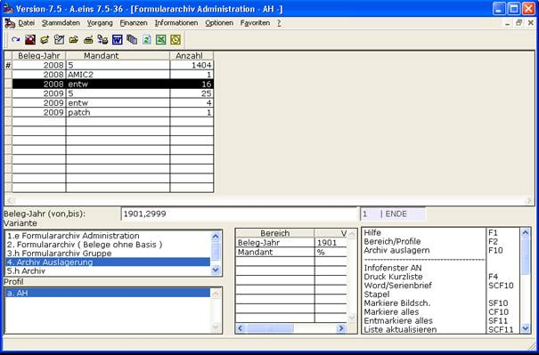

# Die Übersicht

<!-- source: https://amic.de/hilfe/_diebersicht.htm -->

In der Anwendung „Formulararchiv Administration“ die neue Variante „Archiv Auslagerung“. Dort wird eine jahrgangsweise Übersicht des Archives präsentiert. Auf Systemen die mehrere Mandanten verwalten wird nochmals nach Mandanten gegliedert.

Eine nicht ganz untypische Ansicht könnte sich in etwa so darstellen:

Man sieht das Archiv dieser Datenbank hält die entsprechende Anzahl von Belegen im jeweiligen Jahr mit entsprechenden Mandanten vor – vorbehaltlich etwaiger schon getätigter Auslagerungen. Die schon getätigten Auslagerungen erscheinen nicht mehr in dieser Statistik.

Um nun ein Jahr mit einem Mandanten auszulagern, wähle man entsprechende Einträge an. Mehrfachselektion ist möglich und führe dann die Funktion Archiv auslagern aus.

Führt man diese Funktion aus, legt der Datenbank-Server unterhalb eines „Auslagerungspfades“ eine Archivauslagerung an. Die Geschwindigkeit des Vorganges ist angemessen, bedenken Sie bitte dass je nach Datenaufkommen einiges an Informationen transportiert werden muss.

Nach Durchführung wird die Übersicht aktualisiert und es wurde eine Information ins Fehlerprotokoll von A.eins abgelegt.

Wechselt man z.B. mit dem Windows-Explorer in den „Auslagerungspfad“ findet man eindeutige XML-Steuerdateien, deren Namen mit Belegjahr_Mandant anfangen und Verzeichnisse die die Archivdaten enthalten. In diesem Punkt ist die Auslagerung sehr stark an den Archiv-Export angelehnt und kann auch als solcher verwendet werden.

Darüber hinaus ist die Beleg-Recherche-Funktion von A.eins so angepasst worden, dass sie im Falle, dass sich keine binäre Beleg-Information mehr in der Datenbank befindet, A.eins nun versucht, diese Information über obigen eingerichteten Auslagerungspfad zu ermitteln.

Die Auslagerungs-Funktion vermerkt den Export eines Beleges in fa_progintern mit Wert -1.

Somit ist eine selektive Löschung der Relation Archiv möglich, und die Datenbank kann nach einem „Rebuild“ wesentlich kleineren Umfang aufweisen.

Die Archiv-Zugriffsfunktion ist entsprechend auf diese Situation vorbereitet und versorgt das System dann mit den binären Daten aus dem Dateisystem, statt aus der Stamm-Relation Archiv.
