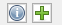

# Belegfluss - Pfleger

<!-- source: https://amic.de/hilfe/belegflusspfleger.htm -->

**Postfach** 

Hier werden abhängig von der [Prozedur](../belegfluss_variante_4_postfacheinrichtung/belegfluss_postfacheinrichtungspfleger.md) die Postfächer angezeigt. 

**Status** 

Hier werden abhängig von der [Prozedur](../belegfluss_variante_4_postfacheinrichtung/belegfluss_postfacheinrichtungspfleger.md) die Weiterleitungen angezeigt. 

Stammdaten

| Name | Beschreibung |
| --- | --- |
| Aktuelles Postfach | Die Bezeichnung des aktuellen Postfachs  
 |
| Fa-Id | Formulararchiv - ID  
 |
| FA-MndNr | Formulararchiv - Mandantennummer  
 |

 

Zugehöriger Beleg

| Name | Beschreibung |
| --- | --- |
| Typ | Hier wird angezeigt, ob es sich bei dem Beleg um einen Warenwirtschafts- oder Finanzbuchhaltungsbeleg handelt.  
 |
| Nummer | Hier wird die Belegnummer angezeigt.  
 |
| Buttons | Ändern/Ansehen/Löschen des Belegs  
 |

 

Kontierung

| Name | Beschreibung |
| --- | --- |
| Belegtyp | Hier kann zwischen Ware und FiBu gewählt und damit können jeweils unnötige Felder ausgeblendet werden. |
| Belegart (Fibu) | Hier kann für die Finanzbuchhaltung eine Belegart (ER, EG, SO-Beleg) angegeben werden. Nur bei SO-Belegen kann das Sollhabenkennzeichen angegeben werden, bei Eingangsrechnungen und Eingangsgutschriften nicht. Ist keine Belegart hinterlegt, kann man zwar das Sollhabenkennzeichen angeben, es wird jedoch nicht in der Finanzbelegerfassung ausgewertet.  
 |
| Lieferant/Kreditor | Nummer und Bezeichnung des Lieferanten/Kreditor  
 |
| Mailadresse Kreditor | E-Mailadresse des Kunden in Bezug auf den Beleg  
 |
| Belegnummer | Hier kann die Belegnummer des eingegangenen Beleges eingepflegt werden.  
 |
| Belegdatum | Hier kann das Belegdatum eingepflegt werden.  
Sind neben dem Belegdatum, die Felder für die FiBu-Buchungsperiode ausgefüllt, so wird das Belegdatum je nach Einstellung des Einrichterparameters „[Belegdatum mit Periode prüfen?](../../../../firmenstamm/einrichterparameter/belegerfassung_epa_fibuerf.md)“ geprüft.  
 |
| FiBu-Buchungsperiode (Periode/Jahr) | Hier kann eine Buchungsperiode für die Finanzbuchhaltung eingeben werden. Es dürfen nur offene Perioden und keine Abschlussperioden ausgewählt werden.  
Hinweis: Die Prüfungen, ob die eingebende Periode gültig ist, beziehen sich immer auf die FiBu-Periode. Des Weiteren wird die Periode nur für Finanzbelege ausgewertet. Daher wird es empfohlen keine Periode einzugeben oder die Periode zu entfernen, wenn statt eines Finanzbeleges ein Warenwirtschaftsbeleg erfasst werden soll.  
 |
| UStId Kunde | UmsatzsteuerId des Kunden/Lieferanten |
| UStId Firma | Eigene UmsatzSteuerId |
| Steuergruppe | Steuergruppe des Kunden/Lieferanten |
| Brutto des Beleges | Bruttobetrag des Beleges. Neben dem Feld „Brutto des Beleges“ wird die Summe aller Beträge der Datentabelle „Kostenaufteilung“ angezeigt. Die angezeigte Summe dient als Kontrollsumme.  
 |
| Zahlungsbedingung | Mit der F3\-Taste kann hier eine Zahlungsbedingung ausgewählt werden. Die Zahlungsbedingung wird mit der Zahlungsbedingung EK aus dem Kundenstamm vorbelegt, sofern ein Lieferant/Kreditor angegeben wurde.  
Bei der Auswahl einer Zahlungsbedingung wird das Feld „Skontosatz“ mit dem Skontosatz aus der Zahlungsbedingung gefüllt. Ist das Belegdatum gesetzt, so wird auch das Skonto- und das Valutadatum vorbelegt.  
 |
| Steuerbetrag | Steuerbetrag des Beleges. Neben dem Feld „Steuerbetrag“ wird die Summe aller Steuerbeträge der Datentabelle „Kostenaufteilung“ angezeigt. Die angezeigte Summe dient als Kontrollsumme.  
 |
| Skontodatum | Hier kann das Skontodatum eingetragen werden.  
 |
| Skontoprozent | Hier kann ein Skontosatz eingetragen werden. Bei der Auswahl einer Zahlungsbedingung wird das Feld „Skontosatz“ mit dem Skontosatz aus der Zahlungsbedingung gefüllt.  
 |
| Skontobetrag | Skontobetrag des Beleges. Neben dem Feld „Skontobetrag“ wird die Summe aller Skontobeträge der Datentabelle „Kostenaufteilung“ angezeigt. Die angezeigte Summe dient als Kontrollsumme. |
| Skontobetrag | |
| Valutadatum | Hier kann das Valutadatum ausgewählt werden.  
 |
| Währung | Währung des Beleges |
| Währungskurs | Kurs der Währung wenn von der Buchwährung abweichend |
| Buttons |   
Auswahl einer Vorlage/ Neu-Anlage einer Vorlage |

eRechnung

Hier werden im Fall einer eRechnung die Werte aus der jeweiligen Position angezeigt. Die Anzeige ist mit einer privaten Prozedur in der Postfacheinrichtung bzw. im Kunden einrichtbar.

Steuern

Anzeige der Steuersätze, Netto- und Bruttobeträge und den jeweiligen Steuerwerten. Diese können zum Ausgleich von Rundungsfehlern editiert werden.

**Grids**

Kostenaufteilung

| Name | Beschreibung |
| --- | --- |
| Betrag | Hier kann der Rechnungsbetrag eingegeben werden.  
 |
| Skonto  
 | Hier kann der Skonto-Betrag eingegeben werden. |
| Gegenkonto | Mit der F3\-Taste kann hier ein Konto ausgewählt werden. Wurde als Belegart „SO-Belege“ angegeben, so kann hier ein Personen- oder Sachkonto ausgewählt werden. Ansonsten ist nur die Eingabe eines Sachkontos zulässig. Handelt es sich bei dem Sachkonto um ein Forderungs- oder Steuerkonto, so kann dieses nicht ausgewählt werden.  
   
Hinweis:  
Bei der Eingabe eines Personenkontos als Gegenkonto ist zu beachten, dass eine Erfassung eines FiBu-Beleges nur noch über die Funktion "Direkt-Finanzbelegerfassung" erfolgen kann. Da eine direkte Buchung von Personenkonto an Personenkonto nicht zulässig ist, ist in der Prozedur für die "Direkt-Finanzbelegerfassung" ein Sachkonto als Hauptkonto anzugeben, über das die Umbuchung erfolgen soll.  
 |
| Kostenstelle | Bei der Auswahl eines Gegenkontos wird das Feld „Kostenstelle“ mit der [Kostenstelle](../../../../finanzbuchhaltung/kostenrechnung/kostenstellen.md) aus dem Gegenkonto vorbelegt. Ist die Kostenstelle im Sachkonto als gesperrt oder fest eingetragen, kann hier keine Änderung erfolgen.  
 |
| Kostenträger  
 | Bei der Auswahl eines Gegenkontos wird das Feld „Kostenträger“ mit dem [Kostenträger](../../../../finanzbuchhaltung/kostenrechnung/kostentraeger.md) aus dem Gegenkonto vorbelegt. Ist der Kostenträger im Sachkonto als gesperrt oder fest eingetragen, kann hier keine Änderung erfolgen.  
Voraussetzung: Der Steuerparameter „Kostenträgerrechnung angeschlossen“ steht auf „Ja“.  
 |
| Kostenobjekt  
 | Bei der Auswahl eines Gegenkontos wird das Feld „Kostenobjekt“ mit dem [Kostenobjekt](../../../../finanzbuchhaltung/kostenrechnung/kostenobjekte/index.md) aus dem Gegenkonto vorbelegt. Ist das Kostenobjekt im Sachkonto als gesperrt oder fest eingetragen, kann hier keine Änderung erfolgen.  
Voraussetzung: Es wird die [Kostenobjekt-Lizenz](../../../../firmenstamm/steuerparameter/lizenzen/kostenobjekt_lizenz_spa_1064.md) benötigt.  
 |
| Steuerklasse | Mit der F3\-Taste kann hier die Steuerklasse ausgewählt werden.  
 |
| Steuerschlüssel | Mit der F3\-Taste kann hier der Steuerschlüssel ausgewählt werden.  
 |
| Steuergruppe | Mit der F3\-Taste kann hier die Steuergruppe ausgewählt werden.  
 |
| Buchungstext | Hier kann ein Belegtext eingegeben werden, der dem Gegenkonto zugeordnet wird.  
 |
| S/H | Soll/Haben-Kennzeichen für die FiBu-Direkterfassung. Hier kann man die Werte 1 für Soll und 2 für Haben hinterlegen. Eine Eingabe ist nicht möglich, wenn als Belegart Eingangsrechnung bzw. Eingangsgutschrift angegeben wurden.  
 |
| Artikelnummer | Artikelnummer für den Kunden  
 |
| Lager | Lager des Artikels  
 |
| Menge | Menge des Artikels  
 |
| Kontrakt | Kontrakt für den Beleg  
 |
| Bemerkung | Bemerkung für den Beleg  
 |
| Quellposition | Mit der F3\-Taste kann hier ein bei Warebelegen eine Quellposition aus Eingangslieferscheinen des Kunden zur Teildisposition von Mengen ausgewählt werden |
| Kontrakt | Mit der F3\-Taste kann hier ein anwendbarer Kontrakt ausgewählt werden |

Wenn die Einrichtungshilfe aktiviert ist, werden neue oder geänderte Einträge in der gesamten Spalte übernommen, um so wiederholtes Eingeben zu minimieren.

Historie

| Name | Beschreibung |
| --- | --- |
| Bediener-Zuordnung | Bezeichnung des Bedieners, welcher das Dokument dem Postfach zugeordnet hat.  
 |
| Datum-Zuordnung | Das Datum, an welchem das Dokument dem Postfach zugeordnet wurde.  
 |
| Postfach | ID des Postfachs  
 |
| Status | Der Status des Dokuments  
 |
| Bediener-Status | Bezeichnung des Bedieners, welcher den Status gesetzt hat.  
 |
| Datum-Status | Das Datum, an welchem der Status des Dokuments gesetzt wurde.  
 |

 

Funktionen

| Name | Beschreibung |
| --- | --- |
| Finanzbelegerfassung | Öffnet die Finanzbelegerfassung mit den Werten aus Kontierung und Kostenaufteilung  
   
Hinweis: Die Funktion steht zur Verfügung, wenn noch kein Beleg erfasst wurde.  
Das Ausführen dieser Funktion wird protokolliert und unter dem Register "Historie" angezeigt. |
| Warenbeleg-Rechnung  
Warenbeleg-Lieferschein  
Warenbeleg-Gutschrift | Erzeugt einen Warenbeleg mit der im Postfach hinterlegten Vorgangs- und Unterklasse und öffnet diesen im Editiermodus.  
Datengrundlage sind Kontierung und Kostenaufteilung von der Maske.  
Wenn keine Vorgangsklasse hinterlegt ist, dann erscheint auch die Funktion nicht.  
   
Hinweis: Die Funktion steht zur Verfügung, wenn noch kein Beleg erfasst wurde.  
Das Ausführen dieser Funktion wird protokolliert und unter dem Register "Historie" angezeigt. |
| Direkt-Finanzbelegerfassung | Erzeugt einen Finanzbeleg auf Basis der im Postfach hinterlegten Prozedur (Direkt-Finanzbelegerfassung).  
   
Hinweis: Die Funktion steht zur Verfügung, wenn noch kein Beleg erfasst wurde.  
Das Ausführen dieser Funktion wird protokolliert und unter dem Register "Historie" angezeigt. |
| Belegzuordnung entfernen  
 | Die Zuordnung eines Beleges zum Belegfluss verlief über die Belegreferenz. Ab der Version 9.0.2303.1 wird die ID des Beleges direkt mit dem Belegfluss verknüpft. Für bereits angelegte Belegfluss-Datensätze (vor der Version 9.0.2303.1) erfolgt die Zuordnung weiterhin über die Belegreferenz. Für diese Datensätze kann mithilfe der Funktion Belegzuordnung entfernen, die Zuordnung vom Beleg zum Belegfluss rückgängig gemacht werden. Anschließend werden die Kontierungsfelder und die Felder der Kostenaufteilung wieder zur Bearbeitung freigegeben. Es kann ein neuer Beleg angelegt werden.  
   
Hinweis:  
Die Funktion ist nur verfügbar, wenn im Postfach das Feld „Beleg-Freigabe erlaubt?“ auf „Ja“ steht.  
Das Ausführen dieser Funktion wird protokolliert und unter dem Register "Historie" angezeigt.  
 |

