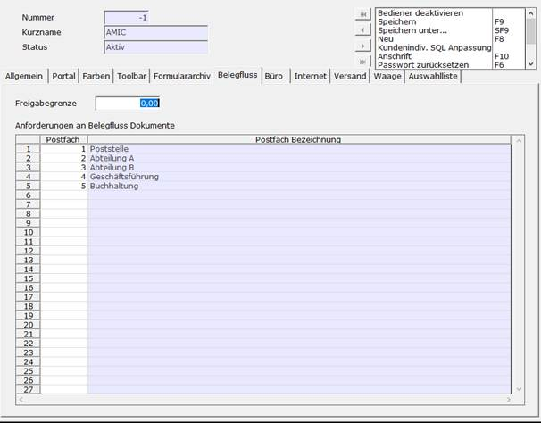
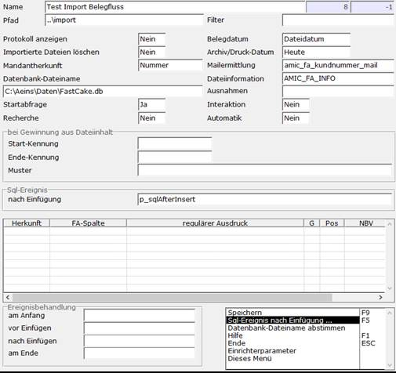

# Schritt 2 Konfiguration

<!-- source: https://amic.de/hilfe/_sfsbelegfluss2.htm -->

<details>
<summary>Schritt 2.1: Postfächer den Benutzern zuweisen</summary>

Damit Benutzer auf die Postfächer zugreifen können müssen diese dem Benutzer zugewiesen werden. Dafür mit dem Direktsprung [BD] den gewünschten Bediener auswählen, den Pfleger aufrufen (F5) und hier unter dem Reiter „Belegfluss“ die Postfächer hinzufügen (F3)



</details>

<details>
<summary>Schritt 2.2: Test Import</summary>

Um nun einen Datensatz in den Belegfluss zu importieren benutzt man den Direktsprung [FAI]. Im Archiv Import importiert man nun mit (F5) einen Datensatz.



Hier ist zu beachten, dass ein Name vergeben muss und der Pfad „..\\import“ mit einem Testpfad ausgetauscht werden muss (in diesem Pfad sollte sich eine Testdatei befinden). Ebenfalls muss man die Funktion Sql-Ereignis nach Einfügung aufrufen und folgende Prozedur einfügen:

```sql
create procedure
"admin"."p_sqlAfterInsert" ( in in_fa_id integer , in in_fa_mndnr integer )
begin
       insert into
formulararchivbelegfluss (fa_id, fa_mndnr, angefordert) values (in_fa_id,
in_fa_mndnr, 1)
end
```

Nachdem dies konfiguriert ist, speichert man den Datensatz mit (F9) ab.

</details>
