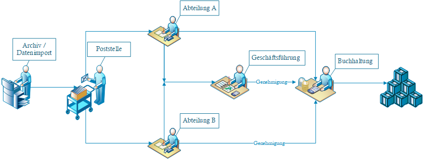
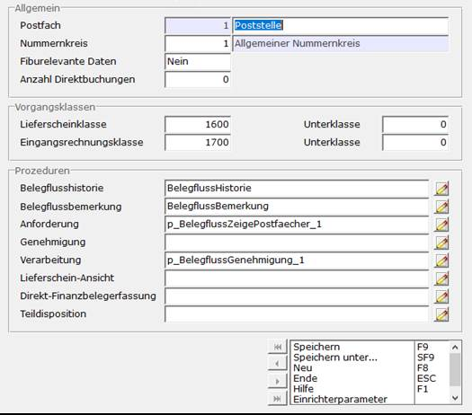
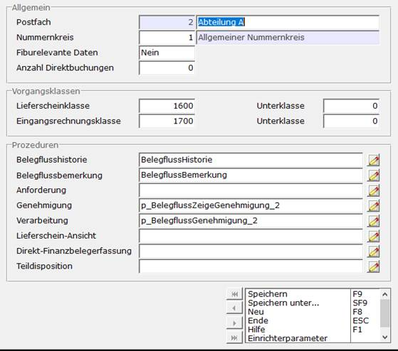
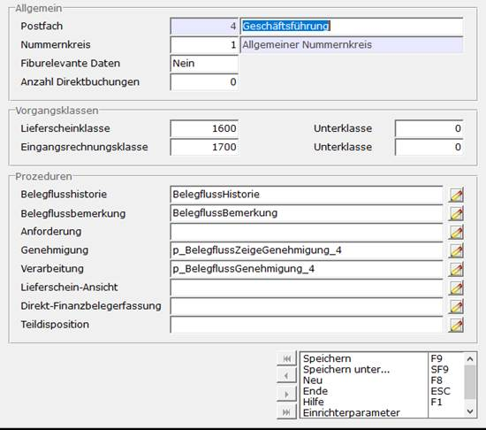
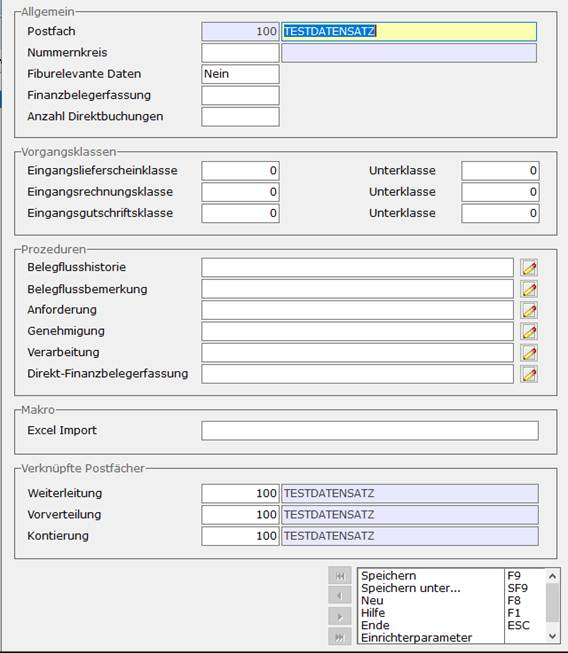

# Schritt 3 Einrichtung Fallbeispiel

<!-- source: https://amic.de/hilfe/_sfsbelegfluss3.htm -->

<details>
<summary>Schritt 3.1: Szenario</summary>

Um das Belegfluss Modul so effektiv wie möglich zu nutzen, muss man sich eine Aufteilung überlegen. Folgendes ist lediglich ein Beispielaufbau:



</details>

<details>
<summary>Schritt 3.2: Poststelle</summary>

In der Poststelle sollen alle Daten ankommen, um diese dort auf die Abteilungen aufzuteilen.



<p class="just-emphasize">Private Prozeduren:</p>

Datenbankvariable:

Um in einer privaten Prozedur festzustellen, mit welchem Postfach diese aufgerufen wurde, kann die Datenbankvariable DBVAR_BELEGFLUSS_POSTFACH verwendet werden. Diese Variable enthält die Postfach-ID und kann innerhalb der privaten Prozeduren abgefragt werden. Nach dem Verlassen der Maske wird die Datenbankvariable automatisch gelöscht.

Beispiel

```sql
declare dc_PostfachId
integer;
if VAREXISTS('DBVAR_BELEGFLUSS_POSTFACH') <> 0
then
  select DBVAR_BELEGFLUSS_POSTFACH into
dc_PostfachId;
  …
end if;
```

Anforderung:

```sql
CREATE PROCEDURE
"ADMIN"."p_BelegflussZeigePostfaecher_1" ()
result (nummer integer, bezeich char(255))
begin
  select postfach as nummer, PostfachBezeich as
bezeich
    from BelegflussPostfach
    where 1 = 1
      and Postfach in
(2,3)
EXCEPTION
  when others then call fehlerprotokoll (
in_text='Problem bei BelegflussZeigePostfaecher '||errormsg()||' '||traceback()
);
END
```

Verarbeitung:

```sql
CREATE PROCEDURE
"ADMIN"."p_BelegflussGenehmigung_1" ( in in_GenehmigungsStufe integer,
in in_fa_id integer,
in in_fa_mndNr integer,
in in_angefordert integer,
in in_neueHaken char(255),
in in_entfernteHaken char(255))
result (status char(255))
begin
  declare local temporary table
temp_PostfaecherNeu (postfach integer, primary key(postfach) ) on commit
preserve rows;
  declare local temporary table
temp_PostfaecherEntfernen (postfach integer, primary key(postfach) ) on commit
preserve rows;
  insert into temp_PostfaecherNeu (postfach) on
existing skip select trim(row_value) from sa_split_list(in_neueHaken,',');
  insert into temp_PostfaecherEntfernen (postfach)
on existing skip select trim(row_value) from
sa_split_list(in_entfernteHaken,',');
-- Prüfe ob die Gewählte Stufe überhaupt erlaubt ist.
Falls Nein muss ein Wert != '' zurückgegeben werden.
-- Setze GenehmigungsStufe
  if in_GenehmigungsStufe is not null then
    update formulararchivBelegfluss set
genehmigt=in_GenehmigungsStufe, GenehmigtWann=now(), GenehmigtUser=User where
fa_id = in_fa_id and fa_mndNr=in_fa_mndNr and angefordert = in_angefordert;
  end if;
-- Setze Postfächer wie auf Maske
  for a1 as a1 insensitive cursor for
    select postfach as this_postfach
from temp_PostfaecherNeu
  do
   insert into FormulararchivBelegfluss (
fa_id, fa_mndnr, angefordert ) on existing update values ( in_fa_id,
in_fa_mndNr, this_postfach );
  end for;
  for b1 as b1 insensitive cursor for
    select postfach as this_postfach
from temp_PostfaecherEntfernen
  do
   delete FormulararchivBelegfluss where
fa_id=in_fa_id and fa_mndnr=in_fa_mndNr and angefordert=this_postfach;
  end for;
-- Nachbehandlung
  case in_GenehmigungsStufe
    --wiedervorlage
    when 0 then
      select '';
      return;
    --genehmigt
    when 1 then
      -- kein Update damit
User und Zeitstempel gesetzt werden
      insert into
FormulararchivBelegfluss ( fa_id, fa_mndnr, angefordert ) on existing update
values ( in_fa_id, in_fa_mndNr, in_angefordert + 1 );
      delete
FormulararchivBelegfluss where fa_id = in_fa_id and fa_mndnr = in_fa_mndNr and
angefordert = in_angefordert;
      select '';
      return;
    --abgelehnt
    when 2 then
    -- kein Update damit User und
Zeitstempel gesetzt werden
      insert into
FormulararchivBelegfluss ( fa_id, fa_mndnr, angefordert ) on existing update
values ( in_fa_id, in_fa_mndNr, in_angefordert - 1 );
      delete
FormulararchivBelegfluss where fa_id = in_fa_id and fa_mndnr = in_fa_mndNr and
angefordert = in_angefordert;
      select '';
      return;
    --falsch zugeordnet
    when 3 then
    -- kein Update damit User und
Zeitstempel gesetzt werden
      insert into
FormulararchivBelegfluss ( fa_id, fa_mndnr, angefordert ) on existing update
values ( in_fa_id, in_fa_mndNr, in_angefordert - 1 );
      delete
FormulararchivBelegfluss where fa_id = in_fa_id and fa_mndnr = in_fa_mndNr and
angefordert = in_angefordert;
      select '';
      return;
  end;
EXCEPTION
  when others then call fehlerprotokoll (
in_text='Problem bei BelegflussGenehmigung '||errormsg()||' '||traceback()
);
  select 'Es ist ein Fehler aufgetraten. Bitte
prüfen Sie das Fehlerprotokoll';
  return;
END
```

</details>

<details>
<summary>Schritt 3.3: Abteilung A/B</summary>

In den Abteilungen soll man nun über das weitere Verfahren bestimmen (Ablehung/Genemigung/Weiterleitung/usw)



<p class="just-emphasize">Private Prozeduren A</p>

Genehmigung

```sql
CREATE PROCEDURE
"ADMIN"."p_BelegflussZeigeGenehmigung_2" ()
result (nummer integer, bezeich char(255))
begin
  select formlstwert as nummer, formlstbezeich as
bezeich
    from FormatList
    where FormLstKennung='af_genehmi'
      and formlstwert in
(0,1,2,3,4)
EXCEPTION
  when others then call fehlerprotokoll (
in_text='Problem bei BelegflussZeigeGenehmigung '||errormsg()||' '||traceback()
);
END
```

Verarbeitung

```sql
CREATE PROCEDURE
"ADMIN"."p_BelegflussGenehmigung_2" ( in in_GenehmigungsStufe integer,
in in_fa_id integer,
in in_fa_mndNr integer,
in in_angefordert integer,
in in_neueHaken char(255),
in in_entfernteHaken char(255))
result (status char(255))
begin
  declare local temporary table
temp_PostfaecherNeu (postfach integer, primary key(postfach) ) on commit
preserve rows;
  declare local temporary table
temp_PostfaecherEntfernen (postfach integer, primary key(postfach) ) on commit
preserve rows;
  insert into temp_PostfaecherNeu (postfach) on
existing skip select trim(row_value) from sa_split_list(in_neueHaken,',');
  insert into temp_PostfaecherEntfernen (postfach)
on existing skip select trim(row_value) from
sa_split_list(in_entfernteHaken,',');
-- Prüfe ob die Gewählte Stufe überhaupt erlaubt ist.
Falls Nein muss ein Wert != '' zurückgegeben werden.
-- Setze GenehmigungsStufe
  if in_GenehmigungsStufe is not null then
    update formulararchivBelegfluss set
genehmigt=in_GenehmigungsStufe, GenehmigtWann=now(), GenehmigtUser='::USER'
where fa_id = in_fa_id and fa_mndNr=in_fa_mndNr and angefordert =
in_angefordert;
  end if;
-- Setze Postfächer wie auf Maske
  for a1 as a1 insensitive cursor for
    select postfach as this_postfach
from temp_PostfaecherNeu
  do
   insert into FormulararchivBelegfluss (
fa_id, fa_mndnr, angefordert ) on existing update values ( in_fa_id,
in_fa_mndNr, this_postfach );
  end for;
  for b1 as b1 insensitive cursor for
    select postfach as this_postfach
from temp_PostfaecherEntfernen
  do
   delete FormulararchivBelegfluss where
fa_id=in_fa_id and fa_mndnr=in_fa_mndNr and angefordert=this_postfach;
  end for;
-- Nachbehandlung
  case in_GenehmigungsStufe
    --wiedervorlage
    when 0 then
      select '';
      return;
    --genehmigt
    when 1 then
      -- kein Update damit
User und Zeitstempel gesetzt werden
      insert into
FormulararchivBelegfluss ( fa_id, fa_mndnr, angefordert ) on existing update
values ( in_fa_id, in_fa_mndNr, 5 );
      delete
FormulararchivBelegfluss where fa_id = in_fa_id and fa_mndnr = in_fa_mndNr and
angefordert = in_angefordert;
      select '';
      return;
    --abgelehnt
    when 2 then
    -- kein Update damit User und
Zeitstempel gesetzt werden
      delete
FormulararchivBelegfluss where fa_id = in_fa_id and fa_mndnr = in_fa_mndNr and
angefordert = in_angefordert;
      select '';
      return;
    --falsch zugeordnet
    when 3 then
    -- kein Update damit User und
Zeitstempel gesetzt werden
      insert into
FormulararchivBelegfluss ( fa_id, fa_mndnr, angefordert ) on existing update
values ( in_fa_id, in_fa_mndNr, 0 );
      delete
FormulararchivBelegfluss where fa_id = in_fa_id and fa_mndnr = in_fa_mndNr and
angefordert = in_angefordert;
      select '';
      return;
    --Geschäftsführung
    when 4 then
    -- kein Update damit User und
Zeitstempel gesetzt werden
      insert into
FormulararchivBelegfluss ( fa_id, fa_mndnr, angefordert ) on existing update
values ( in_fa_id, in_fa_mndNr, 4 );
      delete
FormulararchivBelegfluss where fa_id = in_fa_id and fa_mndnr = in_fa_mndNr and
angefordert = in_angefordert;
      select '';
      return;
  end;
EXCEPTION
  when others then call fehlerprotokoll (
in_text='Problem bei BelegflussGenehmigung '||errormsg()||' '||traceback()
);
  select 'Es ist ein Fehler aufgetraten. Bitte
prüfen Sie das Fehlerprotokoll';
  return;
END
```

<p class="just-emphasize">Private Prozeduren B</p>

Genehmigung

```sql
CREATE PROCEDURE
"ADMIN"."p_BelegflussZeigeGenehmigung_3" ()
result (nummer integer, bezeich char(255))
begin
  select formlstwert as nummer, formlstbezeich as
bezeich
    from FormatList
    where FormLstKennung='af_genehmi'
--      and formlstwert in
(0,1,2,3,4)
EXCEPTION
  when others then call fehlerprotokoll (
in_text='Problem bei BelegflussZeigeGenehmigung '||errormsg()||' '||traceback()
);
END
```

Verarbeitung

```sql
CREATE PROCEDURE
"ADMIN"."p_BelegflussGenehmigung_3" ( in in_GenehmigungsStufe integer,
in in_fa_id integer,
in in_fa_mndNr integer,
in in_angefordert integer,
in in_neueHaken char(255),
in in_entfernteHaken char(255))
result (status char(255))
begin
-- Setze GenehmigungsStufe
  if in_GenehmigungsStufe is not null then
    update formulararchivBelegfluss set
genehmigt=in_GenehmigungsStufe, GenehmigtWann=now(), GenehmigtUser='::USER'
where fa_id = in_fa_id and fa_mndNr=in_fa_mndNr and angefordert =
in_angefordert;
  end if;
-- Nachbehandlung
  case in_GenehmigungsStufe
    --wiedervorlage
    when 0 then
      select '';
      return;
    --genehmigt
    when 1 then
      -- kein Update damit
User und Zeitstempel gesetzt werden
      insert into
FormulararchivBelegfluss ( fa_id, fa_mndnr, angefordert ) on existing update
values ( in_fa_id, in_fa_mndNr, 5 );
      delete
FormulararchivBelegfluss where fa_id = in_fa_id and fa_mndnr = in_fa_mndNr and
angefordert = in_angefordert;
      select '';
      return;
    --abgelehnt
    when 2 then
    -- kein Update damit User und
Zeitstempel gesetzt werden
      delete
FormulararchivBelegfluss where fa_id = in_fa_id and fa_mndnr = in_fa_mndNr and
angefordert = in_angefordert;
      select '';
      return;
    --falsch zugeordnet
    when 3 then
    -- kein Update damit User und
Zeitstempel gesetzt werden
      insert into
FormulararchivBelegfluss ( fa_id, fa_mndnr, angefordert ) on existing update
values ( in_fa_id, in_fa_mndNr, 1 );
      delete
FormulararchivBelegfluss where fa_id = in_fa_id and fa_mndnr = in_fa_mndNr and
angefordert = in_angefordert;
      select '';
      return;
    -- Geschäftsführung
    when 4 then
    -- kein Update damit User und
Zeitstempel gesetzt werden
      insert into
FormulararchivBelegfluss ( fa_id, fa_mndnr, angefordert ) on existing update
values ( in_fa_id, in_fa_mndNr, 4 );
      delete
FormulararchivBelegfluss where fa_id = in_fa_id and fa_mndnr = in_fa_mndNr and
angefordert = in_angefordert;
      select '';
      return;
  end;
EXCEPTION
  when others then call fehlerprotokoll (
in_text='Problem bei BelegflussGenehmigung '||errormsg()||' '||traceback()
);
  select 'Es ist ein Fehler aufgetraten. Bitte
prüfen Sie das Fehlerprotokoll';
  return;
END
```

</details>

<details>
<summary>Schritt 3.4: Geschäftsführung</summary>

Teilweise wird es nötig sein, der Geschäftsführung Daten vorzulegen.



<p class="just-emphasize">Private Prozeduren</p>

Genehmigung

```sql
CREATE PROCEDURE
"ADMIN"."p_BelegflussZeigeGenehmigung_4" ()
result (nummer integer, bezeich char(255))
begin
  select formlstwert as nummer, formlstbezeich as
bezeich
    from FormatList
    where FormLstKennung='af_genehmi'
      and formlstwert in
(0,1,2,3)
EXCEPTION
  when others then call fehlerprotokoll (
in_text='Problem bei BelegflussZeigeGenehmigung '||errormsg()||' '||traceback()
);
END
```

Verarbeitung

```sql
CREATE PROCEDURE
"ADMIN"."p_BelegflussGenehmigung_4" ( in in_GenehmigungsStufe integer,
in in_fa_id integer,
in in_fa_mndNr integer,
in in_angefordert integer,
in in_neueHaken char(255),
in in_entfernteHaken char(255))
result (status char(255))
begin
  declare local temporary table
temp_PostfaecherNeu (postfach integer, primary key(postfach) ) on commit
preserve rows;
  declare local temporary table
temp_PostfaecherEntfernen (postfach integer, primary key(postfach) ) on commit
preserve rows;
  insert into temp_PostfaecherNeu (postfach) on
existing skip select trim(row_value) from sa_split_list(in_neueHaken,',');
  insert into temp_PostfaecherEntfernen (postfach)
on existing skip select trim(row_value) from
sa_split_list(in_entfernteHaken,',');
-- Prüfe ob die Gewählte Stufe überhaupt erlaubt ist.
Falls Nein muss ein Wert != '' zurückgegeben werden.
-- Setze GenehmigungsStufe
  if in_GenehmigungsStufe is not null then
    update formulararchivBelegfluss set
genehmigt=in_GenehmigungsStufe, GenehmigtWann=now(), GenehmigtUser=user where
fa_id = in_fa_id and fa_mndNr=in_fa_mndNr and angefordert = in_angefordert;
  end if;
-- Nachbehandlung
  case in_GenehmigungsStufe
    --wiedervorlage
    when 0 then
      select '';
      return;
    --genehmigt
    when 1 then
      -- kein Update damit
User und Zeitstempel gesetzt werden
      insert into
FormulararchivBelegfluss ( fa_id, fa_mndnr, angefordert ) on existing update
values ( in_fa_id, in_fa_mndNr, in_angefordert + 1 );
      delete
FormulararchivBelegfluss where fa_id = in_fa_id and fa_mndnr = in_fa_mndNr and
angefordert = in_angefordert;
      select '';
      return;
    --abgelehnt
    when 2 then
    -- kein Update damit User und
Zeitstempel gesetzt werden
      delete
FormulararchivBelegfluss where fa_id = in_fa_id and fa_mndnr = in_fa_mndNr and
angefordert = in_angefordert;
      select '';
      return;
    --falsch zugeordnet
    when 3 then
    -- kein Update damit User und
Zeitstempel gesetzt werden
      insert into
FormulararchivBelegfluss ( fa_id, fa_mndnr, angefordert ) on existing update
values ( in_fa_id, in_fa_mndNr, 1 );
      delete
FormulararchivBelegfluss where fa_id = in_fa_id and fa_mndnr = in_fa_mndNr and
angefordert = in_angefordert;
      select '';
      return;
  end;
EXCEPTION
  when others then call fehlerprotokoll (
in_text='Problem bei BelegflussGenehmigung '||errormsg()||' '||traceback()
);
  select 'Es ist ein Fehler aufgetraten. Bitte
prüfen Sie das Fehlerprotokoll';
  return;
END
```

</details>

<details>
<summary>Schritt 3.5: Buchhaltung</summary>

Die Buchhaltung ist die Letzte Instanz. Hier muss eine Individuelle Lösung für den Verbleib der Daten gefunden werden.



<p class="just-emphasize">Private Prozeduren</p>

Hier sind die Prozeduren nicht von Bedeutung, da die Lösung in jedem Fall individuell sein muss.

</details>
