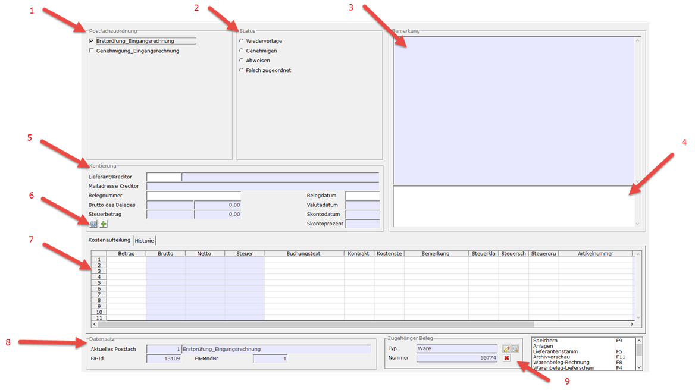

# Schritt 4 Benutzeroberfläche

<!-- source: https://amic.de/hilfe/_sfsbelegfluss4.htm -->

Abhängig, wie das Postfach eingerichtet ist, werden die Postfachzuordnung und Status angezeigt, oder ausgeblendet.

1. Postfachzuordnung

Wird nur angezeigt, wenn im Postfach die [Prozedur](../belegfluss_modul/belegfluss_variante_4_postfacheinrichtung/belegfluss_postfacheinrichtungspfleger.md) Anforderung hinterlegt ist. Hier kann unter den in der Prozedur vorselektierten Postfächer frei ausgewählt werden, wo das Dokument landen soll.

Dies ist meist in der Poststelle Sinnvoll, welche den Beleg beispielsweise einer Abteilung zuordnet.

2\. Status

Wird nur angezeigt, wenn im Postfach die [Prozedur](../belegfluss_modul/belegfluss_variante_4_postfacheinrichtung/belegfluss_postfacheinrichtungspfleger.md) Genehmigung hinterlegt ist. Hier wird der Status eines Dokuments aktualisiert. In der Weiterverarbeitung ist dann hinterlegt, wo das Dokument als nächstes landet.

Wenn ein Abteilungsleiter ein Dokument genehmigt, könnte dies beispielsweise an die Buchhaltung weitergeleitet werden.

**Es wird empfohlen sich bei jedem Postfach zu entscheiden, ob die Postfachzuordnung oder der Status für die Weiterleitung genutzt wird.**

3 & 4. Bemerkung

In Fenster 3 werden alle Bemerkungen, welche in Fenster 4 erfasst wurden, dargestellt. Die Formatierung der Darstellung kann in der Prozedur „Belegflussbemerkung“ angepasst werden

5 & 7. Kontierung

Hier können Daten für die Kontierung erfasst werden. Diese werden bei der Erzeugung von Warenbelegen bzw. Fibubelegen als Grundlage genutzt. Hierbei handelt es sich lediglich um eine Erfassungshilfe. Nachträgliche Änderungen in den Belegen werden nicht übertragen. Nach dem Erzeugen eines Belegs ist es nicht mehr möglich die Felder zu editieren.

6\. Kontierung-Vorlage

Mit dem i-Button lassen sich gespeicherte Vorlagen auswählen. Sollte bereits ein Kunde ausgewählt sein, werden auch nur die Vorlagen des entsprechenden Kunden angezeigt.

Mit dem +-Button lässt sich der Vorlagen-Pfleger öffnen. Die aktuelle Belegung wird übernommen. Auf diese Weise lassen sich Vorlagen schnell erfassen. Die Verwaltung der Vorlagen läuft über Variante 5.

8\. Datensatz

Eindeutige Identifikation des Datensatzes. Fa-Id und Fa-MndNr definieren hierbei das Dokument.

9\. Zugehöriger Beleg

Hier wird der Beleg angezeigt, welcher zu dem Dokument erstellt wurde. Mit den Buttons (oder OB-Funktionen) lässt sich der Beleg ansehen/ändern/stornieren. Dies funktioniert für Fibu- und Warenbelege.
