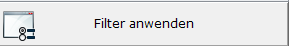

# Dokumentenverwaltung Filter

<!-- source: https://amic.de/hilfe/dokumentenverwaltungfilter.htm -->

Mit Hilfe der Filter lassen sich gängige Recherchen durchführen und sitzungsübergreifend speichern.

Jeder Filter wird mit entsprechendem „Abhack-Kästchen“ aktiviert bzw. deaktiviert.

Der Filter selber wird mittels  aktiviert.

| Filter | | |
| --- | --- | --- |
| Volltextrecherche | Siehe  
[Volltext Recherche](../../archiv_administration/anwendung_formulararchiv/archiv_aendern_ansehen.md) | Die Dokumente werden zusätzlich hinsichtlich der Volltext-Recherche-Möglichkeiten geprüft. |
| Kundennummer | Von – Bis | Wird ein Feld nicht ausgefüllt wird jeweils die kleinste bzw. größte Kundennummer angenommen.  
Möchte man z.B. ausschließlich nach dem Kunden 12000 suchen müssen beide Felder mit 12000 gefüllt sein. |
| Archivdatum Tage zurück | Es werden dann nur die Archiv-Einträge berücksichtigt deren Archiv/Druckdatum um so viele Tage zurückliegt. | |
| Datum | Von - Bis | Man kann Monat bzw. Jahr weglassen, dann wird dafür das aktuelle angenommen.  
Für das jeweils aktuelle Tagesdatum kann man HEUTE bzw TODAY einsetzen. |
