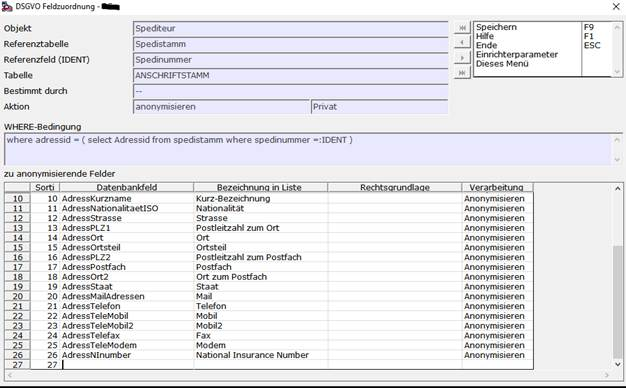

# DSGVO Feldzuordnung

<!-- source: https://amic.de/hilfe/dsgvofeldzuordnung.htm -->

Hauptmenü > Stammdatenpflege > Anschriften > DSGVO

Direktsprung **[DSGVO]** Variante DSGVO-Feldzuordnung.

Nicht alle Felder müssen oder dürfen anonymisiert werden.

In der Variante „DSGVO-Feldzuordnung“ werden alle Objekte und die dazugehörigen Felddefinitionen angezeigt.

Der Bearbeitungsdialog zeigt im oberen Bereich die Objektdefinition. Die zugeordneten Felder werden in der unteren Tabelle dargestellt:

| Spalte | Bedeutung |
| --- | --- |
| Sortierung | Gibt die Reihenfolge an, in der die Felder auf der Liste erscheinen. Um z.B. das Feld Geburtstag vor dem Feld AdressGeburtsLandISO auszudrucken, würde man beim Geburtstag eine 2 eintragen. Das Feld wird dann in diese Zeile eingefügt und alle weiteren Felder werden nach hinten verschoben  |
| Datenbankfeld | Name des Feldes in der Datenbank. Eine Auswahl ist mit F3 möglich. In dieser Auswahl werden nur die Felder angeboten, die noch nicht eingetragen sind. Sind die Felder von AMIC vorgegeben, so lässt sich diese Zelle nicht ändern.  |
| Bezeichnung in der Liste | Die Bezeichnung, die vor dem Wert steht. Wird keine Bezeichnung angegeben, dann wird die Bezeichnung des Datenbankfeldes angedruckt.  |
| Rechtsgrundlage  | Hier kann hinterlegt werden, aufgrund welcher Rechtsgrundlage die Anonymisierung erfolgt. |
| Verarbeitung  | Hier existieren zwei Auswahlmöglichkeiten: • Nur Auskunft: Das Feld wird in der Liste angedruckt, jedoch bei der Anonymisierung ignoriert, • Anonymisieren: Das Feld wird sowohl in der Liste angedruckt, als auch bei der Anonymisierung verarbeitet.  |

Um Felder aus dieser Liste zu entfernen kann man Zeilen mit der Tastenkombination Strg+Umschalt+Entf entfernen, die Zeile wird dann grau hinterlegt. Die Löschung kann mit derselben Tastenkombination wieder aufgehoben werden.
