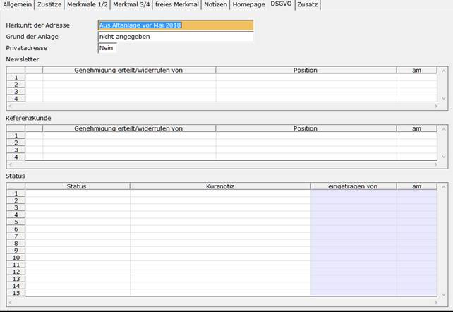

# Zusätzliche DSGVO-Information im Anschriftenstamm

<!-- source: https://amic.de/hilfe/zustzlichedsgvoinformationiman.htm -->

Auf dem Anschriftenpfleger erscheint bei allen von der DSGVO betroffenen Anschriften ein weiterer Reiter mit der Überschrift DSGVO. Dieser Reiter lässt sich mit dem Einrichterparameter auf der Maske Anschriften „Soll die Registerkarte DSGVO versteckt werden?“ ausblenden. Dieser Einrichterparameter gilt auch für die Maske STDADR.

| | Bedeutung |
| --- | --- |
| Herkunft der Adresse | Hier steckt das Anwenderformat „AF_DSGVOHERK“ hinter, welches vom Anwender individuell gepflegt werden kann. Der Wert 0 ist mit „Aus Altanlage vor Mai 2018“ vorbelegt.  |
| Grund der Anlage | Hier steckt das Anwenderformat „AF_DSGVOHERK“ hinter, welches vom Anwender individuell gepflegt werden kann. Der Wert 0 ist mit „nicht angegeben“.  |
| Privatadresse | Hier kann hinterlegt werden, ob es sich bei dieser Adresse ggf. um eine private Adresse handelt. Der Wert ist mit „Nein“ vorbelegt.  |
| Newsletter | In dieser Tabelle wird mit Historie eingetragen, ob der Kunde einen Newsletter haben möchte oder nicht. Einmal gespeicherte Daten können nicht mehr gelöscht werden. Es muss dann eine weitere Zeile mit der Änderung erfasst werden.  |
| Genehmigung erteilt/widerrufen von | Hier kann der Namen desjenigen eingetragen werden, der die Genehmig erteilt bzw. widerrufen hat. |
| Position | Welche Position bekleidet derjenige. Eine Auswahl ist mit F3 möglich. Das Anwenderformat „AF_ZUSTAENDI“ kann individuell erweitert werden.  |
| Am | Das Datum der Genehmigung/ des Widerrufs wird mit dem Tagesdatum vorbelegt |
| Referenzkunde | In dieser Tabelle wird mit Historie eingetragen, ob der Kunde zugestimmt hat als Referenzkunde geführt zu werden. Einmal gespeicherte Daten können nicht mehr gelöscht werden. Es muss dann eine weitere Zeile mit der Änderung erfasst werden.  |
| Genehmigung erteilt von | Hier kann der Namen desjenigen eingetragen werden, der die Genehmig erteilt bzw. widerrufen hat.  |
| Position | Welche Position bekleidet derjenige. Eine Auswahl ist mit F3 möglich. Das Anwenderformat „AF_ZUSTAENDI“ kann individuell erweitert werden.  |
| Am | Das Datum der Genehmigung/ des Widerrufs wird mit dem Tagesdatum vorbelegt  |
| Status | Hier kann festgehalten werden, was alles im Sinne der DSGVO mit dieser Adresse geschehen ist. Bei der F3-Auswahl handelt es sich um das Anwenderformat „AF_DSGVOSTAT“. Folgende Ausprägungen sind von AMIC vorgegeben.   <ul><li>&nbsp;&nbsp;&nbsp; Unbearbeitet</li><li>&nbsp;&nbsp;&nbsp; Vertrag versendet</li><li>&nbsp;&nbsp;&nbsp; Vertrag telefonisch besprochen</li><li>&nbsp;&nbsp;&nbsp; Vertrag rechtliche Prüfung</li><li>&nbsp;&nbsp;&nbsp; Vertrag unterschrieben zurück</li><li>&nbsp;&nbsp;&nbsp; Vertrag verweigert</li><li>&nbsp;&nbsp;&nbsp; Antrag zur Auskunft</li><li>&nbsp;&nbsp;&nbsp; Auskunft gedruckt</li><li>&nbsp;&nbsp;&nbsp; Auskunft versendet</li><li>&nbsp;&nbsp;&nbsp; Antrag auf Anonymisierung</li><li>&nbsp;&nbsp;&nbsp; Anonymisiert &nbsp; Beim Aufruf der Funktion zum Anonymisieren bzw. beim Druck der DSGVO-Liste werden automatisch Protokolleinträge erzeugt. &nbsp;</li></ul> |
| Kurznotiz | Hier kann eine kurze Notiz hinterlegt werden.  |
| Eingetragen von | Wird vom Programm automatisch mit dem Anwender ausgefüllt, der den Protokolleintrag erzeugt hat.  |
| am | Das Datum, an dem der Protokolleintrag erzeugt wurde.  |

Siehe auch:

- [DSGVO Suche](./dsgvo_suche.md)
