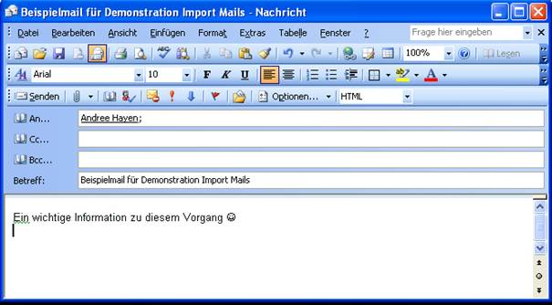
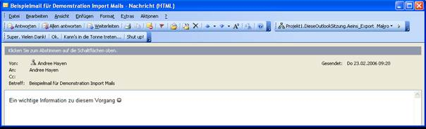
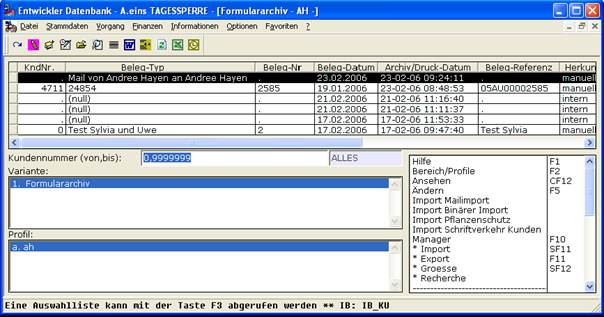
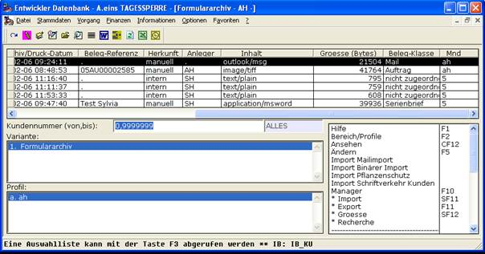
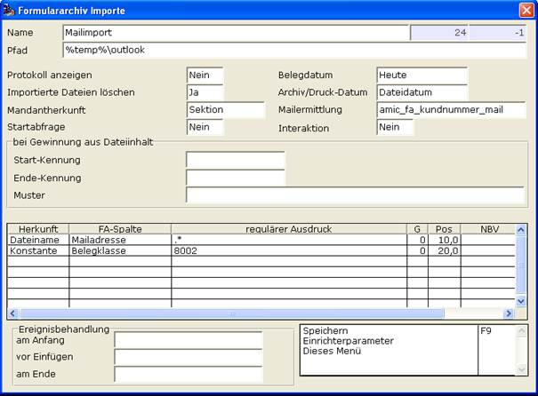

# Anwendungsbeispiel Outlook

<!-- source: https://amic.de/hilfe/_anwendungsbeispielou.htm -->

Hier soll nun die Fähigkeit, einen externen Import ins Formulararchiv mittels eingehender Mail via Outlook, demonstriert werden.

Dazu kopiert man sich unten folgendes Outlook-Script in die VBAProjekt.OTM und passt in der Zeile 2 den Parameter auf sie Sektion an mit seinem eigenen Mandanten/Sektion-Namen. In Zeile 3 kann – muss aber nicht – der Arbeitspfad angepasst werden; er sollte aber auf jedem Falle vorhanden sein. Bitte denken Sie daran in vorher anzulegen.

Wichtig ist die Zeile 3, in der die Ident des Imports anzugeben ist. In meinem Beispiel ist es die 24.

Als weitere vorbereitende Maßnahme sollten Sie – falls noch nicht geschehen – das COM-Objekt A.eins einmalig registrieren, das geschieht durch den Aufruf / Kommandozeile im Bin-Verzeichnis von A.eins

Aeins.exe welcome ServerInstall=true

```vbnet
Public Sub Aeins_Export()
  Dim Aeins_Verbindung As String: Aeins_Verbindung
= "section=ah"
  Dim Aeins_ImportPfad As String: Aeins_ImportPfad
= "c:\temp\outlook"
  Dim Aeins_ImportProfil As Integer:
Aeins_ImportProfil = 24
  Dim myOlApp As Object: Set myOlApp =
CreateObject("Outlook.Application")
  Dim myItem As Outlook.Inspector: Set myItem =
myOlApp.ActiveInspector
  If TypeName(myItem) = "Nothing" Then
    MsgBox "Kein aktives
Mailfenster!"
    GoTo raus
  End If
  Dim objItem As Object: Set objItem =
myItem.CurrentItem
  Dim SenderEmailAddress As String
  If objItem.SenderEmailType = "SMTP" Then
    SenderEmailAddress =
objItem.SenderEmailAddress
  Else
    SenderEmailAddress =
objItem.SenderName
  End If
  ' ersetze @ durch .
  SenderEmailAddress = Replace(SenderEmailAddress,
"@", ".")
  Dim Aeins As Object: Set Aeins =
CreateObject("AMIC.Aeins")
  If Aeins Is Nothing Then
    MsgBox "Es besteht keine
Aeins-Verbindung!"
    GoTo raus
  End If
  Dim Connect As Boolean: Connect =
Aeins.Connect(Aeins_Verbindung)
  If Connect = False Then
    MsgBox "Connect zur Datenbank
fehlgeschlagen!"
    GoTo ende
  End If
  Dim hdl As String: hdl = "outlook is
calling"
  Aeins.jpp_new hdl, "JFileSystem"
  Aeins.jpp_in hdl, "DIR", Aeins_ImportPfad
  Aeins.jpp_do hdl, "DirectoryCreate"
  Aeins.jpp_delete hdl
  objItem.SaveAs Aeins_ImportPfad & "\" &
SenderEmailAddress & ".msg", olMSG
  Aeins.jpp_new hdl, "JFA_Import"
  Aeins.jpp_in hdl, "fai_id",
Aeins_ImportProfil
  Aeins.jpp_in hdl, "fai_pfad",
Aeins_ImportPfad
  Aeins.jpp_in hdl, "receiver",
objItem.ReceivedByName
  Aeins.jpp_do hdl, "Free_Import"
  Aeins.jpp_delete hdl
ende:
  Aeins.Quit
raus:
End Sub
```

Dann wird eine Beispielmail verfasst.



Die ankommende Mail erscheint wie folgt



Man sieht rechts oben einen Knopf, an den ich das Outlook-Makro gebunden habe.

Dieser wird betätigt und ein eventueller Warnhinweis von Outlook bestätigt.

Im Formulararchiv von A.eins ist nun folgender Eintrag zu finden:





Die Mail lässt sich nun wie gehabt ansehen

Zuständig war folgendes Profil:



Das besondere hierbei ist eben die „24“, die dem Outlook-Script mitgeteilt werden muss und zum anderen die feste Zuweisung der Belegklasse 8002 an diesen Vorgang; es handelt sich ja um Mail.

Interessant ist nun hierbei noch die Ermittlung der Kundennummer aus der Mailadresse.

Das System ist anwenderfreundlich aufgebaut, es stellt also eine Standard-Funktionalität zur Verfügung (in diesem Falle eine Datenbank-Funktion), die dann ggf. nach den eigenen Vorstellungen bzw. Sachzwängen modelliert werden kann.

Amic_fa_kundnummer_mail ist so gestrickt:

```sql
CREATE FUNCTION AMIC_FA_KUNDNUMMER_MAIL
( IN
 in_MailAdresse varchar(200) )
returns integer
BEGIN
  DECLARE
fetch_kundnummer integer;
  select first
k.kundnummer into fetch_kundnummer
  from
kundenstamm k join anschriftstamm a
on k.kundid = a.adressnummer
  where
a.adressmailadress = in_MailAdresse;
  return
fetch_kundnummer;
 END
```

An Hand der Mail-Adresse wird also die Kundennummer ermittelt.

Ist also die Mail-Adresse beim Kunden hinterlegt, so kann sie auch gefunden werden.
