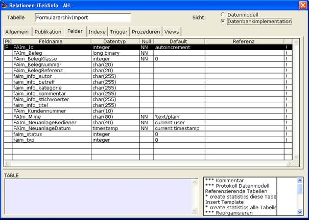

# Relation Formulararchivimport

<!-- source: https://amic.de/hilfe/_relationformulararch.htm -->

Die „Hinzufügen“-Technologie bedient sich der Technik eine interne Relation Formulararchivimport via ODBC-Methoden zu füllen. Diese Relation wird entweder vom Mandantenserver oder per Funktion dazu benutzt die Daten dann endgültig ins Formulararchiv zu stellen.



Per Funktion kann dieser Import per „^jpl fa_exec externerimport“ ausgelöst werden.

Es handelt sich dabei dann um eine JPP-Methode

```text
call JPP_NEW( "FAI" ,
"JFA_Import"  )
call JPP_EX ( "FAI" , "Auto_Import" )
call JPP_DELETE( "FAI"
)
```

Diese steht somit also auch „extern“ zur Verfügung.
