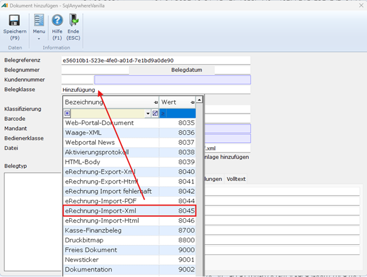
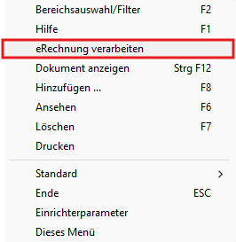

# Manueller Import

<!-- source: https://amic.de/hilfe/manuellerimport.htm -->

In der Archivvariante können manuell XML-Dateien zum Archiv hinzugefügt werden.

Verwenden Sie dazu die Funktion Hinzufügen die Belegklasse 8045 (eRechnung-Import-Xml) bzw 8044 (ZUGFerD-Pdf) ***(ab Herbstversion 2025).***

Mit der Funktion eRechnung verarbeiten kann nun manuell das Xml bzw. Pdf eingelesen und in die Importtabellen geschrieben werden.

