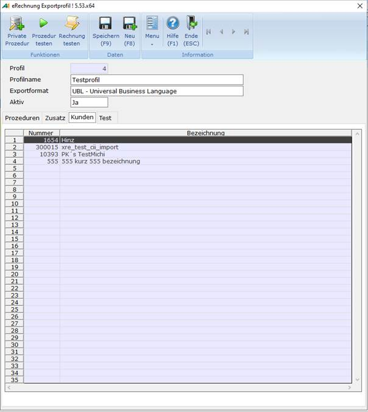

# Oberfläche – Kunden

<!-- source: https://amic.de/hilfe/_oberflaechekunden.htm -->

Auf der Registerkarte ***Kunden*** werden die Kunden angezeigt, bei welchen dieses Profil und die damit verbundenen Prozeduren greifen sollen.

Um hier einen Kunden zuzuordnen muss im Kundenstamm **[KU]** auf dem Register ***eRechnung*** das entsprechende Profil angegeben werden.

Im Modus ***Neu*** ist die Registerkarte nicht vorhanden.

Auf der Registerkarte ***Kunden*** sind folgende Felder zu sehen:

  <table>
    <tbody>
      <tr>
        <td colspan="2">
          
<strong>Felder</strong>

        </td>
      </tr>
      <tr>
        <td>
          
Nummer

        </td>
        <td>
          
Die Kundennummer des Kunden

        </td>
      </tr>
      <tr>
        <td>
          
Bezeichnung

        </td>
        <td>
          
Die Bezeichnung des hinterlegten Kunden

        </td>
      </tr>
    </tbody>
  </table>

