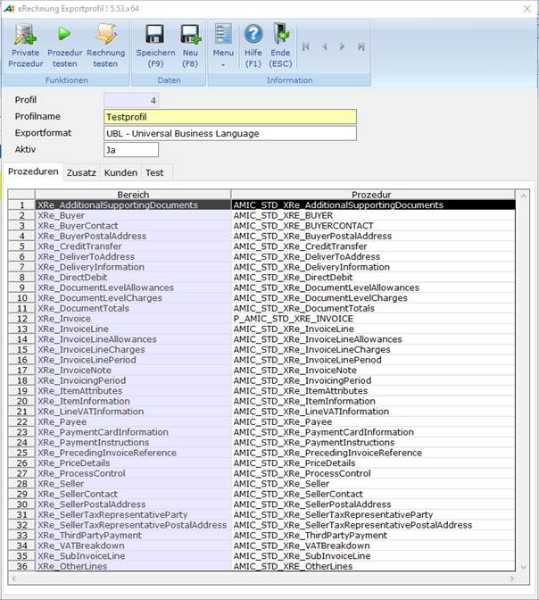

# Oberfläche - Startseite

<!-- source: https://amic.de/hilfe/oberflchestartseite.htm -->

Auf der Startmaske sind folgende Felder zu sehen:

| Felder |
| --- |
| Profil | (In allen Modi außer <strong>*Neu):*</strong> Id des Profils |
| Profilname | Hier wird der Name des Profils hinterlegt. |
| Exportformat | Wählen Sie das Format aus, in dem die eRechnung exportiert werden soll. Zur Auswahl stehen: • UBL • ZugFeRD / CII ***ab Herbstversion 2025*** |
| Aktiv | Legen Sie fest mit der Optionsauswahl ***Ja*** oder ***Nein***, ob dieses Profil aktiviert ist. |
| Bereich | Geben Sie alle Bereiche (Relationen) an, welche für die eRechnung befüllt werden können. |
| Prozedur | Wählen Sie eine Prozedur aus, welche die Informationen für den entsprechenden Bereich sammelt. |

Im ***Ändern***\-Modus gibt es zusätzlich die Funktionen:

| Funktionen |
| --- |
| Private Prozedur | Von der zuletzt markierten Prozedur wird eine private Prozedur erstellt, welche ggf. angepasst werden kann. Falls dort schon eine private Prozedur hinterlegt wurde, wird diese zum Bearbeiten geöffnet. |
| Prozedur testen | Die zuletzt markierte Prozedur wird getestet. Dabei nimmt er die auf dem Testreiter hinterlegten **Ids** am Ende der Maske und stellt für diese Vorgänge oder Warenbewegungen die Ergebnisse dar. Damit können entweder die Prozeduren oder die **Ids** auf ihre Richtigkeit bzw. Vollständigkeit getestet werden. |
| Rechnung testen | Eine komplette eRechnung wird erstellt und anschließend geöffnet. Dabei ist dies allerdings ein Test, somit werden sämtliche nachfolgende Effekte oder Informationen rückgängig gemacht. |
