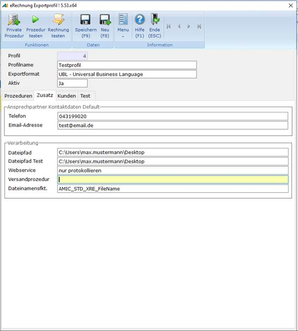

# Oberfläche - Zusatz

<!-- source: https://amic.de/hilfe/oberflchezusatz.htm -->

Auf der Registerkarte ***Zusatz*** werden die weiteren Daten zum Kunden sowie zur Verarbeitung angezeigt.

Auf dem Register ***Zusatz*** sind folgende Felder zu sehen:

| Ansprechpartner Kontaktdaten Default |
| --- |
| Telefon | Die Telefonnummer des Ansprechpartners, wenn nicht im Bediener hinterlegt. |
| E-Mail-Adresse | Die E-Mail-Adresse des Ansprechpartners, wenn nicht im Bediener hinterlegt. |

Der Ansprechpartner stellt eine Person im eigenen Unternehmen dar, welche Sie bei Fragen oder Problemen zu dieser Rechnung kontaktieren können.

| Verarbeitung |
| --- |
| Dateipfad | Dort werden die erstellten XMLs hinterlegt. |
| Dateipfad Test | Dort werden die XMLs hinterlegt, welche durch die Funktion ***Rechnung testen*** erstellt wurden. |
| Webservice | Ob die eRechnung an einen Webservice zur Verifikation weitergeleitet wird, dabei gibt es folgende Möglichkeiten:  
**0** - nicht durchführen: Das erzeugte Xml wird nicht zur Verifikation an den Webservice gesendet.  
**1** - nur protokollieren: Das erzeugte Xml wird zur Verifikation an den Webservice gesendet, das Ergebnis wird aber lediglich protokolliert.   
**2** - immer beachten: Das erzeugte Xml wird immer an den Webservice gesendet - schlägt die Verifikation fehlt, wird der Export sofort wieder gelöscht, nur archiviert. |
| Versandprozedur | (! Nur im Exportformat UBL !)  
Hier kann eine Versandprozedur angegeben werden. Diese muss zwei Eingabeparameter haben. Diese sind die **Fa_id** und die **Fa_MndNr** des Archiveintrags, der nach der Erstellung versendet werden soll. Die Ziel-Mailadresse wird hier drin ermittelt und der Versandprofilstammeintrag u. U. fest verdrahtet eingetragen. |
| Dateinamensfkt. | Hier kann eine Datenbankfunktion zur Findung des Dateinamens eingetragen werden. Als Standard gilt „AMIC_STD_XRE_Filename“. |
