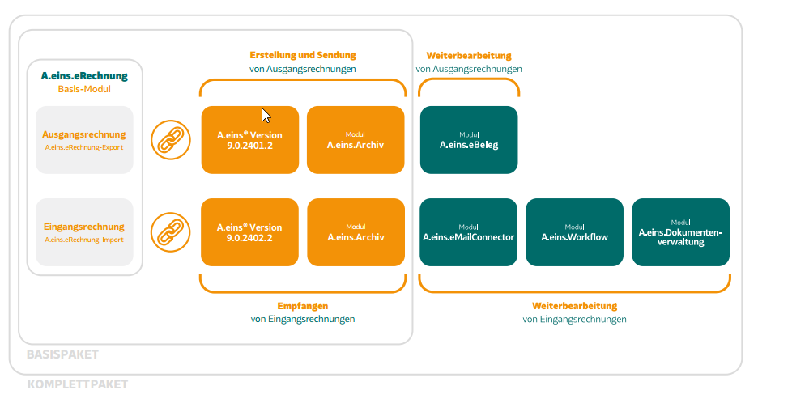

# eRechnung

<!-- source: https://amic.de/hilfe/_!erechnung1.htm -->

Hauptmenü > Stammdatenpflege > Konstanten Kundenstamm

Hauptmenü Direktsprung **[XRE]**

Das Modul A.eins.® eRechnung basiert auf dem gesetzlich vorgeschriebenen XRechnung-Standard, der den strukturierten, elektronischen Austausch von Rechnungsdaten ermöglicht.

Die eRechnung ermöglicht die automatische Erstellung und Vorverarbeitung von B2B-Rechnungen, was Ihre Durchlaufzeiten optimiert, die Effizienz steigert und Fehler reduziert.

Dabei werden die gesetzlichen Anforderungen aus der **EN16931** berücksichtigt.

.

Dabei wird folgendes Format unterstützt für Export und Import: 

è **UBL-XML** - Dateien – Universal Business Language. Entwickelt von OASIS (Organization for the Advancement of Structured Information Standards), ist ein auf XML basierender Standard für den Austausch von elektronischen Dokumenten wie Rechnungen, Bestellungen und Lieferscheinen.

Für den Import wird dazu das folgende Format unterstützt: 

è **ZUGFeRD** Zentraler User Guide des Forums elektronische Rechnung Deutschland, das gemäß der Richtlinie EU/2014/55 und des Standards EN16931 UN/CEFACT-**XML** in **PDF**/A-3-Dateien einbettet.

Überblick eRechnung-Modulpakete

Die folgenden Modulpaketen der eRechnung stehen Ihnen bei Lizenzierung zur Verfügung:

Sie möchten Ihren eingehende eBelege automatisiert weiterverarbeiten und Ihre Geschäftsprozesse verschlanken?

Mit dem Komplettpaket bieten wir Ihnen auf Ihre Geschäftsprozesse zugeschnittene Lösungen.

Siehe auch:

- [Allgemeine Hinweise](./allgemeine_hinweise.md)
- [Pflege von Basisdaten](./pflege_von_basisdaten.md)
- [eRechnung – Profilpfleger](./erechnung_profilpfleger/index.md)
- [eRechnung - Export](./erechnung_export/index.md)
- [eRechnung - Import](./erechnung_import/index.md)
- [eRechnung – im Archiv](./erechnung_im_archiv/index.md)
