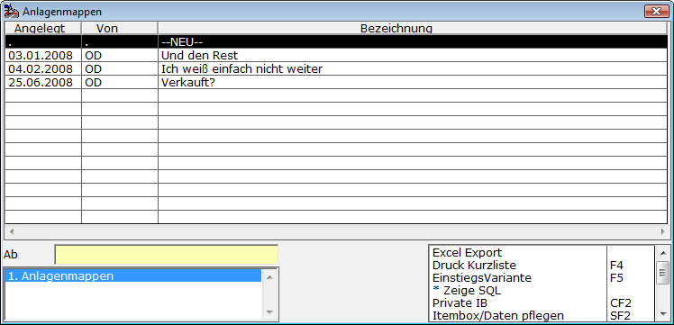
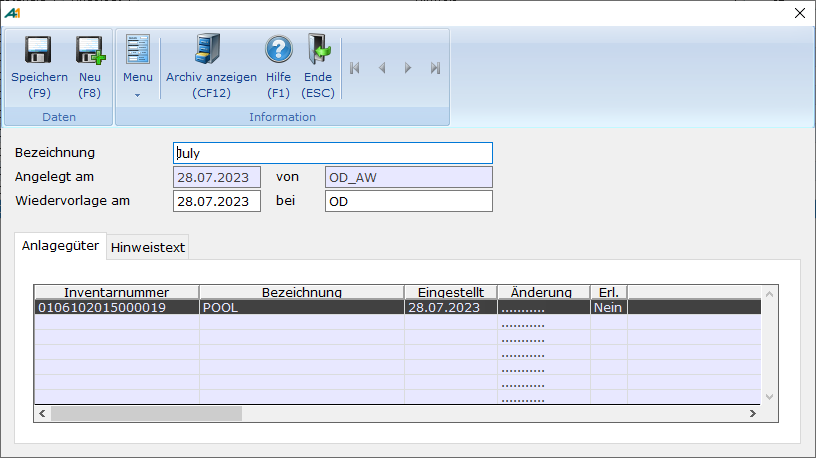

# Anlagenmappe

<!-- source: https://amic.de/hilfe/_anlagenmappe.htm -->

Hauptmenü > Anlagenbuchhaltung > Anlagenbuchhaltung > Anlagenmappen

Direktsprung **[ANKAM]**

Die Anlagenmappen dienen dazu, Anlagegüter, bei denen Fragen zu klären sind bzw. die zur Vorlage bei einem Kollegen zusammengefasst werden sollen, in Gruppen bzw. „Mappen“ zusammen zu stellen und sie für ein bestimmtes Datum für den Kollegen auf Wiedervorlage zu setzen.

Um eine Mappe zu erstellen geht man wie folgt vor:

In der Auswahlliste für den [Anlagenstamm](./anlagenstamm.md) markiert man die Anlagengüter, die zu einer Mappe zusammengefasst werden sollen. Sind ein oder mehrere Anlagengüter markiert steht eine Funktion „Zur Mappe hinzufügen“ zur Verfügung. Wenn man diese Funktion auswählt öffnet sich eine Itembox, in der man entweder diese Anlagenguter zu bestehenden Mappen hinzufügen kann oder eine Neue Mappe anlegen kann.

Der Punkt NEU sorgt dafür, dass eine neue Mappe angelegt wird. Es öffnet sich folgendes Fenster

| | Bedeutung |
| --- | --- |
| Bezeichnung  
 | Hier trägt man einen eindeutigen Text ein, der die Identifizierung erleichtert.  
 |
| Angelegt am / von  
 | Hier steht das Datum, an dem die Mappe erstellt wurde bzw. der Benutzer, der sie angelegt hat. Beide werden vom System eingetragen und sind nicht änderbar.  
 |
| Wiedervorlage am / bei  
 | Hier wird ein Datum eingetragen, an dem die Mappe bei dem Kollegen der unter “bei“ eingetragen wurde vorgelegt wird. An dem Datum erscheint dann, wenn dieser Anwender sich neu anmeldet unter dem Menü Favoriten ein Punkt „Wiedervorlage vorhanden“. Ist kein Anwender unter „bei“ eingetragen, wird keine Funktion ausgelöst.  
 |
| Hinweistext  
 | Hier trägt man ein, was zu klären ist.  
 |

Nachdem man diese Mappe gespeichert hat, kann man sie unter dem Menüpunkt „Anlagenmappen“ bearbeiten. Dort erscheint dann wieder das bekannte Fenster, nur dass jetzt eine weitere Registerkarte mit den Anlagegütern erscheint.

Durch Doppelklick auf eine Zeile oder durch Drücken der Funktionstaste **F5** öffnet sich die Erfassungsmaske zu diesem Anlagegut. Dort können dann sofort Änderungen vorgenommen werden oder lediglich unter „Allgem.Hinweise“ Antworten auf offenen Fragen eingetragen werden.

In der Spalte „Änderung“ wird das letzte Änderungsdatum festgehalten.

In der Spalte „Erl.“ wie „Erledigt“ kann mit **Umschalt+F9** gekennzeichnet werden, ob alle Fragen geklärt sind. Das Kennzeichen kann so auch wieder auf „Nein“ - also nicht erledigt - gestellt werden.

Mit der Funktion ***„Aus Mappe entfernen“*** **F7** kann ein fälschlich in eine Mappe geratener Eintrag wieder gelöscht werden. Man kann sich auch überlegen, ob man statt des Erledigungskennzeichens lieber die Zeile löscht.

Die Funktion „***Archiv anzeigen***“ **CF12** zeigt alle zu dem jeweiligen Anlagegut existierenden Einträge im Archiv an.
