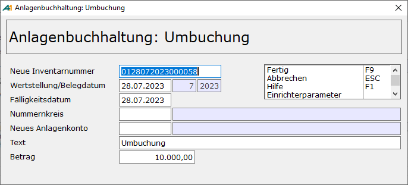

# Anlagenstamm

<!-- source: https://amic.de/hilfe/_anlagenstamm.htm -->

Hauptmenü > Anlagenbuchhaltung > Anlagenbuchhaltung > Anlagenstamm

Direktsprung **[ANKAS]**

Der Anlagestamm wird über die Anwendung **Anlagenstamm** verwaltet. Hier werden alle relevanten Geschäftsvorfälle erfasst. Auch können für einzelne Anlagegüter AfA-Vorschläge erfasst, gelöscht oder freigegeben werden. Bevor man in diese Auswahlliste gelangt muss zuerst der [Firmenstamm](./einstellungen_anlagenbuchhaltung.md) eingerichtet werden. Ist der Firmenstamm noch nicht eingerichtet, so erscheint eine Meldung und die Auswahlliste wird sofort wieder verlassen.

| | Bedeutung |
| --- | --- |
| Anlagengruppe | Die einzelnen Gegenstände des Anlagevermögens können zu verschiedenen Gruppen zusammengestellt werden. Diese Gruppen können sich z.B. aus der Gliederung des Anlagevermögens in Sachanlagen, Finanzanlagen usw. oder nach anderen betrieblichen Gesichtspunkten ergeben. Die Anlagengruppen werden in einer separaten Anwendung gepflegt und sind z.B. über den Direktsprung **[ANKAG]** zu erreichen.  |
| Inventarnummer | Eindeutige Nummer zur Identifikation des Anlagegutes. Die Belegung bleibt dem Anwender überlassen, es ist jedoch möglich eine Funktion im Firmenstamm zu hinterlegen, die eine Vorbelegung vornimmt. Diese Nummer ist auch nachträglich änderbar, dazu muss man jedoch erst die Funktion ***Inventarnummer ändern*** auswählen. Dann wird das Feld Inventarnummer freigegeben und die Schreibmarke springt in das Feld. So wird ein versehentliches Ändern verhindert und die Funktion kann ggf. weggeschützt werden.  Die Prüfung der Inventarnummer kann mit einer eigenen Datenbankfunktion durchgeführt werden. Der Name der Datenbankfunktion wird im [Firmenstamm](./einstellungen_anlagenbuchhaltung.md) hinterlegt.  |
| Anlagenkonto   | Dies ist das Konto, mit dem der Anlagewert in der Finanzbuchhaltung korrespondiert. Es ist das Bestand (direkte Abschreibung) bzw. das Bestandsveränderungskonto (indirekte Abschreibung) der Bilanz.  |
| AfA-Konto   | Dies ist das Aufwandskonto aus dem GuV-Bereich, welches bei der Buchung der Abschreibung verwendet wird.  |
| Bezeichnung   | Die Bezeichnung zur Identifikation des Anlagengutes.  |
| Standort   | Hier gibt man die Nummer des Standorts ein. Eine Auswahl ist auch über **F3** möglich. [Standorte](./einstellungen_anlagenbuchhaltung.md) werden über einen eigenständigen Pfleger verwaltet.  |
| Handelsbilanz führen | Im Zuge des BilMoG kann es notwendig sein den Abschreibungsverlauf handels- und steuerrechtlich zu trennen. Z.B. kann bei Geschäfts- und Firmenwerten sich die Nutzungsdauer unterscheiden, so dass grundsätzlich unterschiedliche Verläufe zu bilden sind. Stellt man dieses Feld auf „Ja“, so werden alle bisher für dieses Anlagegut erfassten Daten kopiert. Ausgeschlossen hiervon sind natürlich alle AfA- Einträge, da diese sich unterscheiden können. Bereits umgebuchte Anlagengüter können nicht mehr umgestellt werden.  |

Register Allgemein

| | Bedeutung |
| --- | --- |
| Wertstellung  | Wann wurde das Anlagegut in Betrieb genommen? Dieses Datum wird als Startdatum für die Abschreibung verwendet und nicht das Datum der Anschaffungs- und Herstellungskosten in der Historie. Bei der Erfassung wird das Datum der ersten Erfassungszeile immer mit diesem vorbelegt. Nachträgliches Ändern des Wertstellungsdatums ist nur möglich, solange noch keine Abschreibung für dieses Wirtschaftsgut vorgenommen wurde.  |
| Baujahr  | Das Baujahr des Anlagegutes. Es dient zur Eingrenzung bzw. zur Sortierung in den Auswahllisten. Bei der sogenannten Poolabschreibung ist dies das Jahr, in dem der Pool gebildet wurde.  |
| Abschreibungsart  | Folgende Berechnungsmethoden für die automatische Ermittlung der Abschreibungsbeträge werden vom Programm angeboten: • Lineare Abschreibung Der Abschreibungsbetrag ermittelt sich bei dieser Art der Abschreibung als Quotient aus Restbuchwert und Restnutzungsdauer. Die vor 2004 geltende Vereinfachungsregel für bewegliche abnutzbare Sachanlagen – für in der ersten Hälfte des Jahres angeschaffte bewegliche Sachanlagen gilt der volle Jahres-AfA-Satz, für die zweite Jahreshälfte die halbe Jahres-AfA - wird hierbei berücksichtig. Die Anwendung dieser Vereinfachungsregel lässt sich im Firmenstamm abstellen. • Totalabschreibung GWG Geringwertige Wirtschaftsgüter können im Jahr der Anschaffung total abgeschrieben werden. Beim Erstellen der Vorschlagsliste wird dann unabhängig von der Nutzungsdauer der gesamte Betrag abgeschrieben. Es erfolgt vom Programm keine Prüfung, ob der Wert des Anlagengutes den aktuellen Grenzen (z.Zt. 410 € und mit der Unternehmenssteuerreform ab dem 01.01.2008 nur noch 150,00 €. Bei sogenannten Überschusseinkunftsarten bleibt die 410 € bestehen. ). Wird diese Art der Abschreibung gewählt, so wird die Nutzungsdauer fest auf 1 Jahr gesetzt und ist nicht änderbar. • Degressive Abschreibung Diese Abschreibungsverfahren wird ab 2008 abgeschafft. Für Wirtschaftsgüter, die vor 2008 angeschafft oder hergestellt wurden, kann die degressive Abschreibung auch noch in den Jahren ab 2008 entsprechend der Nutzungsdauer des Wirtschaftsgutes verwendet werden. Dies gilt auch für Wirtschaftsgüter, die zwischen dem 1. Januar 2009 und dem 31. Dezember 2010 angeschafft wurden. • Degressiv/Lineare Abschreibung Bei der Degressiv/Linearen Abschreibung wird am Jahresende geprüft, ob der Wechsel zur linearen Abschreibung einen höheren Abschreibungssatz bewirkt. Der Anwender muss sich also nicht darum kümmern, wann es sinnvoll ist, von der degressiven auf die Lineare Abschreibung zu wechseln. Wurde einmal Linear abgeschrieben, so bleibt es bei der linearen Abschreibung, egal ob durch spätere Zugänge die degressive Abschreibung wieder günstiger wäre. • Manuelle Abschreibung Wird dieses Verfahren gewählt, so wird dieses Wirtschaftsgut nicht bei der Erstellung der AfA-Vorschläge berücksichtigt. Man kann dann in der Historie selbst die AFA erfassen, was sonst nicht möglich ist. Eine automatische Buchung eines Finanzbuchhaltungsbeleges findet nicht statt. • Poolabschreibung Für Wirtschaftsgüter, die nach dem 31.12.2007 angeschafft oder hergestellt werden und deren Wert (Netto) mehr als 150,00 € und nicht mehr als 1.000,00 € beträgt, gilt zwingend eine sogenannte Poolbewertung. Alle diese Wirtschaftsgüter werden pro Jahr in einem Sammelposten zusammengefasst. Ein Sammelposten ist pro Wirtschaftsjahr zu bilden und auf fünf Jahre jahresbezogen abzuschreiben.  Aus der Besonderheit des Sammelposten ergibt sich im Jahr der Anschaffung eine abweichende Behandlung: Beim Erstellen der AfA-Vorschläge werden bei der ersten Abschreibung des Wirtschaftsgutes sofort die vollen 20% für das gesamte erste Jahr gerechnet. In den folgenden Jahren wird dann die Abschreibung wieder Periodengerecht gebildet. Wenn diese Art der Abschreibung gewählt wird, so wird die Nutzungsdauer auf 5 Jahre und der AfA-Satz auf 20 % gesetzt und ist nicht änderbar. Für Rumpfwirtschaftsjahre werden auch die vollen 20% berechnet. Nach der ersten Abschreibung können weder AHK noch Zu- bzw. Abgänge geändert werden. • Lineare AfA Halbjahresregel Diese Abschreibungsart erscheint nur, wenn der Steuerungsparameter 663 „FIBU-Besonderheiten berücksichtigen für“ auf Österreich steht. Es wird dann die Vereinfachungsregel für bewegliche abnutzbare Sachanlagen – für in der ersten Hälfte des Jahres angeschaffte bewegliche Sachanlagen gilt der volle Jahres-AfA-Satz, für die zweite Jahreshälfte die halbe Jahres-AfA – angewendet und zwar unabhängig von dem Anschaffungsjahr.  |
| Sonder-AfA  | Sonder-AfA ermöglicht zurzeit nur § 7g EstG; diese ist neben der Regel-AfA nach § 7 EstG zulässig. Hier trägt man die Nummer ein, die man in den Stammdaten für [Sonder-AfA](./sonder_afa_stammdaten.md) hinterlegt hat. Beim Errechnen der AfA-Vorschläge wird dann auch die Sonder-AfA errechnet. Anlagegüter, bei denen die Abschreibungs-Methode auf „manuelle Abschreibung“ steht, wird natürlich auch keine Sonder-AfA automatisch errechnet.   |
| Nutzungsdauer  | Dies ist die Dauer, die das Anlagegut voraussichtlich betrieblich genutzt wird. Im ersten und letzten Jahr der Nutzung werden Abschreibungen zeitanteilig berechnet, in den übrigen Jahren jeweils für das gesamte Kalenderjahr. Die Nutzungsdauer ist in Jahren oder in Monaten anzugeben. Das Intervall, in dem die Abschreibungsvorschläge erstellt werden, kann selbständig ausgewählt werden. Mehr Informationen zu Abschreibungsvorschlägen stehen im Kapitel [Abschreibung](./abschreibung.md). Die Nutzungsdauer kann nur solange geändert werden, solange noch keine AfA errechnet wurde. Bei Anlagegütern, bei denen die Abschreibungsart auf „Manuelle Abschreibung“ steht. Bleibt die Nutzungsdauer änderbar. Muss die Nutzungsdauer nachträglich geändert werden, so geschieht dies über Umbuchungen oder über einen Eintrag „Nutzungsdauer“ in der Historie.  |
| Schrottwert / Anhaltewert  | Auch als Erinnerungswert bekannt. Dies ist der Wert, auf den das Anlagegut automatisch abgeschrieben wird. Der Restbuchwert unterschreitet den Anhaltewert nicht. Wird mit 0 als Standard vorbelegt. Früher wurde 1 € als Erinnerungswert geführt. Dadurch löste der spätere Abgang eines Wirtschaftsgutes eine Bewegung aus. Da im Anlagespiegel die Anschaffungskosten mit aufgeführt sind, ist der Erinnerungswert nicht mehr erforderlich. So lange das Wirtschaftsgut noch vorhanden ist, sind die entsprechenden Anschaffungskosten im Anlagespiegel enthalten.  |

Historie auf dem Register Allgemein

In der folgenden Tabelle werden die an dem Wert des Anlagegutes vorgenommenen Veränderungen als Historie protokolliert. Dabei ist die Art dafür entscheidend, ob der Betrag von den Anschaffungskosten abgezogen oder hinzugerechnet wird. In der ersten Zeile der Historie ist nur AHK oder Zugang erlaubt. Das Datum des ersten AHK bzw. Zugangs wird als Datum der Anschaffung im Anlagenspiegel ausgewiesen. Dieses Datum kann auch vor dem Wertstellungsdatum – also vor Beginn der Abschreibung - liegen, aber nicht dahinter.

| | Bedeutung |
| --- | --- |
| Art  | • **AHK** Anschaffungs- und Herstellungskosten. Grundlage für die Bewertung einer fremdbezogenen Anlage ist die Eingangsrechnung. Die Anschaffungskosten entsprechen in der Regel dem Rechnungsendbetrag ohne Umsatzsteuer. Allerdings ist zu beachten, dass für eine zu erfassende Anlage u.U. mehrere Eingangsrechnungen anfallen, so z.B. Rechnungen für den Antransport, die Aufstellung usw. . Diese sind als Anschaffungsnebenkosten ebenfalls Bestandteil der gesamten Anschaffungskosten der jeweiligen Anlage. Bei selbstproduzierten Anlagen gilt ähnliches für die Bestimmung der gesamten Herstellungskosten.   • **Zugang**: Hier werden die Zugänge zeitlich festgehalten. Existieren für das Anlagegut noch keine Anschaffungs- und Herstellungskosten, so wird beim Buchen der ersten AfA die Art von Zugang auf AHK geändert. Zu- und Teilabgänge bewirken, dass bei der Berechnung der Abschreibung die Berechnung mit dem Restwert ab dem Zeitpunkt des Zu- bzw. Teilabgangs durchgeführt wird.   • **Teilabgang** Hier werden die Teilabgänge zeitlich festgehalten. Aus AHK, Zu- und Teilabgängen ermitteln sich die Anschaffungskosten. Zu- und Teilabgänge bewirken, dass bei der Berechnung der Abschreibung die Berechnung mit dem Restwert ab dem Zeitpunkt des Zu- bzw. Teilabgangs durchgeführt wird.   • **AfA** Steht die Abschreibungsart auf **manuell** oder handelt es sich um die Neuerfassung eines Anlagegutes, so ist es möglich [AfA manuell einzutragen](./geschaeftsvorfaelle/teilverkauf.md). Ab Version 7.4 ist es auch möglich, bei anderen als manueller Abschreibung die AfA einzugeben. Diese Zeilen werden dann als „manuell geändert “ gekennzeichnet.   • **Umbuchung**. Eine Umbuchung bewirkt, dass der Restbuchwert oder ein Teil des Wertes einem anderen Anlagegut zugeordnet wird. Dies sollte zum Beispiel dann geschehen, wenn sich Konto, [Kostenstelle](../kostenrechnung/kostenstellen.md), [Kostenträger](../kostenrechnung/kostentraeger.md), [Kostenobjekt](../kostenrechnung/kostenobjekte/index.md), Laufzeit oder Standort ändert. Man kann diese Werte zwar direkt im Anlagengut ändern, hat aber dann nicht die Möglichkeit zurückliegende Perioden erneut so auszudrucken, dass sie dem tatsächlichen damals vorhandenen Stand entsprechen.  Ein weiterer Grund für Umbuchungen ist, dass sich die Restlaufzeit durch nachträgliche Anschaffungs- und Herstellungskosten ändern kann. Die Nutzungsdauer eines Anlagengutes lässt sich nur solange anpassen, solange noch keine AfA-Buchungen erstellt wurden.   Umbuchungen betreffen immer den handelsrechtlichen und den steuerrechtlichen Verlauf gleichzeitig. Trägt man auf der Seite „Allgemein“ also eine Umbuchung ein, so wird auch auf der Seite „Handelsrechtlich“ automatisch eine Umbuchungszeile generiert.  Wird eine Umbuchung ausgeführt, so öffnet sich ein weiteres Fenster, in dem die notwendigen Informationen für das neue Anlagengutes direkt abgefragt werden.    Das neue Anlagengut erhält zwei Einträge und zwar AHK-Umbuchung und AfA-Umbuchung. Die AHK-Umbuchung wird mit dem Datum der Wertstellung festgehalten und enthält den Wert zuzüglich aller Zu- und Abgänge. Sämtliche Abschreibungen werden unter der Art AfA-Umbuchung mit dem letzten Wertstellungsdatum festgehalten. Anschließend öffnet sich sofort die Erfassungsmaske des Anlagengutes und man kann die restlichen Werte sofort nachtragen. Wird das neue Anlagengut gelöscht, dann wird auch die Umbuchungszeile des Originals gelöscht. Zu dem bei der Umbuchung automatisch entstandenen SO-Beleg wird dann auch automatisch ein Stornobeleg erstellt.  Wenn die Umbuchung unterjährig vorgenommen wird, dann werden die Abschreibungen anteilig auf das „alte“ und das „neue“ Anlagegut verteilt. Man muss daher vor der Umbuchung darauf achten, dass für das alte Anlagengut bereits die Abschreibungen vorgenommen worden sind, da diese nicht nachgeholt werden können. • **Abgang/Verkauf.** Dies Kennzeichnet, dass das Anlagegut **endgültig** aus dem Betriebsvermögen ausscheidet. Es kann sich hierbei um Verkauf oder um Verschrottung o.ä. handeln. Je nach Einstellung im Firmenstamm werden entweder die Anschaffungskosten vorgegeben (also nicht änderbar) oder man kann den Verkaufserlös bzw. Schrottwert eingetragen. Es ist dann auch ein Wert 0 zulässig. Datum und Text sind änderbar. In den Auswahllisten erscheint dieses Gut weiterhin, jedoch steht in der Spalte hinter Abgang ein „T“, das den Totalabgang kennzeichnet. Das Anlagegut wird im aktuellen Wirtschaftsjahr noch bei Abschreibung berücksichtigt, jedoch nicht mehr in den Folgejahren. Im Anlagenspiegel erscheint es im aktuellen Jahr in der Spalte Abgänge. • Der Abgang betrifft immer das gesamte Anlagegut, so dass dieser immer auf beiden Seiten – also Handels und Steuerrechtlich – eingetragen wird.   • **sbA sonstiger betrieblicher Aufwand,** z.B. nach Abgang wegen eines Abgangs durch Verkauf. Nachdem die letzte Abschreibung nach dem Verkauf des Anlagengutes durchgeführt worden ist, bleibt ggf. noch ein Restbetrag. Dieser wird dann als sonstiger betrieblicher Aufwand ausgebucht, so dass das Anlagegut auf 0 steht. In der Buchungsübersicht erscheint diese Zeile in der Spalte Umbuchung und ist zusätzlich mit einem „A“ gekennzeichnet. Über die Option „sonstige betriebliche Erträge / Aufwendungen führen“ im [Firmenstamm](./einstellungen_anlagenbuchhaltung.md) lässt sich die Verwendung der Typen sbA und sbE ausschalten.   • **sbE sonstiger betrieblicher Ertrag**. Wie sbA. Scheidet ein Anlagegut z.B. durch Verkauf aus dem Unternehmen aus und wird dabei ein Gewinn erzielt, so kann die Differenz zu dem Restbuchwert hier ausgebucht werden. In der Buchungsübersicht erscheint diese Zeile in der Spalte Umbuchung und ist zusätzlich mit einem „E“ gekennzeichnet. Über die Option „sonstige betriebliche Erträge / Aufwendungen führen“ im [Firmenstamm](./einstellungen_anlagenbuchhaltung.md) lässt sich die Verwendung der Typen sbA und sbE ausschalten.   • **AfaA** ist die Abkürzung an „[Absetzung für außergewöhnliche Abnutzung](./geschaeftsvorfaelle/absetzung_fuer_aussergewoehnliche_abnutzung_afaa.md)“. Diese Art gehört zu den Außerplanmäßigen Abschreibungen. Neben dem neuen Restbuchwert kann man hier auch eine geänderte Lebensdauer erfassen.   • **Teilwert**\-**AfA.** Bei der [Teilwert-AfA](./geschaeftsvorfaelle/absetzung_fuer_aussergewoehnliche_abnutzung_afaa.md) kann zusätzlich die Nutzungsdauer neu bestimmt werden. Achtung, man gibt hier die neue Gesamtlebensdauer und nicht die Restnutzungsdauer an.   • **Sonder-AfA.** Generell dürfen zusätzlich zur linearen AfA weitere 20 % vom Kaufpreis sofort gewinnmindernd geltend gemacht werden. Wann Sonder-AfA genutzt werden kann, ist vom Gesetzgeber geregelt.   • **Nutzungsdauer.** Kommt es vor, dass nur die Nutzungsdauer sich für ein Anlagegut ändert und dafür keine Umbuchung vorgenommen werden soll, so kann man in der Historie eine Änderung der Nutzungsdauer eintragen. Dafür dient die Art **Nutzungsdauer.** Man muss dazu neben dem Stichtag zusätzlich in der Spalte **Nd** die neue Gesamtnutzungsdauer angeben. Ab diesem Zeitpunkt wird dann der Restbuchwert auf die neue Restnutzungsdauer verteilt.   • **Zuschreibung.** Unter Zuschreibung versteht man eine nachträgliche Änderung der Bewertung eines Anlagegutes. Je nach Geschäftsvorfall kann es sich dabei um eine Wertzunahme eines Vermögensgegenstandes handeln oder um die Korrektur in der Vergangenheit zu hoch vorgenommener Abschreibungen. In A.eins werden Zuschreibungen im Anlagenspiegel in einer separaten Spalte dargestellt und den Abschreibungen hinzugerechnet. Zusätzlich zu diesen manuell erfassbaren Arten der Wertänderung gibt es noch weitere, die jedoch vom Programm eingetragen werden. Zu diesen gehören: • **AfA – Umbuchung** (s.o.) • **AHK- Umbuchung** (s.o.) • **Vorschlag** (AfA)  |
| Datum | Zeitpunkt der Buchung. Das hier eingetragene Datum wird unter anderem als Anschaffungsdatum im Anlagenspiegel ausgegeben.  |
| Per. bzw. Jahr   | Periode und Jahr werden anhand des eingegeben Datums bestimmt. Sie können nicht geändert werden.  |
| Text | Beschreibender Text.  |
| Betrag | Um welchen Betrag soll sich der Wert des Anlagengutes ändern. Der Betrag wird immer Positiv eingegeben. Ob er von den AHK abgezogen wird oder hinzugerechnet wird, hängt von der Art ab.  |

Register Zusatzinformation

Auf dem Register Zusatzinformationen befinden sich die Informationen, die für die Finanzbuchhaltung gebraucht werden, für den Maschinenpark allgemein und speziell für Kraftfahrzeuge.

| | Bedeutung |
| --- | --- |
| Kostenstelle   | Die [Kostenstelle](../kostenrechnung/kostenstellen.md) wird beim Erstellen des Beleges dem AfA-Konto zugeordnet.  |
| Kostenträger | Der [Kostenträger](../kostenrechnung/kostentraeger.md) wird beim Erstellen des Beleges dem AfA-Konto zugeordnet.  |
| Kostenobjekt | Das [Kostenobjekt](../kostenrechnung/kostenobjekte/index.md) wird beim Erstellen des Beleges dem AfA-Konto zugeordnet.  |
| Hersteller | Nummer des Lieferanten aus dem Lieferantenstamm. Dieser Wert dient zur Information. Neben diesem Feld wird die Bezeichnung des Lieferanten angezeigt.  |
| Garantie bis | Datumsfeld, dient zur Sortierung und Eingrenzung in den Auswahllisten.  |
| Nächste Wartung | Termin der nächsten Wartung.. In der Variante „Wiedervorlage“ lässt sich die Auswahl so eingrenzen, dass nur die Kraftfahrzeuge bzw. sonstige Anlagegüter aufgelistet werden, deren nächste Wartung an einem anzugebenden Stichtag fällig ist.  |
| Wartungsintervall | Hier kann ein Wartungsintervall hinterlegt werden. Dieser wird in der Variante Wiedervorlage ausgewertet.  |
| Nächste HU | Termin der nächsten Hauptuntersuchung.. In der Variante „Wiedervorlage“ lässt sich die Auswahl so eingrenzen, dass nur die Kraftfahrzeuge aufgelistet werden, deren nächste HU an einem anzugebenden Stichtag fällig ist.  |
| Nächste ASU | Termin der nächsten Abgassonderuntersuchung.. In der Variante „Wiedervorlage“ lässt sich die Auswahl so eingrenzen, dass nur die Kraftfahrzeuge aufgelistet werden, deren nächste ASU an einem anzugebenden Stichtag fällig ist.  |
| Nutzer   | Wer verwendet das KFZ. Hier kann ein in A.eins im Bedienerstamm eingerichteter Anwender eingegeben werden.  |
| Versicherung | Textfeld zur Erfassung der Versicherung / der Versicherungsscheinnummer.    |
| Archivreferenz   | Die Archivreferenz ist die Nummer, mit der auf das in A.eins integrierte Archiv verwiesen wird. Es können somit zu den einzelnen Anlagegütern existierende Unterlagen (Wartungsverträge, Lizenzen,...) im Archiv hinterlegt und den einzelnen Anlagegütern zugewiesen werden. Über die Funktion „Archiv anzeigen“ CF12 werden alle archivierten Dokumente aufgelistet und können dort bearbeitet/angesehen werden.  |

Register Allgemeiner Hinweis

Hier können allgemeine Informationen zu diesem Anlagengut festgehalten werden. Diese erscheinen u.a. auch in der Anlagenmappe.

**HINWEIS:**

*Weitere Informationen lassen sich durch das in A.eins integrierte Informationssystem AIS anbinden.*

Register &lt;Neues Bild>

Wenn man auf dieses Registerklickt, öffnet sich ein Dateiauswahldialog, mit dem man ein Bild auswählen kann, dass diesem Anlagengut zugeordnet werden soll.

Pro Anlagengut können bis zu 9 Bilder, die einzeln auf den Registern dargestellt werden, hinterlegt werden. Bilder werden in der Standardeinstellung im Anlagen-Stammblatt nicht mit ausgegeben. Man muss erst im Auswahlbereich „Bilder ausblenden“ auf „Nein“ stellen.

Bilder können auch bei Etiketten über den AMIC Etikettendruck ausgedruckt werden.
