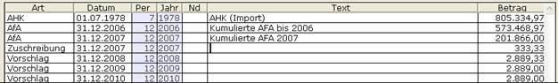

# Einstellungen Anlagenbuchhaltung

<!-- source: https://amic.de/hilfe/_einstellungenanlagen.htm -->

Hauptmenü > Anlagenbuchhaltung > Stammdaten > Firmenstamm

Direktsprung [ANKFS]

Im Firmenstamm werden verschiedene Einstellungen für die Anlagenbuchhaltung vorgenommen. Bevor man Anlagegüter erfassen kann, müssen diese Daten einmal eingerichtet werden.

| Option | Bedeutung |
| --- | --- |
| Neue Anlagegüter immer als Zugänge übernehmen? | Im Standard wird bei der Neuerfassung aus der Finanzbuchhaltung die erste Zeile in der Historie immer als AHK geführt. Trägt man hier ein JA ein, so wird diese Zeile mit Zugang vorbelegt. Diese Einstellung hat keine Auswirkung auf die Auswertungen, da im Jahr der Anschaffung AHK und Zugang als Zugang ausgewiesen werden.  
 |
| Eingangsgutschriften als negative Zugänge führen? | Wenn in der Belegerfassungen Eingangsgutschriften erfasst werden und bei dem Gegenkonto handelt es sich um ein Anlagenkonto, so kann man diese Werte - wie bei Eingangsrechnungen - direkt in die Anlagenbuchhaltung übernehmen. Eingangsgutschriften führen zu einer Verminderung der Anschaffung- und Herstellungskosten und werden als Teilabgang in die Historie eingetragen. Wenn man die Eingangsgutschriften lieber als Zugänge mit negativem Betrag führen möchte, so muss man hier JA eintragen. An den Rechenoperationen ändert dies nichts.  
 |
| Zugänge im Folgejahr (Stammblatt) als AHK ausweisen? | Im Anlagenstammblatt werden Zugänge als AHK ausgegeben, wenn sie im Anschaffungsjahr liegen und bereits für Folgejahre Daten erfasst wurden.  
 |
| GWG sofort bei Erfassung abschreiben? | Wenn hier ein Ja eingetragen wird, so wird gleich bei der Erfassung des GWG eine weitere Zeile mit der AfA über den Betrag des GWG abzüglich des Anhaltewertes in die Historie geschrieben.  
 |
| Sonstige betriebliche Erträge / Aufwendungen führen? | Es ist möglich, beim [Verkauf](./geschaeftsvorfaelle/verkauf_verschrottung_abgang.md) den Verkaufsbetrag einzugeben. Über die Differenz können dann Zeilen vom Typ sbA bzw. sbE erfasst werden. In den Auswertungen werden beim Verkauf immer die Anschaffungskosten ausgegeben. Stellt man hier „Nein“ ein, so stehen die Typen sbA und sbE nicht zur Verfügung. Beim Abgang/Verkauf werden sofort die Anschaffungskosten eingetragen.  
 |
| In der Historie den Text Gewinn/Verlust verwenden statt sbA/sbE? | In der Historie kann der angezeigte Text sbA und sbE als Gewinn/Verlust ausgegeben werden. Inhaltlich ändert sich nichts.  
 |
| Vorschläge nur erstellen, wenn keine unbearbeiteten Vorschläge existieren? | Die Voreinstellung ist so, dass man nur neue Vorschläge erstellen kann, wenn die Vorschlagsliste leer ist. Man kann das Verhalten so ändern, dass für Anlagegüter, für die kein Vorschlag existiert, ein neuer Vorschlag erstellt werden kann. Dazu trägt man hier „Nein“ ein.  
 |
| Vereinfachungsregel bei Zu- und Abgängen anwenden? | Die sich durch nachträgliche Anschaffungs- und Herstellungskosten ergebende neue Bemessungsgrundlage muss auf die Restnutzungsdauer verteilt werden. D.h. bis zum Zeitpunkt des Zugangs muss mit der alten Bemessungsgrundlage gerechnet werden, danach mit der neuen. Dies entspricht der Standardeinstellung(„Nein“) der A.eins Anlagenbuchhaltung. Aus Vereinfachungsgründen ist es zulässig, die Kosten so zu berücksichtigen, als wären sie zu Beginn des Jahres aufgewendet worden (R 7.4 Abs. 9 EStR 2008). Dann muss hier ein JA eingetragen werden.  
Sind für ein Anlagegut bereits Abschreibungen im Jahr des Zugangs vorgenommen worden, so wird die AfA trotzdem ab Beginn des Jahres neu gerechnet. Die Differenz wird dann als eigener AfA-Vorschlag mit der Bezeichnung „Nachaktivierung“ ausgewiesen.  
 |
| Die vor 2004 geltende Vereinfachungsregel für Sachanlagen anwenden? | Die vor 2004 geltende Vereinfachungsregel für bewegliche abnutzbare Sachanlagen – für in der ersten Hälfte des Jahres angeschaffte bewegliche Sachanlagen gilt der volle Jahres-AfA-Satz, für die zweite Jahreshälfte die halbe Jahres-AfA – kann hier abgestellt werden.  
Diese Einstellung bewirkt nur für Anlagegüter, die vor dem 01.01.2004 angeschafft wurden und linear abgeschrieben werden, dass die AfA entsprechend gerechnet wird. Bewegliche abnutzbare Sachanlagen, die zu einem späteren Zeitpunkt angeschafft wurden, sind davon nicht betroffen.  
Für Österreich gilt eine andere Regelung: Hat man dem System mit dem Steuerungsparameter 663 „FIBU-Besonderheiten berücksichtigen für“ auf Österreich gestellt, so kann man pro Anlagegut angeben, ob die Halbjahresregel gelten soll. Man kann dann als Abschreibungsart „Lineare AfA Halbjahresregel“ angeben. Dann wir unabhängig vom Anschaffungsjahr diese Regel angewendet.  
 |
| Pro Anlagengut eine Zeile im AfA-Beleg erzeugen? | Bei der Freigabe der AfA-Vorschläge werden automatisch Fibubelege für den steuerrechtlichen geführten Verlauf erstellt. Dabei werden die Zeilen pro AfA-Konto, [Kostenstelle](../kostenrechnung/kostenstellen.md), [Kostenträger](../kostenrechnung/kostentraeger.md) und [Kostenobjekt](../kostenrechnung/kostenobjekte/index.md) gerafft. Wenn man dies nicht möchte, so kann man diese Option auf JA setzen. Es wird dann pro AfA-Zeile eine Zeile im Beleg erzeugt. Dies hat dann den Vorteil, dass man den Betrag im Beleg wiederfindet. Zusätzlich werden als Belegtext die Inventarnummer und die Inventarbezeichnung festgehalten**.**  
 |
| Rundungsmethode der AfA-Beträge? | Hier kann eingestellt werden, ob Kaufmännisch, immer abgerundet oder immer aufgerundet werden soll. Auf wie viele Nachkommastellen gerundet werden soll stellt man ein mit  
 |
| Nachkommastellen der AfA-Beträge? | Hier trägt man ein, auf wie viele Stellen gerundet werden soll. Die bei der Buchwährung hinterlegte Stellenanzahl im Währungsstamm legt das Maximum der Stellenzahl fest. Kleinste Möglichkeit ist auf 0 Stellen zu runden.  
 |
| Cent-Beträge sofort Abschreiben? | Wenn hier JA eingetragen wird, so werden bei der Ermittlung der Abschreibung die Cent-Beträge der Anschaffungs- und Herstellungskosten sofort abgeschrieben, so dass der Restbuchwert immer den vollen Euro-Betrag enthält. Diese Einstellung wirkt auch bei Zu – und Abgängen und allen anderen Geschäftsvorfällen. Auch werden dann die Nachkommastellen AfA-Betrage in den Folgejahren abgeschnitten, es sei denn man hat in den Rundungsoptionen eine andere Methode – also kaufmännisches Runden oder Aufrunden - mit 0 Nachkommastellen eingestellt. Das Ergebnis der Berechnung sieht bei der Einstellung „kaufmännisch Runden mit 0 Nachkommastellen“ dann z.B. so aus.  
  
 |
| Wechsel der AfA-Art ohne Prüfung erlauben? | Nach einem neuaufsetzen der Anlagenbuchhaltung kann es nötig sein, alter AfA-Arten durch andere zu ersetzen. Hier kann als Beispiel den Wechsel von Linearer Abschreibung auf Pool-Abschreibung nennen. Im normalen Betrieb ist dies nicht erlaubt, kann aber bei Einführung der A.eins Anlagenbuchhaltung notwendig sein, wenn die Daten importiert wurden und das alte Programm die Pool-Abschreibung noch nicht kannte.  
 |
| AfA-Vorschläge nach Handelsrecht in die Primanota übernehmen? | Man kann Anlagegüter nach Steuerrecht und nach Handelsrecht führen. Bei der Freigabe der Vorschläge werden im Standard nur die für Steuerrecht errechneten Abschreibungsvorschläge freigegeben. Wählt man hier Handelsrecht aus, werden für alle Anlagegüter, bei denen bei „[Handelsbilanz führen](./anlagenstamm.md#Handelsbilanzfuehren)“ ein **Ja** eingetragen ist, diese in die Primanota übernommen. Bei allen anderen, bei denen keine handelsrechtlichen Daten geführt werden, werden weiterhin die nach Steuerrecht geführten Daten übernommen.  
    
 |
| Funktion zur Vorbelegung der Inventarnummer. | Wenn es notwendig und möglich ist, die Inventarnummer nach bestimmten Regeln vorzubelegen, so kann man hier eine Funktion hinterlegen, die die Inventarnummer bildet. Sie wird aufgerufen, wenn man ein Anlagegut neu anlegt. Diese Funktion muss als Rückgabeparameter eine Text der Länge 20 – also char(20) – liefern. Sie hat kein Eingabeparameter.  
    
Diese Beispielfunktion liefert eine Inventarnummer, die fest mit ‚01‘ beginnt, gefolgt vom Tagesdatum in der Form DDMMJJJJ und anschließend die 6-stellige Anzahl der Anlageneinträge.  
 |
| Funktion zum Testen der Inventarnummer. | Es kann in den Unternehmen notwendig sein, dass die Inventarnummern nach unterschiedlichsten Gesichtspunkten aufgebaut werden. Um dem Anwendern eine Möglichkeit zu geben, den Aufbau der Inventarnummern nach den eigenen Kriterien zu testen, existiert die Möglichkeit hier eine Datenbankfunktion einzutragen. Diese bekommt als IN-Parameter die Inventarnummer geliefert und muss als Rückgabeparameter eine Textfolge liefern. Bei einer leeren Textfolge geht das Programm davon aus, dass der Test erfolgreich war. Liefert die Funktion einen Text, wird dieser angezeigt und der Test als Fehlschlag interpretiert. Die Inventarnummer muss dann entsprechend geändert werden, bevor man das Feld verlassen kann.  
    
Diese Beispielfunktion prüft, ob das erste Zeichen der Inventarnummer eine ‚1’ ist:  
 |
