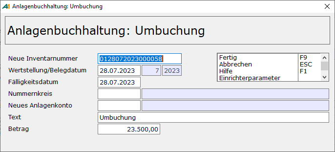
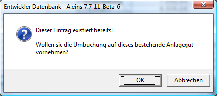
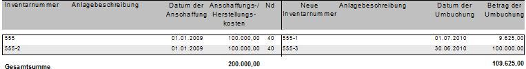
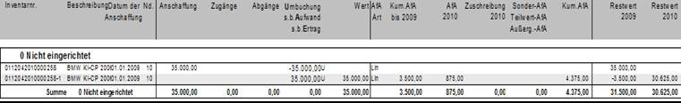

# Umbuchung

<!-- source: https://amic.de/hilfe/_umbuchung.htm -->

Umbuchen sind entweder dann notwendig, wenn im Bau befindliche Anlagen fertiggestellt sind und nun abgeschrieben werden sollen ( Änderung der AfA – Methode ) oder bestimmte Daten wie z.B.: Nutzungsdauer, Anlagenkonto, [Kostenstelle](../../kostenrechnung/kostenstellen.md), [Kostenträger](../../kostenrechnung/kostentraeger.md) oder [Kostenobjekt](../../kostenrechnung/kostenobjekte/index.md) sich ändern. Im Anlagenspiegel erscheinen im Jahr der Umbuchung beide Anlagegüter.

**Wichtig:** *Vor der Umbuchung müssen ggf. die Abschreibungen vorgenommen werden.*

Wird für ein Anlagegut der Abschreibungsverlauf handels- und steuerrechtlich getrennt behandelt, so betreffen Umbuchungen immer sowohl den steuerrechtlichen als auch den handelsrechtlichen Verlauf. Für den handelsrechtlichen Verlauf werden keine automatischen Buchungen erstellt.

Um ein Anlagegut umzubuchen, gibt es drei Möglichkeiten:

- Man geht in der Historie und trägt in der letzten Zeile „Umbuchung“ ein (eine Auswahl sämtlicher möglichen Arten ist mit **F3** möglich).
- Man markiert einen oder mehrere Datensätze in der Variante „Anlagenkartei“ der Auswahlliste zum Anlagenstamm und wählt die Funktion Umbuchen aus (siehe [Anzahlung](./anzahlungen.md)).
- Man markiert in der Variante „Fibubeleg ohne Anlageneintrag“ einen SO-Beleg, bei dem als Anka-Typ „Umbuchung“ steht. Die hier angezeigten SO-Belege haben als Haupt und als Gegenkonto ein Anlagenkonto.

Bei den ersten beiden Varianten öffnet sich dann ein weiteres Eingabefenster, auf dem dann die notwendigen Informationen abgefragt werden. Bei der dritten Variante ist dies nicht nötig, da hier ja bereits der Beleg existiert und somit nur eine Zuweisung zu dem Anlagegut geschieht.

Es sind also die neue Inventarnummer, das Datum, an dem die Umbuchung durchgeführt wird, Fälligkeit, Nummernkreis für den Fibubeleg sowie das ggf. neue Anlagenkonto und eine Text einzutragen. Wählt man als Inventarnummer die Nummer eines bestehenden Anlagegutes, so erscheint eine Abfrage, in der man bestätigen muss, dass man die Umbuchung auf ein existierendes Anlagegut vornehmen will.

Anschließend öffnet sich sofort das Erfassungsfenster des neuen bzw. des ausgewählten Anlagegutes. Ist es ein neues Anlagegut, so steht dort in der Wertstellung nicht das Datum der Umbuchung, sondern das Wertstellungsdatum des Originals. Aus diesem Datum, der Lebensdauer und dem Umbuchungsdatum ergibt sich, wie welchem Anlagegut die Abschreibung zugeordnet werden soll. Bei bestehenden Anlagegütern wird das Wertstellungsdatum nicht geändert, auch wird das **neue Anlagekonto** nicht übernommen.

Bei Erfassung über Historie ist es möglich einen abweichenden Betrag einzugeben. Man kann somit ein Anlagegut auf verschieden Güter aufteilen. Dies ist zum Beispiel bei Anlagen im Bau notwendig: vom Gesamtbetrag Anlagen in Bau geht ein Teil zum Gebäude, ein Teil zur Betriebsausstattung, ein Teil zur Büroeinrichtung usw.

Verwendet man die Variante „Fibubeleg ohne Anlageneintrag“ zur Erstellung der Umbuchung wird der Betrag des SO-Beleges als Umbuchungsbetrag verwendet, solange er kleiner oder gleich dem Restwert des Anlagengutes ist.  
    

Beispiel 1:

Anschaffung 01.01.2005 für 10.000,00. Am 15.04.2006 wird das Anlagegut einer anderen Kostenstelle zugewiesen, die Lebensdauer soll unverändert bleiben.  
    

| Wertstellung | 01.01.2005 | |
| --- | --- | --- |
| Lebensdauer | 5 Jahre | |
| AHK | 01.01.2005 | 10.000,00 |
| AfA | 31.12.2005 | 2.000,00 |
| AfA | 15.04.2006 | 500,00 |
| Umb | 15.04.2006 | 7.500,00 |

Neues Anlagengut:

| Wertstellung | 01.01.2005 | |
| --- | --- | --- |
| Lebensdauer | 5 Jahre | |
| AHK-Umbuchung | 15.04.2006 | 10.000,00 |
| AfA-Umbuchung | 15.04.2006 | 2.500,00 |

Die nächste AfA errechnet sich dann wie folgt: Aus Wertstellung und Datum der Umbuchung ergibt sich die Zeit, die das Anlagegut bereits abgeschrieben wurde, nämlich 15 Monate. Der Restbuchwert von 7.500,00 Euro muss demnach noch 45 Monate Abgeschrieben werden, davon 9 im Jahr 2006. Es ergibt sich also der abzuschreibende Betrag als

RESTBUCHWERT / RESTLEBENSDAUER \* ABSCHREIBUNGSDAUER bzw.

7500,00 / 45 \* 9 = 1500,00

Beispiel 2:

Eine im Bau befindliche Anlage wird am 12.05.2005 fertiggestellt. Die Lebensdauer der neuen Anlage beträgt 20 Jahre. Abschreibung Linear

Anlage im Bau

| Wertstellung | 01.07.2004 | |
| --- | --- | --- |
| Lebensdauer | 0 Jahre | |
| AHK | 01.01.2005 | 10.000,00 |
| Zug | 01.02.2005 | 2.000,00 |
| Umb | 12.05.2005 | 12.000,00 |

Neues Anlagengut:

| Wertstellung | 12.05.2005 | |
| --- | --- | --- |
| Lebensdauer | 20 Jahre | |
| AHK-Umbuchung | 12.05.2005 | 12.000,00 |

Dadurch, dass die Anlage im Bau eine Lebensdauer von 0 Jahren hat, wird sie nicht mit im AfA –Vorschlag berücksichtigt. Man kann dies auch dadurch erreichen, indem man die AfA-Methode der Anlage im Bau auf „manuelle AfA“ setzt und nach der Umbuchung auf Linear.

Die Umbuchungsübersicht zeigt alle im ausgewählten Wirtschaftsjahr umgebuchten Anlagegüter mit Anschaffungsdatum, Anschaffungskosten, neuer Inventarnummer, dem Datum der Umbuchung und dem Umbuchungsbetrag an. Dieser Umbuchungsbetrag muss nicht den Anschaffungs- und Herstellungskosten entsprechen, da auch nur Teilbeträge umgebucht werden können.

Im Anlagenspiegel werden Umbuchungen in einer eigenen Spalte angezeigt. Im Folgenden Beispiel wurde das Anlagegut 0112042010000258 umgebucht. Dem neuen Anlagegut 0112042010000258-1 wurde z.B. ein anderes Anlagenkonto zugeordnet.

Bis zur Version 7.7-20 wurden beim Erstellen des Vorschlags diese Anlagegüter immer zusammen behandelt. Für das „alte“ Anlagengut wurde die Abschreibung bis zum Tag der Umbuchung errechnet und als Vorschlag ausgewiesen. Gleichzeitig wird in der Historie eine Zeile der Art „Vorschl.Korr.Umb“ angezeigt. Dies ist der Wert, um den die Umbuchung korrigiert wurde. Der neue Wert erhielt eine Zeile mit dem Vorschlag und entsprechend eine Zeile der Art „Vorschl.Afa.Umb“. Nach Freigabe der Vorschläge wurden diese zusätzlichen Zeilen entsprechend in eine Zeile Korr.Umbuchung und AfA Umbuchung umgewandelt.

Ab der Folgeversion entfällt diese Automatik. Man hat dadurch die Möglichkeit die Anlagegüter einzeln zu behandeln und auch nur Teile des Anlagegutes umzubuchen.
