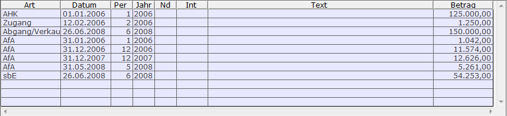
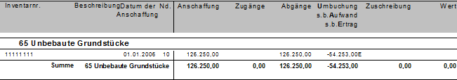

# Verkauf/Verschrottung (Abgang)

<!-- source: https://amic.de/hilfe/_verkaufverschrottung.htm -->

Um ein Anlagegut aus dem Anlagenspiegel zu entfernen, gibt man in der Historie eine Zeile vom Typen **Abgang/Verkauf** ein. Es wird immer nur das gesamte Anlagengut verkauft.

Wird für ein Anlagegut der Abschreibungsverlauf handels- und steuerrechtlich getrennt behandelt, so betreffen Umbuchungen immer sowohl den steuerrechtlichen als auch den handelsrechtlichen Verlauf.

Wie beim Verkauf eines Anlagegutes verfahren wird, hängt mit der Option „sonstige betriebliche Erträge / Aufwendungen führen“ im [Firmenstamm](../einstellungen_anlagenbuchhaltung.md) zusammen. Steht diese Option auf „Nein“, so wird beim Abgang/Verkauf der Restbuchwert als Betrag eingetragen. Dieser kann auch nicht geändert werden. Beim Erstellen der Abschreibungsvorschläge wird dieses Anlagegut bis zum Datum des Verkaufs/der Verschrottung berücksichtigt.

 Will man die Erträge bzw. Aufwendungen aus Anlagenabgängen in der Anlagenbuchhaltung führen (Option muss dann auf Ja stehen), so wird als Betrag zunächst der Restbuchwert vorgeschlagen. Dieser lässt sich jedoch auf den echten Verkaufswert – auch auf 0,00 Euro – ändern. Es bleibt dann gewöhnlich eine Differenz auf dem Anlagenkonto stehen. Bevor man diese als sonstiger betrieblicher Aufwand sbA oder als sonstiger betrieblicher Ertrag sbE ausbucht, muss man natürlich noch die Abschreibung bis zum Tag des Verkaufs vornehmen. Die Historie kann z.B. wie folg aussehen:

Im Anlagenspiegel findet man für dieses Anlagengut dann in der Spalte **Abgänge** den Wert und daneben die Ertragsbuchung, die mit einem „E“ gekennzeichnet ist. Werden sbA und sbE nicht geführt, so erscheinen diese natürlich nicht in der Auswertung.

Nachdem eine Zeile mit sbE oder sbA erfasst worden ist, ist es nicht mehr möglich Abschreibungen für dieses Anlagengut vorzunehmen!

Um für ein Anlagegut den Abgang zu erfassen, gibt es folgende Möglichkeiten:

• Man geht in der Historie und trägt in der letzten Zeile „Abgang“ ein - eine Auswahl sämtlicher möglichen Arten ist mit **F3** möglich.

• Man markiert in der Variante „Fibubeleg ohne Anlageneintrag“ einen AR-Beleg bzw. einen SO-Beleg, bei dem als Anka-Typ „Abgang/Verkauf“ steht und führt dann die Funktion „Verteilung / Zuordnung“ aus.

Es wird davon ausgegangen, dass immer das gesamte Anlagegut verkauft wird. Tritt nun ein Geschäftsvorfall auf, bei dem nur ein Teil des Anlagegutes verkauft werden soll, so muss man diesen Teil erst umbuchen. Diesen Teil kann man dann komplett verkaufen.
