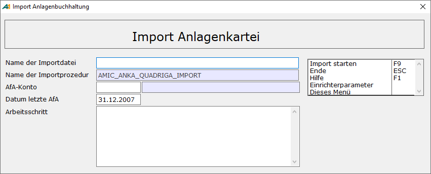

# Import in die Anlagenbuchhaltung

<!-- source: https://amic.de/hilfe/_importindieanlagenbu.htm -->

Hauptmenü > Anlagenbuchhaltung > Stammdaten > Anlagenstamm importieren

Direktsprung **[ANKAI]**

Es ist möglich Anlagengüter in die Anlagenbuchhaltung aus zu importieren. Vor dem Start des Imports wird geprüft ob Daten in der Anlagenbuchhaltung existieren. Ist dies der Fall, werden keine Daten importiert.

Der Anlagenspiegel liefert anschließend den aktuellen Stand.

| | Bedeutung |
| --- | --- |
| Name der Importdatei | Dort muss der Name der zu importierenden Datei angegeben werden.  |
| Name der Importprozedur | hier steht der Name der verwendeten Prozedur. Die Prozedur AMIC_ANKA_QUADRIGA_IMPORT wird von AMIC zur Verfügung gestellt. Sie kann jedoch durch eine Private Prozedur ersetzt werden. Dieser Prozedur werden zwei Parameter übergeben, das Konto und das Datum der letzten AfA:  |
| AfA-Konto   | Dieses Konto wird als AfA-Konto in den Stammsatz eingetragen. |
| Datum letzte AfA | Die kumulierte AfA sowie Zugänge und Abgänge werden diesem Datum und der sich daraus ergebenden Periode zugeordnet.  |
| Arbeitsschritt | Hier werden die Arbeitsschritte, die gerade durchgeführt werden, angezeigt.  |

Als Datengrundlage wird eine Excel-Datei (\*.xls) erwartet. Die Daten werden erst ab Zeile drei eingelesen. Folgenden Spalten werden ausgewertet:

| Spalte | Bedeutung | |
| --- | --- | --- |
| A | Inventarnummer. Diese muss eindeutig sein! | A |
| B | Bezeichnung des Anlagengutes | A |
| C | Anschaffungsdatum. | D (tt.mm.jjjj) |
| E | Lebensdauer in Jahren. | N |
| F | Dies gibt die AFA-Art wieder. Es werden die Buchstaben „L“ „R“ „S“ „G“ „K“ und „D“ ausgewertet. L,R,S ⇨ Lineare Abschreibung G ⇨ GWG K ⇨ Manuelle Abschreibung D ⇨ Degressive Abschreibung | A |
| G | Anfangsbestand in Euro. Steht hier ein Wert ungleich 0 wird eine Zeile des Typs AHK generiert. | N (15,4) |
| H | Zugänge. Steht hier ein Wert ungleich 0, so wird eine Zeile des Typs Zugang generiert. | N (15,4) |
| I | Teilabgänge. Ist Anfangsbestand und Teilabgang gleich, so handelt es sich um einen Totalabgang. | N (15,4) |
| L | Kumulierte AfA Vorjahre. **Optional.** Steht hier ein Wert, so wird für dieser als Kumulierte Afa für das Vorjahr eingetragen. | N (15,4) |
| M | Kumulierte AfA aktuelles Jahr. | N (15,4) |
| P | \- | |
| R | AfA-Konto. **Optional.** Steht hier ein Wert, so wird dieser an Stelle des auf der Importmaske eingegebenen AfA-Kontos verwendet. | N |
| S | Kostenstelle. **Optional.** | N |
| U | Standort. **Optional.** Ansonsten werden die hier eingetragenen Standorte in den Anlagestammdaten eingetragen. | A |
| V | Unterstandort. **Optional.** Aus Standort und ggf. Unterstandort wird ein Eintrag in die Stammdaten generiert. | A |
| W | Anlagen-Gruppe. **Optional.** Wenn hier ein Wert steht, dann werden die Anlagengruppen in die Stammdaten übernommen. | N |
| X | Bezeichnung der Anlagengruppe. **Optional.** | A |
| Y | Schrottwert/Anhaltewert | N (15,4) |
| Z | Anlagekonto. | N |

a=Alphanumerisch, n=Numerisch , d=Datum

Wenn die Excel-Datei nicht diesem Aufbau entspricht (Vorgabe bei Verwendung der Prozedur AMIC_ANKA_QUADRIGA_IMPORT), muss sie entsprechend angepasst werden.
