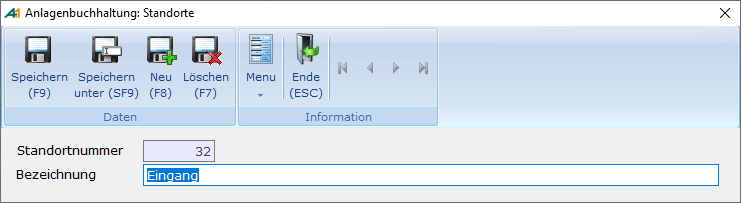

# Standort Stammdaten

<!-- source: https://amic.de/hilfe/_standortstammdaten.htm -->

Hauptmenü > Anlagenbuchhaltung > Stammdaten > Standorte

Direktsprung [ANKAO]

Die Standorte dienen neben der Beschreibung des Anlagegutes auch zur Eingrenzung innerhalb der Auswahllisten und Auswertungen.

