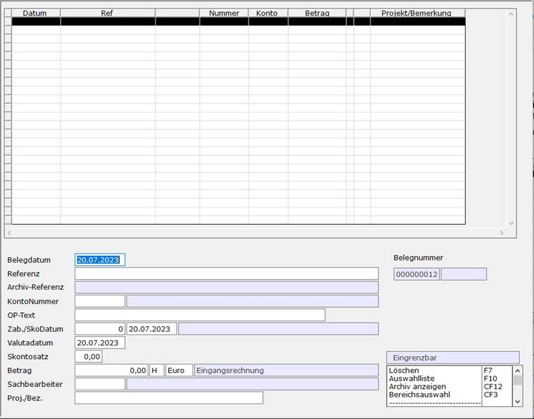

# Eingangsmappe

<!-- source: https://amic.de/hilfe/eingangsmappe.htm -->

Hauptmenü > Finanzbuchhaltung > Erfassung > Eingangsmappe

Direktsprung **[EMA]**

Hierbei handelt es sich um eine Vorerfassung von Finanzbuchhaltungsbelegen vom Typ Eingangsrechnung oder -gutschrift. Diese vorerfassten Belege sind im Allgemeinen Vorgänge, die inhaltlich noch zu klären sind (z.B. vom Sachbearbeiter noch abzuzeichnen) und deshalb noch nicht in der Primanote erfasst werden können. Hierauf kann sowohl in der Belegerfassung der Finanzbuchhaltung als auch in der Vorgangserfassung für Klasse 1700 (Eingangsrechnung) bzw. 1800 (Eingangsgutschrift) zugegriffen werden.

In der Belegerfassung der Fibu kann man auf der Position „Belegdatum“ mit **F3** die Eingangsmappe aufblättern. Dort kann der gewünschte Beleg ausgewählt werden. Die Felder werden entsprechend der Vorerfassung vorbelegt; im Betragsfeld muss jedoch die Eingabe wiederholt werden.

Im Bereich der Vorgangserfassung lässt sich die Eingangsmappe auf dem Feld „Liefer./Bez.“ aufrufen. Nach Auswahl des Beleges aus der Eingangsmappe werden dann der Kunde und die Referenznummer in den Vorgang übernommen.  
Der [Steuerparameter 1067 - 'Zahlungsbedingung aus Eingangsmappe'](../../../firmenstamm/steuerparameter/optionen_global/zahlungsbedingung_aus_eingangsmappe_spa_1067.md) regelt die Behandlung der Zahlungsbedingung bei der Erfassung von Eingangsrechnungen mit Datenübernahme aus der Eingangsmappe. Ist die Einstellung dieses Parameters für den entsprechenden Warenbelegstyp freigegeben, so wird die Zahlungsbedingung aus der Eingangsmappe mit dem dort angegebenen Skontosatz übernommen. Valuta- und Skontodatum werden, soweit es der Zahlungsbedingungstyp zulässt, ebenfalls übernommen.

Der ausgewählte Beleg ist dann in der Auswahl der Eingangsmappe nicht mehr verfügbar. Beim Stornieren oder beim Anlegen eines Stornobeleges für den Vorgang wird der Eingangsmappen-Beleg wieder freigegeben. Ausnahme hierbei ist, wenn der Vorgang bereits an die Fibu übergeben wurde.

Der für Belege aus der Eingangsmappe verwendete Nummernkreis wird in den Einrichterparametern bei „Standard Nummernkreisvorbelegung“ hinterlegt.

| Feld | Beschreibung |
| --- | --- |
| Belegdatum  
    
 | Datum des Beleges. Wird bei der Übernahme der Daten in die Belegerfassung mit übernommen. In den Einrichterparametern lässt sich einstellen, wie - und ob das Datum vorbelegt werden soll. Dazu muss man bei dem Einrichterparameter „Vorbelegung Belegdatum: 0=Tagesdatum; 1 - …. = Tage zurück; -1=leer; -2 wie 0 bei Einstieg“ einen entsprechenden Wert eintragen. Vorbelegt wird das Belegdatum, wenn man nichts ändert mit dem Tagesdatum.  
 |
| Belegnummer | Die Belegnummer setzt wird über den Nummernkreis bestimmt und ist hier nicht änderbar. Der Nummernkreis ist als Einrichterparameter „Standard Nummernkreisvorbelegung“ zu hinterlegen.  
 |
| Referenz | Entspricht der Referenznummer in der Belegerfassung. In den Einrichterparametern lässt sich einstellen, ob bei der Erfassung geprüft werden soll, ob die Referenznummer Daten enthalten muss oder nicht. Dazu muss man bei „Referenznummer muss Daten enthalten“ ein **Ja** eintragen.  
Ist in den Einrichterparametern der Belegerfassung eingetragen, dass die Referenznummer eindeutig sein muss, so bezieht sich dies auch auf die Referenznummer, die im der Eingangsmappe erfasst wird.  
 |
| Archivreferenz  
    
 | Das Feld hinter der Referenznummer ist die Archivreferenz. Es wird später als Paginiernummer in die Finanzbuchhaltung übernommen. Dieses Feld kann mit dem Einrichterparameter „Archivreferenz/Paginiernummer abfragen?“ abgeschaltet werden. Der Einrichterparameter „Archivreferenz/Paginiernummer muss Daten enthalten?“ bestimmt, ob dieses Feld Daten enthalten muss oder nicht. Wenn es auf **Ja** steht, so wird nach dem Löschen des Inhaltes wieder ein Wert vorbelegt. Eine Leereingabe ist somit nicht möglich.  
 |
| Kontonummer  
    
 | Welchem Personenkonto ist die Eingangsrechnung zugeordnet. In den Einrichterparametern kann man hinterlegen, welcher Kundentyp in der F3-Auswahl zugelassen ist.  
 |
| OP-Text | Dieser Text wird in das Textfeld der Belegerfassung übernommen. Der Text kann wie in der Belegerfassung aus den [Textvorbelegungen](../../stammdaten_der_fibu/textvorbelegungen.md#Textvorbelegung) (Direktsprung [FITXT]) Mit Nummer + F2 bzw. mit F3 gezogen werden.  
 |
| Zab./SkoDat/Valutadatum/Skontosatz | Es wird die Zahlungsbedingung abgefragt. Sämtliche hier eingetragenen Werte werden so in den Beleg in der Finanzbuchhaltung übernommen, wie sie sind, ohne noch einmal nachgerechnet zu werden.  
 |
| Betrag  
    
 | Dieser Betrag wird bei der Übernahme oben rechts in der Belegerfassung angezeigt. Direkt darunter steht die Differenz zu den in den Positionen erfassten Beträgen. Das Sollhabenkennzeichen gibt an, ob es sich um eine Rechnung oder eine Gutschrift handelt. Dies wird im Textfeld hinter dem Währungsfeld angezeigt.  
 |
| Sachbearbeiter | Hier kann der Sachbearbeiter eingetragen werden. Über F3 bekommt man eine Liste der Bediener.  
 |
| Proj./Bez.  
    
 | Hinweis für den Sachbearbeiter. |

Siehe auch:

- [Finanzbuchhaltungsbelege aus der Eingangsmappe](./finanzbuchhaltungsbelege_aus_der_eingangsmappe.md)
