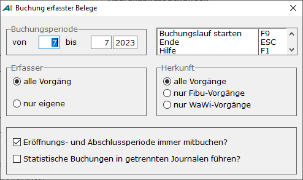

# Buchen

<!-- source: https://amic.de/hilfe/buchen.htm -->

Hauptmenü > Finanzbuchhaltung > Buchungen / Journal > Buchungen Fibu

Direktsprung **[BUC]**

Um nun die Belege endgültig in der Finanzbuchhaltung festzuschreiben, müssen sie „gebucht“ werden.

Dazu dient der Menüpunkt „Buchungen Fibu“ (Direktsprung BUC) oder die [Einrichtung einer allgemeinen Buchungsautomatik](./einrichtung_einer_allgemeinen_buchungsautomatik.md):

 

Es kann nun entschieden werden, welche Belege verbucht werden sollen. Entsprechend dieser Einstellung werden die Belege zusammengestellt, verbucht und journalisiert:

• Angabe des Zeitraumes, über den verbucht werden soll

• Angabe, ob alle Belege im Zeitraum oder nur die des aktuellen Bedieners

• Selektion der Belege nach Warenwirtschaft, Finanzbuchhaltung oder alle.

• Eröffnungs- und Abschlussperioden grundsätzlich mitbuchen.

Wenn man den Buchungslauf startet, werden alle Belege, die den angegebenen Kriterien entsprechen und bei denen das Kennzeichen „[Buchungssperre](../../op_verwaltung/einzelbeleganzeige.md#Buchungssperre)“ nicht gesetzt ist, gekennzeichnet, damit sie anschließend vom Mandantenserver verarbeitet werden können. Je nach Organisation der EDV läuft er im Hintergrund mit, so dass die technische Verbuchung zeitgleich abläuft, oder wird periodisch aktiviert. In diesem Fall besteht eine zeitliche Differenz zwischen inhaltlicher und technischer Verbuchung.

**HINWEIS:** *Wenn man auf die Verarbeitung über den Mandantenserver verzichten will, kann man per Einrichterparameter „Buchen ohne Mandantenserver“ das System so einstellen, dass die Buchung direkt ausgeführt wird. Der Arbeitsplatz, auf dem das Buchen gestartet wird, ist dann natürlich länger belastet.*

Unabhängig davon, ob die Belege bereits vom Mandantenserver verarbeitet wurden oder nicht, stehen sie nach diesem Buchungslauf nicht mehr in der Primanota und können nicht mehr verändert werden.

Wenn beim Buchen der Belege keine Probleme aufgetreten sind, können die Journale gedruckt werden. In der Anwendung [Journal/Ereignisprotokoll](../journal_ereignisprotokoll.md) (Direktsprung **[JOUR]**) werden alle Journale aufgelistet. Zum Druck dieser Journale stehen zum einen fest definierte Crystal-Reporte zur Verfügung und zum anderen besteht die Möglichkeit sich über den Formulareinrichter eigene Listen zu definieren.

Siehe auch:

- [Einrichtung einer allgemeinen Buchungsautomatik](./einrichtung_einer_allgemeinen_buchungsautomatik.md)
