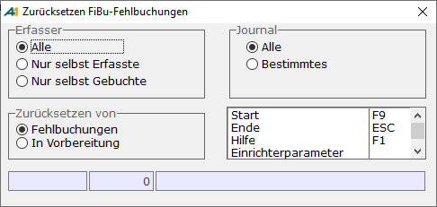

# Fehlbuchungen

<!-- source: https://amic.de/hilfe/fehlbuchungen.htm -->

Hauptmenü > Finanzbuchhaltung > Buchungen / Journal > Journal/Ereignisprotokoll > Variante **Fehlerliste Buchungen**

Direktsprung **[JOUR]**

Leider läuft nicht immer alles so glatt, wie man es sich wünscht und es kommt dazu, dass beim Buchen Fehler auftreten. Diese Fehler werden in der Anwendung „**Journal/Ereignisprotokoll**“ in der Variante „**Fehlerliste Buchungen**“ aufgelistet. Es können folgende Fehler auftreten:

• Beleg unvollständig!  
Bedeutung: Es fehlt der Abschlusssatz eines Beleges (Fibuvorgstamm).  
Ursache/Abhilfe: Ein solcher Beleg kann theoretisch nicht im Buchungslauf erscheinen, da nur vollständige Belege zum Buchen herangezogen werden. Also kann nur zwischen „Buchungen Fibu“ und dem Lauf des Mandantenservers der Abschlusssatz verschwunden sein. Dieses wäre also ein harter Fehler und unbedingt AMIC zu melden. Eine Überprüfung der Datenbank ist nötig.

• Beleg gesperrt, weil in Benutzung!  
Bedeutung: Es existiert ein Eintrag für diesen Beleg in der Lockingrelation.  
Ursache/Abhilfe: In dem Moment, in dem der Mandantenserver den Beleg verarbeiten will, wird er gerade anderweitig bearbeitet.  
Anschließend Fehlbuchungen zurücksetzen und neu buchen.

• Beleg hat falschen Buchungsstatus!  
Bedeutung: Der Wert des Feldes Fibuv_Buchstat ist nicht 1.  
Ursache/Abhilfe: Bei „Buchungen Fibu“ wird der Status auf 1 (zum Buchen vorgesehen) gesetzt und es ein Eintrag im Datenstrom vorgenommen, damit der Mandantenserver diesen Beleg verarbeitet. Beim Verarbeiten wird dieser Wert dann auf 2 (in Bearbeitung) und anschließend auf 3 (gebucht) oder auf 4 (nicht buchbar) gesetzt. Dabei muss ein Fehler aufgetreten sein.  
Fehlbuchungen zurücksetzen und erneut buchen.

• Periode %d / %d nicht offen oder nicht vorhanden!  
Bedeutung: Die Periode, der dieser Beleg zugeordnet hat nicht den Status „offen“ (Status=1) oder „Buchungsschluss“(Status=2) oder sie existiert nicht.  
Ursache/Abhilfe: Der Belege wurde für eine nicht existierende oder nicht offen Periode in System gestellt. Über die Warenwirtschaft bzw. die Belegerfassung der Fibu ist dies normalerweise nicht möglich. Auch im Importbereich der Fibu wird die korrekte Periode geprüft. Es ist zu überprüfen, wie dieser Beleg ins System gekommen ist und gegebenenfalls ist dieses Verfahren zu ändern. Sollte es sich um ein von AMIC eingerichtetes Verfahren handeln oder um einen nicht importierten Beleg, so melden sie bitte diesen Fehler, damit das Problem grundsätzlich behoben werden kann.  
Fehlbuchungen zurücksetzen, Periode des Beleges ändern oder die Periode im Periodenstamm eröffnen und erneut buchen.

• Journalzuordnung unmöglich, wahrscheinlich interner Fehler!  
Bedeutung: Es existiert für diesen Beleg kein Satz in der Relation Journalfreigabe.  
Ursache/Abhilfe: Bei „Buchungen Fibu“ wird bereits ein Satz für die Journalfreigabe erzeugt, in dem bereits die Zuordnung zu einem Journal festgelegt ist. Dabei ist ein Fehler aufgetreten. Um diesen Fehler zu beheben, müssen die Fehlbuchungen zurückgesetzt werden. Dabei werden auch eventuell falsche Einträge aus Journalfreigabe entfern. Nach erneutem buchen sollte dieser Fehler nicht wieder auftreten. Ist dies dennoch der Fall, so muss die Datenbank überprüft werden.

• Journal konnte nicht abgeschlossen werden. Buchungen möglicherweise inkorrekt!!!!  
Bedeutung: Für dieses Journal konnten die Felder FiBuJourZeilZae und FiBuJourBelZahl nicht aktualisiert werden.  
Ursache/Abhilfe: Der Journaleintrag fehlt oder ist gesperrt. Sollte der Fehler nach zurücksetzen der Fehlbuchung erneut auftreten, muss die Datenbank überprüft werden.

• Keine Belegpositionen vorhanden!  
Bedeutung: Der zu buchende Beleg hat keinen Eintrag in der Relation Fibuvorgposition.  
Ursache/Abhilfe: Dieser Fehler kann nicht durch die von AMIC erzeugten Belege entstehen. Es ist zu überprüfen, wie der Beleg ins System gekommen ist und dieses Importverfahren ist gegebenenfalls zu ändern. Sollte dieser Beleg aus A.eins heraus erzeugt worden sein, so setzen sie sich bitte umgehend mit AMIC in Verbindung, damit dieses Problem behoben werden kann.  
Um diesen Beleg zu entfernen kann im „Fibu Reorganisator“ (Direktsprung FIREO) der Punkt „Reorg. Fragmente“ angewählt werden.

• Belegsaldo ungleich Null!  
Bedeutung: Die Summe der Beträge im Haben entspricht nicht der Summe der Beträge im Soll. Der Beleg ist inkonsistent.  
Ursache/Abhilfe: Diese Prüfung wird von A.eins bereits bei der Erfassung bzw. beim Übertrag der Daten aus der Warenwirtschaft durchgeführt und dürfte nicht auftreten. Sollte es dennoch der Fall sein, setzen sie sich bitte mit AMIC in Verbindung damit dieses Problem grundsätzlich beseitigt werden kann. Der defekte Beleg ist zu überprüfen. Eventuell lässt sich das Problem dadurch beheben, dass er in der Belegerfassung der Fibu korrigiert, die Fehlbuchungen zurücksetzen und erneut gebucht wird. Ansonsten muss der Beleg gelöscht und neu erfasst werden.

• Eintrag in Journalzeile fehlgeschlagen  
Bedeutung: Der Eintrag in die Relation Journalposition ist fehlgeschlagen.  
Ursache/Abhilfe: Pro Zeile eines Beleges wird ein Eintrag in die Relation Journalposition vorgenommen. Wenn dies nicht funktioniert, weil z.B. der Datensatz gesperrt ist, kommt es zu dieser Fehlermeldung. Sollte der Fehler nach zurücksetzen der Fehlbuchung und erneutem buchen wieder auftreten, melden sie den Fehler bitte an AMIC, damit das Problem beseitig werden kann.  
    

• Kontonummer 0 ist für Forderungs- bzw. Verbindlichkeitskonten unzulässig!  
Bedeutung: Dem Personenkonto ist keine Forderungsgruppe zugeordnet, oder in der Forderungsgruppe sind keine Konten eingetragen.  
Ursache/Abhilfe: Es ist zu überprüfen, welche Forderungsgruppe bei dem Personenkonto eingetragen ist. Diese muss korrigiert werden. Anschließend kann die Fehlbuchung zurückgesetzt und erneut gebucht werden.

• Kontonummer 0 ist unzulässig!  
Bedeutung: Ein Konto des Belegs ist 0.  
Ursache/Abhilfe: 0 ist keine gültige Kontonummer. Der Beleg ist zu überprüfen. Ist es ein Beleg aus der Warenwirtschaft, ist die Erlöskennziffer/Kontozuordnung zu überprüfen. Dieser Beleg muss nicht erneut übertragen werden. Die Kontonummer kann in der Belegerfassung der Finanzbuchhaltung nachgetragen werden. Ist es eine Steuerposition, so sind die Steuersätze zu überprüfen. Die Kontonummer kann in der Belegerfassung der Finanzbuchhaltung nachgetragen werden. Anschließend kann die Fehlbuchung zurückgesetzt und erneut gebucht werden.

• Kontenstamm fehlt: Konto %d  
Bedeutung: Das Konto existiert nicht in der Relation Kontostamm.  
Ursache/Abhilfe: Um eine Überschneidung der Kontonummer zu verhindern, werden Personenkonten, Sachkonten und Oberkonten in der Relation Kontostamm geführt. Bei der Erfassung der Stammdaten für diese Bereiche wird also auch immer ein Eintrag in der Relation vorgenommen. Es kommt gelegentlich vor, dass Importprogramme diesen Eintrag selbst nicht vornehmen. Zu Behebung dieses Problems reicht es im „Fibu Reorganisator“ den „Test Stammdaten“ anzuwählen. Er listet alle Konten mit diesem Problem auf und behebt es auch gleich.

• Falscher Kontotyp: Konto %d  
Bedeutung: Kontotyp ist weder Sach- noch Personenkonto.  
Ursache/Abhilfe: In einem Beleg dürfen nur Sach- oder Personenkonten direkt vorkommen, also keine Oberkonten. Bei den von A.eins erstellten Belegen kann dies nicht vorkommen, da bereits bei der Erfassung die Oberkonten ausgeklammert werden. Es ist als zu prüfen, woher dieser Beleg kommt um dann dort den Fehler zu beheben. Zur Korrektur des Beleges reicht es, in der Belegerfassung das korrekte Konto einzutragen, die Fehlbuchungen zurückzusetzen und anschließend neu zu buchen.

• Oberkonto %d fehlt  
Bedeutung: Das angesprochene Oberkonto existiert nicht in den Stammdaten.  
Ursache/Abhilfe: Im Sachkontenstamm oder im Oberkontenstamm ist ein Oberkonto eingetragen, das so nicht in der Relation Obersachkonto existiert. Entweder erfasst man dieses Oberkonto oder man ändert den Verweis im Sachkonten- / Oberkontenstamm. Anschließend kann die Fehlbuchung zurückgesetzt und erneut gebucht werden.

• Oberkonten zu tief geschachtelt  
Bedeutung: Die Verschachtelung der Oberkonten ist hoch oder Kreisschluss.  
Ursache/Abhilfe: Jedem Oberkonto kann wieder ein weiteres Oberkonto zugeordnet werden. Dies kann man theoretisch unendlich fortsetzen. In A.eins werden Oberkonten jedoch nur bis zu einer Schachtelungstiefe von 8 zugelassen. Wird diese überschritten, so kommt es zu der Fehlermeldung. Überprüfen sie die Struktur ihrer Oberkonten. Eventuell handelt es sich auch um einen Kreisschluss. Dieser tritt zum Beispiel dann auf, wenn dem Oberkonto x das Oberkonto Y zugeordnet ist und dem Oberkonto Y das Oberkonto X. Nach Korrektur der Stammdaten Fehlbuchung zurücksetzen und erneut buchen.

• Forderungskonto konnte nicht bestimmt werden!  
Bedeutung: Die im Kundenstamm eingetragene Forderungsgruppe existiert nicht.  
Ursache/Abhilfe: Überprüfen Sie die im Kundenstamm eingetragene Forderungsgruppe, ändern sie diese oder legen sei eine neue Forderungsgruppe an. Nach Korrektur der Stammdaten Fehlbuchung zurücksetzen und erneut buchen.

• Forderungs- oder Verbindlichkeitsbetrag falsch  
Bedeutung: Der im Beleg eingetragene Betrag der Forderungen bzw. der Verbindlichkeiten entspricht nicht dem Betrag des Personenkontos.  
Ursache/Abhilfe: In den Belegen wird der Betrag festgehalten, der den Forderungen bzw. den Verbindlichkeiten zugeordnet werden soll. Wenn der eingetragene Betrag nicht dem Betrag des Personenkontos entspricht, kommt es zu dieser Fehlermeldung. Zur Behebung dieses Problems kann für nicht ausgezifferte Belege im Fibu-Reorganisator die Reorganisation gestartet werden. Bei ausgezifferten Belegen muss die Auszifferung zuerst zurückgesetzt werden.

• Kostenstelle: Manuelle Verteilung ist ungleich dem Gesamtbetrag  
Bedeutung: Die Summe der Beträge in der Relation FIBUVORGKOSTSTEL entspricht nicht dem Gesamtbetrag.  
Ursache/Abhilfe: Überprüfen Sie in der Belegerfassung die Teilbeträge. Anschließend Fehlbuchungen zurücksetzen und erneut buchen.

• Kostenstelle %d ist gelöscht!  
Bedeutung: Eine gelöschte Kostenstelle ist im Beleg eingetragen.  
Ursache/Abhilfe: Kostenstellen werden beim Löschen nicht wirklich gelöscht, sondern bekommen ein Kennzeichen, dass sie nicht weiter verwendet werden sollen. Ist eine solche Kostenstelle im Beleg verwendet, kommt es zu dieser Meldung. Korrigieren sie den Beleg oder setzen sie die Kostenstelle im Stammdatenpfleger wieder auf „nicht gelöscht“.

• Kostenstellen zu tief geschachtelt  
Bedeutung: Die Verschachtelung der Kostenstellen ist hoch oder Kreisschluss.  
Ursache/Abhilfe: Verteilkostenstellen können weitere Verteilkostenstellen zugeordnet werden. Dies kann man theoretisch unendlich fortsetzen. In A.eins werden Verteilkostenstellen jedoch nur bis zu einer Schachtelungstiefe von 5 zugelassen. Wird diese überschritten, so kommt es zu der Fehlermeldung. Überprüfen sie die Struktur ihrer Verteilkostenstellen. Eventuell handelt es sich auch um einen Kreisschluss. Dieser tritt zum Beispiel dann auf, wenn Kostenstelle X auf Kostenstelle Y verteilt wird und Kostenstelle Y wieder der Kostenstelle X. Nach Korrektur der Stammdaten Fehlbuchung zurücksetzen und erneut buchen.

• Unterteilung der Verteilkostenstelle %d fehlt, oder nicht gültig ('%s')  
Bedeutung: Es konnte kein passender Eintrag in der Tabelle Koststelverteil gefunden werden.  
Ursache/Abhilfe: Zu einer als Verteilkostenstelle gekennzeichneten Kostenstelle existiert kein gültiger Eintrag zu den Verteilungen. Eventuell stimmt das Gültigkeitsdatum nicht. Überprüfen Sie die Stammdaten oder ändern sie in der Belegerfassung die Kostenstelle.

• Kostenstelle %d existiert nicht!  
Bedeutung: Es existiert zu dieser Kostenstelle kein Eintrag in der Tabelle s.  
Ursache/Abhilfe: Die im Beleg aufgeführte Kostenstelle existiert nicht. Ändern sie den Beleg oder erfassen sie die Kostenstelle in den Stammdaten.

• Kostenträger: Manuelle Verteilung ist ungleich dem Gesamtbetrag  
Bedeutung: Die Summe der Beträge in der Relation FIBUVORGKOSTENTRAEGER entspricht nicht dem Gesamtbetrag.  
Ursache/Abhilfe: Überprüfen Sie in der Belegerfassung die Teilbeträge. Anschließend Fehlbuchung zurücksetzen und erneut buchen.

• Kostenträger %d ist gelöscht!  
Bedeutung: Ein gelöschter Kostenträger ist im Beleg eingetragen.  
Ursache/Abhilfe: Kostenträger werden beim Löschen nicht wirklich gelöscht, sondern bekommen ein Kennzeichen, dass sie nicht weiter verwendet werden sollen. Ist ein solcher Kostenträger im Beleg verwendet, kommt es zu dieser Meldung. Korrigieren Sie den Beleg oder setzen sie den Kostenträger im Stammdatenpfleger wieder auf „nicht gelöscht“.

• Kostenträger zu tief geschachtelt  
Bedeutung: Die Verschachtelung des Kostenträgers ist hoch oder Kreisschluss.  
Ursache/Abhilfe: Verteilkostenträgern können weitere Verteilkostenträger zugeordnet werden. Dies kann man theoretisch unendlich fortsetzen. In A.eins werden Verteilkostenträger jedoch nur bis zu einer Schachtelungstiefe von 5 zugelassen. Wird diese überschritten, so kommt es zu der Fehlermeldung. Überprüfen Sie die Struktur ihrer Verteilkostenträger. Eventuell handelt es sich auch um einen Kreisschluss. Dieser tritt zum Beispiel dann auf, wenn Kostenträger X auf Kostenträger Y verteilt wird und Kostenträger Y wieder dem Kostenträger X. Nach Korrektur der Stammdaten Fehlbuchung zurücksetzen und erneut buchen.

• Unterteilung des Verteilkostenträgers %d fehlt, oder nicht gültig ('%s')  
Bedeutung: Es konnte kein passender Eintrag in der Tabelle Kostentraegerverteil gefunden werden.  
Ursache/Abhilfe: Zu einem als Verteilkostenträger gekennzeichneten Kostenträger existiert kein gültiger Eintrag zu den Verteilungen. Eventuell stimmt das Gültigkeitsdatum nicht. Überprüfen Sie die Stammdaten oder ändern sie in der Belegerfassung den Kostenträger.

• Kostenträger %d existiert nicht!  
Bedeutung: Es existiert zu diesem Kostenträger kein Eintrag in der Tabelle Kostenträgerstamm.  
Ursache/Abhilfe: Die im Beleg aufgeführte Kostenstelle existiert nicht. Ändern Sie den Beleg oder erfassen sie den Kostenträger in den Stammdaten.

• Rollback konnte nicht durchgeführt werden!  
Bedeutung: Das zurücksetzen eines Beleges hat nicht funktioniert.  
Ursache/Abhilfe: Wenn beim Buchen eines Beleges der Mandantenserver abgebrochen wird, so kann es vorkommen, dass bereits Relationen zum Teil aktualisiert wurden, obwohl der Beleg als nicht gebucht gilt. Beim erneuten Start des Mandantenservers werden diese Teilbuchungen wieder zurückgesetzt. Sollte es dabei zu Problemen kommen, so kommt es zu dieser Meldung. Es muss dann eine Reorganisation gestartet werden.

Nachdem die Ursache gefunden und das Problem behoben wurde, müssen diese Belege wieder freigegeben werden, bevor sie erneut gebucht werden können. Dazu dient die Funktion „***Fehlbuchungen zurücksetzen***“.

