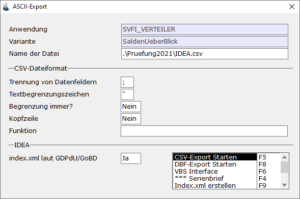
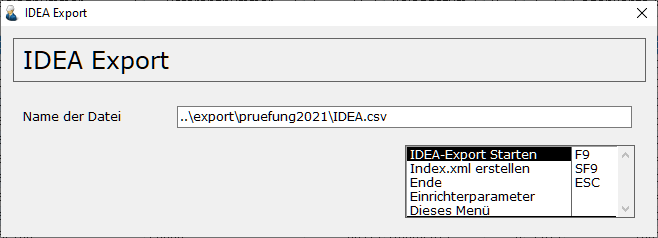

# Standardvorgänge Fibu

<!-- source: https://amic.de/hilfe/standardvorgngefibu.htm -->

Hauptmenü > Finanzbuchhaltung > Buchungen / Journal > Standardvorgänge Fibu

Direktsprung **[FISV]**

Verschiedene Darstellungsvarianten zum Anzeigen und ggf. bearbeiten der Buchungssätze stehen zur Verfügung: gebuchte Belege, ungebuchte Belege, umfassende Selektionsverfahren zum Suchen von Belegen. Ungebuchte Belege können auch von hier aus gebucht werden; auch Fehlbuchungen können rückgängig gemacht werden.

In der Variante **Positionsüberblick** **/ IDEA** werden alle Felder einer Buchungsposition dargestellt. Die Selektion ermöglicht Eingrenzungen nach Konto, Datum, usw. . Diese Variante kann zur Übergabe der Datensätze an die Finanzbehörden genutzt werden:

Nach $ 147 Abs.6 AO ist es der Finanzverwaltung möglich, die Daten von elektronischen Buchführungssystemen „digital“ zu prüfen, entweder durch Datenträgerüberlassung und/oder durch mittelbaren bzw. unmittelbaren Zugriff. Um eine Verwertbarkeit der Daten zu erreichen, müssen die Dateiformate standardisiert sein. In A.eins wurde der ASCII-Export so erweitert, dass eine Datei „Index.xml“ erstellt wird, die dem Beschreibungsstandard GDPdU-01-08-2002 entspricht. Diese kann parallel zum Export erstellt werden, indem man entweder in das Feld „index.xml laut GDPdU“ ‚JA’ einträgt oder einzeln ohne Daten über die Funktion „Index.xml erstellen“ (F9).

Für das Erstellen der Datei index.xml beim ASCII-Export werden Dokumenttyp-Definitionen benötigt. Diese befinden sich in den Dateien „gdpdu-01-09-2004.dtd“ oder „gdpdu-01-08-2002.dtd“, die sich auf dem BIN-Verzeichnis von A.eins befinden müssen. Wenn diese Dateien nicht vorhanden waren, erschien lediglich die Meldung: „Die XML-Indexdatei %s lässt sich nicht erstellen. Setzen Sie sich bitte mit Ihrem Systemadministrator in Verbindung.“ Jetzt wird vor der Erstellung der Datei geprüft, ob die Dateien vorhanden sind. Es erscheint dann ggf. diese Meldung: „Auf dem Arbeitsverzeichnis von A.eins fehlt die Dokumenttyp-Definitionsdatei gdpdu-01-09-2004.dtd oder gdpdu-01-08-2002.dtd Die Datei .\\index.xml kann nicht erstellt werden! Bitte setzen Sie sich mit Ihrem Systemadministrator in Verbindung.“

IDEA Export

**Hinweis:** *Es ist nicht notwendig, die Daten vor dem Export komplett in die Datentabelle zu laden, da beim Export die Daten immer direkt aus der Datenbank gelesen werden.*

In der Auswahlliste 1.0 wird der IDEA Export über die Funktion „Export in ASCII-Datei“ gelöst.

Die hier zu sehenden Einstellungen entsprechen den Standardwerten, die in der Format- und Inhaltsbeschreibung der Prüfsoftware verwendet werden. Sie können jedoch auch abgeändert werden. Zum Start wählt man hier die Funktion CSV-Export starten.

Für die Auswahlliste 2.0 wurde eine separate Funktion „IDEA Export“ F10 geschaffen.  

Die Einstellungen für „Trennung von Datenfeldern“, „Textbegrenzungszeichen“ und „Kopfzeile“ sind auf den Standard der Prüfsoftware eingestellt. Diese Werte können jedoch über die Einrichterparameter geändert werden. Die Datei INDEX.XML wird immer mit erstellt, es ist also nicht notwendig, die Funktion Index.xml erstellen zusätzlich aufzurufen.

Startet man den Export mit der Funktion IDEA-Export starten, dann öffnet sich die Bereichsauswahl und man hat hier noch einmal die Möglichkeit die Eingrenzung einzutragen. Nachdem man mit „Speichern und zurück“ F9 die Eingrenzung bestätigt hat, startet der Export. Nach erfolgreichem Export öffnet sich der Explorer im angegebenen Verzeichnis.
