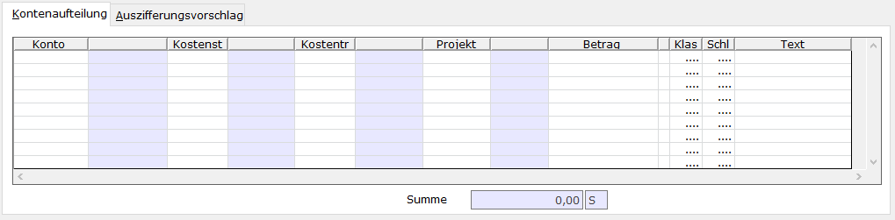

# Anzeigen / Bearbeiten

<!-- source: https://amic.de/hilfe/anzeigenbearbeiten.htm -->

Hauptmenü > Mahn-/Zahl-/Zinswesen > Zahlungsverkehr > e-Clearing > Funktion ***Anzeigen / Bearbeiten* F5**

Direktsprung **[ECL]**

Um einen Bankbeleg bearbeiten zu können, muss Beleg/Kontoauszug markiert werden und gelangt man nach **F5 „Anzeigen/Bearbeiten“** in eine weitere Auswahl, die zu dem angewählten Beleg/Kontoauszug die einzelnen Positionen anzeigt. Oder man verwendet direkt die Variante „Einzelpositionen“. Personenkonten, die mit einer Zahlsperre versehen sind, werden in diesen Auswahllisten mit gelbem Hintergrund dargestellt. Sind einem Sachkonto Steuern zugeordnet, zu denen kein Eintrag im Steuersatz existiert, so werden die Steuerinformationen mit rotem Hintergrund dargestellt. Diese Positionen können dann mit **F5** direkt bearbeiten werden oder Verwendungszweck, Auszifferungsvorschlag bzw. die Kontenaufteilung ansehen bzw. überprüft werden. Solange der Beleg nicht in die Primanota übertragen wurde, lassen sich folgende Felder bearbeiten:

| | |
| --- | --- |
| Kontonummer | Jedoch nur, wenn keine Kontenaufteilung vorgenommen wurde und noch kein Auszifferungsvorschlag besteht. Die Kontonummer kann über eine F3-Auswahl ausgewählt werden. In dieser F3-Auswahl existieren Varianten, bei denen direkt ein Beleg auswählt werden kann (Pers.Kto nach Belgnr., Pers.Kto nach Betrag, … ). Wird das Personenkonto über eine dieser Varianten ausgewählt und passt der Betrag mit dem Betrag auf dem Kontoauszug überein – ggf. mit Skonto, dann wird für diesen Beleg sofort ein Auszifferungsvorschlag gebildet.  
 |
| Wertstellung | Dieses Datum wird als Werstellungsdatum in die Primanota übernommen und u.a. verwendet, um den in A.eins gepflegten Währungskurs zu bestimmen.  
 |
| Kurs | Der Kurs wird nur angezeigt, wenn es sich um eine Position in Fremdwährung handelt. Beim Einlesen der Daten wird der Kurs laut den in A.eins gepflegten Währungskursen vorbelegt und kann direkt hier in der Erfassung geändert werden.  
 |
| Steuerklasse und Steuerschlüssel | Bei Sachkonten, bei denen die Direkterfassung der Steuer nicht gesperrt ist, wird die im Sachkonto hinterlegte Kombination aus Steuerklasse und Steuerschlüssel vorgeschlagen. Da der Betrag immer Brutto ist, werden auch nur die Steuerklassen 0 (Steuerfrei), 2 (Umsatzsteuer Brutto) und 102 (Vorsteuer Brutto) zugelassen.  
 |
| Kostenstelle | Ist als Kontonummer ein Sachkonto angegeben, so ist es möglich je nach Einstellung im Sachkontenstamm auch eine [Kostenstelle](../kostenrechnung/kostenstellen.md) anzugeben.  
 |
| Kostenträger | Ist als Kontonummer ein Sachkonto angegeben, so ist es möglich je nach Einstellung im Sachkontenstamm auch einen [Kostenträger](../kostenrechnung/kostentraeger.md) anzugeben.  
 |
| Kostenobjekt | Kostenobjekt: Ist als Kontonummer ein Sachkonto angegeben, so ist es möglich je nach Einstellung im Sachkontenstamm auch ein [Kostenobjekt](../kostenrechnung/kostenobjekte/index.md) anzugeben.  
 |
| Text | Dies ist der Text, der beim Erstellen des Zahlungsbeleges als Positionstext übernommen wird. Es ist hier auch möglich, die Textkonserven über **F2** wie in der Belegerfassung zu verwenden.  
 |

Wenn der Betrag sich nicht auf ein einzelnes Konto bezieht, noch kein Konto erfasst wurde (also Kontonummer=0), so hat man unter Kontoaufteilung (s.u.) die Möglichkeit, den Betrag auf verschiedene Konten aufzuteilen. Dabei kann man bei Sachkonten entsprechend den Einstellungen im Sachkontenstamm auch eine [Kostenstelle](../kostenrechnung/kostenstellen.md), einen [Kostenträger](../kostenrechnung/kostentraeger.md), ein [Kostenobjekt](../kostenrechnung/kostenobjekte/index.md) bzw. Steuerklasse und Steuerschlüssel hinterlegen. Der Text wird beim Erstellen des Zahlungsbeleges als Positionstext übernommen.

Weiterhin stehen folgende Menüpunkte zur Weiterverarbeitung zur Verfügung.

F7 Auszifferung-zurücksetzen

Jedoch nur, wenn für diese Position eine Auszifferung vorgeschlagen wurde oder dieser Posten manuell ausgeziffert worden ist. Dies kann man durch:

F6 Ausziffern

Wenn man diese Funktion anwählt, dann gelangt man in die OP-Verwaltung und kann diese Position so ausziffern, wie man es von der Belegerfassung gewohnt ist. Das Register „Auszifferungsvorschlag“ wird dann mit „Auszifferung“ überschrieben und die ausgewählten OP’s werden dort angezeigt. Dort steht dann auch die Funktion Beleg anzeigen, die den Beleg in der [Einzelbeleganzeige](../op_verwaltung/einzelbeleganzeige.md) öffnet, zur Verfügung.

SF9 Kundenbank ändern

Hiermit lässt sich die Bankverbindung im Kundenstamm hinterlegen bzw. eine bereits hinterlegte Bank ändern. Dort öffnet sich der aus dem Kundenstamm bekannte Pfleger und man kann dort die Bankverbindung direkt mit der Funktion „Bankverbindung übernehmen“ F10 eintragen lassen. Es wird dann die Bank und die Kontonummer übernommen.

F10 VWZ-Zuordnung erstellen

Man kann direkt von hier aus die Neuerfassung einer [Verwendungszweck-Zuordnung](./vwz_zuordnung.md) aufrufen. Es werden dann automatisch die Felder Zahlungsart, Auftraggeber, BLZ/Konto und Betrag vorbelegt. Diese können geändert oder deaktiviert werden.

F11 Fibu Merkmale

Anzeige der Fibu Merkmale des Kunden/Lieferanten.
