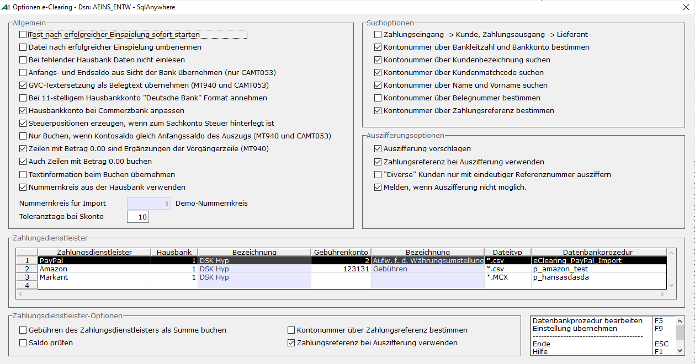
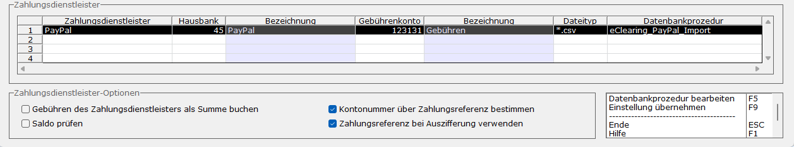
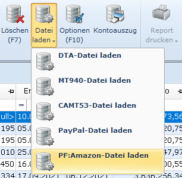

# Optionen

<!-- source: https://amic.de/hilfe/optionen.htm -->

Hauptmenü > Mahn-/Zahl-/Zinswesen > Zahlungsverkehr > e-Clearing > Funktion ***Optionen* F10**

Direktsprung **[ECL]**

### Allgemein

Hier lassen sich bestimmte Einstellungen vornehmen:

| | Beschreibung |
| --- | --- |
| Test nach erfolgreicher Einspielung sofort starten | Soll direkt nach dem Einlesen der Datei für die erfolgreich eingespielten logischen Dateien der Test gestartet werden (Kontenerkennung und automatische Auszifferung F6)?  |
| Datei nach erfolgreicher Einspielung umbenennen | Soll nach erfolgreicher Einspielung die physikalische Datei umbenannt werden? Dies dient zur Sicherheit, um ein doppeltes Einlesen zu verhindern. Die Namensvergabe ist fest vorgegeben. Für die Formate \*.DTI und MT940 wird der neue Name aus der Einspielnummer mit der Erweiterung „.TXT“ gebildet. Bei dem Format CAMT.053 wird einfach die Einspielnummer hinten als Extension angehängt.  |
| Bei fehlender Hausbank Daten nicht einlesen | Sollen bei fehlender Hausbank der Kontoauszug nicht eingelesen werden? Wenn mehrere Bankkonten bei der Hausbank für verschiedene Mandanten existieren, kann man die nicht zum Mandanten gehörenden Kontoauszüge hierüber ausfiltern.  |
| Anfangs- und Endsaldo aus Sicht der Bank übernehmen (nur CAMT053)  | Beim Einspielen der Daten wird der Anfangs- und Endsaldo entweder aus Bank- oder aus Kundensicht eingespielt. Der Standard ist „aus Kundensicht“. Bestehende Daten werden von dieser Einstellung nicht verändert.  |
| GVC-Textersetzung als Belegtext übernehmen (MT940 und CAMT053) | Soll der Text, der einem Geschäftsvorfallcode (s.u.) zugeordnet ist, als Text beim Buchen übernommen werden? Diese Option wird nur ausgewertet, wenn die Datei das Format MT940 oder CAMT053 besitzt.  |
| Bei 11-stelligem Hausbankkonto "Deutsche Bank" Format annehmen | Kontonummern werden im e-Clearing normalerweise rechtsbündig auf 10 Stellen formatiert, da in Deutschland im Normalfall nur 10-stellige Kontonummern existieren. Bei der Deutschen Bank kann es jedoch vorkommen, dass eine zusätzliche elfte Stelle mit übergeben wird. Ist diese Option gesetzt, wird die 11. Stelle ignoriert.  |
| Hausbankkonto bei Commerzbank anpassen | Auch die Commerzbank übergibt ihre Kontonummer nicht 10-stellig. Sie stellt der Kontonummer den Bankplatz/die Ortsnummer aus der Bankleitzahl voran. Wenn hier der Haken gesetzt wird, wird anhand der Netznummer geprüft, ob es sich um eine Commerzbank Filiale handelt und gegebenenfalls die ersten drei Stellen ignoriert.  |
| Steuerpositionen erzeugen, wenn zum Sachkonto Steuer hinterlegt ist | Es wird bei Sachkonten geprüft, ob in den Stammdaten bei Vorbelegung Belegerfassung Steuerinformationen hinterlegt sind. Ist dies der Fall, so werden Steuerpositionen erzeugt, bzw., wenn die hinterlegten Daten nicht korrekt sind, wird der Beleg nicht erstellt. Dieses Verhalten kann man mit dem Häkchen „Steuerposition erzeugen, wenn zum Sachkonto Steuer hinterlegt ist“ wieder abschalten.  |
| Nur Buchen, wenn Kontosaldo gleich Anfangssaldo des Auszugs (MT940 und CAMT053) | Es kann von dem Programm geprüft werden, ob der Saldo des bei der Hausbank hinterlegten Fibu-Kontos mit dem Anfangssaldo des Kontoauszuges übereinstimmt. Setzt man den Haken und stimmen die Salden nicht überein, so kann dieser Auszug nicht gebucht werden. Es erscheint dann eine entsprechende Fehlermeldung. Diese Option wird nur ausgewertet, wenn die Datei das Format MT940 oder CAMT053 besitzt.  |
| Zeilen mit Betrag 0.00 sind Ergänzungen der Vorgängerzeile (MT940 Swift) | Die Anzahl der möglichen Zeilen im MT940 Swift Format ist begrenzt. Um mehr Informationen mit dem elektronischen Kontoauszug übertragen zu können, gehen immer mehr Banken dazu über weitere Positionen mit Betrag 0,00 zu übergeben. Wenn man diesen Haken setzt, werden Positionen mit Betrag 0,00 so interpretiert, dass sie zur vorhergehenden Position dazugehören und es wird lediglich der Verwendungszweck mit an die Vorgängerposition gehängt. Diese Option wirkt beim Einlesen der Daten; einmal eingelesen Daten bleiben hiervon unberührt. Ist in der ersten Position der Betrag 0,00, so wird diese Position trotzdem so übernommen, wie sie ist. Diese Option wird nur bei Verwendung des Formats MT940 Swift ausgewertet.  |
| Auch Zeilen mit Betrag 0.00 buchen | Grundsätzlich ergeben in der Finanzbuchhaltung Buchungen mit Betrag 0,00 nicht immer Sinn. Mit diesem Schalter lässt sich einstellen, dass diese Positionen nicht mit in den Fibubeleg übernommen werden. Dieser Schalter bewirkt zusätzlich, dass diese Daten nicht mehr bearbeitet werden können, d.h. man kann keine Kontonummer eintragen bzw. Auszifferungen o.ä. zuordnen.  |
| Textinformation beim Buchen übernehmen | Textinformationen beim Buchen übernehmen bedeutet, dass der Text des Verwendungszwecks in den Beleg mit übernommen wird. Will man dies nicht, damit diese Informationen z.B. nicht auf dem Kontoblatt erscheinen, muss man diese Option ausschalten.  |
| Nummernkreis aus der Hausbank verwenden | Da man pro Hausbank einen Nummernkreis für den Zahlungsverkehr Bank hinterlegen kann, ist es auch sinnvoll, diesen für die automatisch erstellten Bankbelege zu verwenden. Setzt man hier einen Haken, dann wird also der Nummernkreis aus der Hausbank verwendet und die Abfrage vor dem Buchen entfällt. Ist kein Nummernkreis bei einer Hausbank eingetragen, dann erscheint eine entsprechende Fehlermeldung und der Beleg wird nicht erstellt.  |
| Nummernkreis für Import | Es kann ein spezieller Nummernkreis hinterlegt werden. Dieser übersteuert den unter <strong>[NKF]</strong> hinterlegten [Nummernkreis](../stammdaten_der_fibu/nummernkreise/index.md). Ist kein Nummernkreis eingetragen wird als Nummer die für “Zahlungsverkehr“ unter automatisch eingetragene gezogen, und kann gegebenenfalls vor dem Buchen manuell geändert werden.  |
| Toleranztage bei Skonto | Bei der Bestimmung des Skontos ist es möglich trotz Überschreitung des Skontodatums Skonto zu gewähren, wenn eine bestimmte Anzahl von Tagen noch nicht überschritten wurde. Diese Anzahl Tage, die aus Toleranzgründen gewährt werden sollen, ist hier zu hinterlegen.  |

### Suchoptionen

Werden die folgenden Suchoptionen entfernt, wird zwar die Geschwindigkeit optimiert, aber gleichzeitig wird auch die Trefferrate nach unten gehen.

| Suchoption | Beschreibung |
| --- | --- |
| Zahlungseingang -> Kunde, Zahlungsausgang -> Lieferant | Ist ein Kunde gleichzeitig auch als Lieferant angelegt, so kann man hier einstellen, dass bei Zahlungseingang zuerst Kunden und Kontokorrentkunden und anschließend erst die Lieferanten geprüft werden bzw. bei Zahlungsausgang erst Lieferanten und anschließend erst die Kunden. Diese Einstellung bezieht sich nicht auf die Prüfung nach Belegnummer.  |
| Kontonummer über Bankleitzahl und Bankkonto bestimmen | In den Kontoauszugsinformationen sind die Bankleitzahl und die Kontonummer des betreffenden Kunden/Lieferanten mit hinterlegt. Wenn über die im Kundenstamm hinterlegten Bankverbindungen der Kunde bestimmt werden soll, muss die Option „Kontonummer über Bankleitzahl und Bankkonto bestimmen“ ausgewählt werden.  |
| Kontonummer über Kundenbezeichnung suchen | Bei der Bestimmung der Kontonummer kann auf den Test der Kundenbezeichnung verzichtet werden, wenn die Kundenbezeichnung nicht gepflegt wird, oder die Bestimmung zu unsicher erscheint.  |
| Kontonummer über Kundenmatchcode suchen | Bei der Bestimmung der Kontonummer kann auf den Test des Kundenmatchcodes verzichtet werden, wenn die Kundenbezeichnung nicht gepflegt wird, oder die Bestimmung zu unsicher erscheint.  |
| Kontonummer über Namen und Vorname suchen | Bei der Bestimmung der Kontonummer kann auf den Test des Namens und des Vornamens in der Anschrift des Kunden verzichtet werden, wenn die Kundenbezeichnung nicht gepflegt wird, oder die Bestimmung zu unsicher erscheint.  |
| Kontonummer über Belegnummer bestimmen | Die Möglichkeit, dass die Kontonummer anhand einer eindeutigen Belegnummer bestimmt wird, muss hier erst durch Setzen des Hakens zugeschaltet werden.  |
| Kontonummer über Zahlungsreferenz bestimmen | Aus der Warenwirtschaft wird das Feld FIBUV_ZAHLUNGSREFERENZ versorgt. Dieses kann als eindeutiges Suchkriterium für das Konto herangezogen werden.   Hinweis: Diese Option gilt nicht für die Zahlungsdienstleister! Stattdessen ist die gleichnamige [Option](./optionen.md#Zahldienstl_KontonummerZahlref) unter den Zahlungsdienstleistern-Optionen zu verwenden.  |

### Auszifferungsoptionen

| Suchoption | Beschreibung |
| --- | --- |
| Auszifferung vorschlagen | Bei gefundener Kontonummer kann über Belegnummer und Betrag bzw. nur über den Betrag versucht werden, eine Auszifferung automatisch vorzunehmen. Soll dies grundsätzlich nicht geschehen, kann diese hier abgeschaltet werden.  |
| Zahlungsreferenz bei Auszifferung verwenden | Aus der Warenwirtschaft wird das Feld FIBUV_ZAHLUNGSREFERENZ versorgt. Durch Setzen des Hakens wird die Zahlungsreferenz als Kriterium zur Bestimmung der Auszifferung hinzugeschaltet.   Hinweis: Diese Option gilt nicht für die Zahlungsdienstleister! Stattdessen ist die gleichnamige [Option](./optionen.md#Zahldienstl_AuszifferungZahlref) unter den Zahlungsdienstleister-Optionen zu verwenden.  |
| „Diverse“ Kunden nur mit eindeutiger Referenz ausziffern | Für Kunde bzw. Lieferanten, die in den Stammdaten als bei „Diverses Konto“ **Ja** (Reiter Kennzeichen) eingestellt haben, wird die Auszifferung nur vorgenommen, wenn im Verwendungszweck eine eindeutige Referenznummer gefunden wird. Die Suche nur nach passenden Beträgen entfällt.  |
| Melden, wenn Auszifferung nicht möglich. | Diese Option ist standardmäßig ausgewählt, wenn „Auszifferung vorschlagen“ auf Ja steht. Will man in der Kontrollliste nicht sehen, ob zu einem Konto eine Auszifferung nicht vorgeschlagen werden konnte, so kann man hier den Haken herausnehmen.  |

### Zahlungsdienstleister

Im unteren Teil der Maske können die Zahlungsdienstleister eingerichtet werden. Die vier Optionen unter dem Bereich „Zahlungsdienstleister-Optionen“ können für jeden Zahlungsdienstleister einzeln eingestellt werden. Dazu ist der entsprechende Zahlungsdienstleister in der Datentabelle auszuwählen.

  <table>
    <tbody>
      <tr>
        <td>
          
<strong>Felder</strong>

        </td>
        <td>
          
<strong>Beschreibung</strong>

        </td>
      </tr>
      <tr>
        <td>
          
Zahlungsdienstleister

        </td>
        <td>
          
Mit der <strong>F3</strong>-Taste kann hier ein Zahlungsdienstleister ausgewählt werden.

          
Standardmäßig ist nur der Zahlungsdienstleister PayPal verfügbar. Hierfür wird eine <i>PayPal-Lizenz</i> benötigt.

          
Des Weiteren besteht die Möglichkeit eigene Zahlungsdienstleister einzurichten (freier Datenimport). Zusätzliche Zahlungsdienstleister sind in dem Anwenderformat <b>AF_DTADISKTP</b> zu hinterlegen. Voraussetzung ist die Lizenz <i>Freier Datenimport.</i>

          
Wird ein neuer Zahlungsdienstleister für den freien Datenimport (z.B. Amazon) eingerichtet, so erscheint im Untermenü „Datei laden“ eine neue private Funktion, über die die entsprechenden Kontoauszüge eingespielt werden können.

          

        </td>
      </tr>
      <tr>
        <td>
          
Hausbank

        </td>
        <td>
          
Hier wird dem Zahlungsdienstleister eine Hausbank zugeordnet. Die Angabe einer Hausbank ist zwingend erforderlich.

        </td>
      </tr>
      <tr>
        <td>
          
Gebührenkonto

        </td>
        <td>
          
Erhebt der Zahlungsdienstleister für jede Transaktion Gebühren (wie z.B. PayPal), so kann hier ein Konto angegeben werden, auf dem die Gebühren gebucht werden sollen. Ist zum Zeitpunkt des Buchens kein Gebührenkonto für den Zahlungsdienstleister festgelegt worden, so werden die Gebühren nicht gebucht.

        </td>
      </tr>
      <tr>
        <td>
          
Dateityp

        </td>
        <td>
          
Hier wird der Dateityp des einzuspielenden Kontoauszugs angegeben. Beim Aufruf der Funktion „Datei laden“ werden die Dateien im Datei-Explorer nach dem hier angegeben Dateitypen eingrenzt.

          
Der Dateityp ist wie folgt anzugeben:

          
*.Dateierweiterung

          
Im Falle von PayPal wird immer eine Datei im CSV-Format (*.csv) erwartet.

        </td>
      </tr>
      <tr>
        <td>
          
Datenbankprozedur

        </td>
        <td>
          
Für den freien Datenimport muss hier eine private Datenbankprozedur angegeben werden, die den Dateiinhalt ausliest und alle erforderlichen Daten zurückliefert. Dazu kann man entweder mit <strong>F3</strong> eine bestehende Datenbankprozedur auswählen oder einen neuen Namen eingeben. Diese neue Prozedur wird direkt angelegt und dann sofort zur Bearbeitung geöffnet. Sie enthält ein Grundgerüst mit dem erforderlichen Resultset.

          
Bei PayPal ist die Datenbankprozedur fest vorgegeben und kann nicht geändert werden.

        </td>
      </tr>
      <tr>
        <td>
          
Gebühren des Zahlungsdienstleisters als Summe buchen

        </td>
        <td>
          
Hier kann eingestellt werden, ob die Gebühren des Zahlungsdienstleisters als Summe gebucht werden sollen. Steht diese Option auf „Ja“, so werden die Gebühren aufsummiert und am Ende des Beleges als eine einzelne Position gebucht. Steht die Option auf „Nein“, so wird pro Gebühr eine Gebührenposition erzeugt.

          
Die Standardeinstellung ist „Ja“.

        </td>
      </tr>
      <tr>
        <td>
          
Saldo prüfen

        </td>
        <td>
          
Hier kann die Überprüfung des Endsaldos ein- und ausgeschaltet werden.

          
Steht die Option “Saldo prüfen“ auf „Ja“, so wird die Einspielung der Datei abgebrochen, wenn der Anfangssaldo plus aller Bewegungen nicht mit dem Endsaldo übereinstimmt.

          
Steht die Option auf „Nein“, so erfolgt keine Überprüfung des Endsaldos.

        </td>
      </tr>
      <tr>
        <td>
          
Kontonummer über Zahlungsreferenz bestimmen

        </td>
        <td rowspan="2">
          
PayPal versieht jede Transaktion mit einem eindeutigen Transaktionscode (Zahlungsreferenz). Dieser Transaktionscode kann genutzt werden, damit eine Zuordnung zum offenen Posten erfolgen kann. Da die Suche über dieses Verfahren eindeutig ist, werden die Optionen „Kontonummer über Zahlungsreferenz bestimmen“ und „Zahlungsreferenz bei Auszifferung verwenden“ für PayPal dringend empfohlen.

          
Nutzen andere Zahlungsdienstleister (freier Datenimport) auch einen Transaktionscode, so können diese beiden Optionen auch für diese Zahlungsdienstleister aktiviert werden. Dabei ist zu beachten, dass der Transaktionscode von der privaten Datenbankprozedur geliefert werden muss.

          
<u>Hinweis zur Suche über die Zahlungsreferenz</u><u></u>

          
Ist einer der beiden Optionen aktiv und es wird über die Zahlungsreferenz kein offener Posten gefunden, so wird die Suche abgebrochen und eine entsprechende Meldung ausgegeben.

          
<u>Hinweis zum Aufbau der Zahlungsreferenz</u><u></u>

          
Bei der Zahlungsreferenz im Beleg ist zu beachten, dass der Transaktionscode mit einer Kennung versehen werden muss/kann. Für PayPal lautet diese Kennung #PP# und ist im Anwenderformat <b>AF_DTADISKTP</b> bereits eingetragen. Hat man für den "Freien Datenimport" die Möglichkeit für die Rechnungen einen Transaktionscode zu vergeben, so sollte man auch hier eine eigene eindeutige Kennung wählen. Ansonsten kann – wenn man mit verschiedenen Zahlungsdienstleistern zusammenarbeitet - eine eindeutige Zuordnung über die Zahlungsreferenz nicht sichergestellt werden. Die Kennung in der Rechnung muss sich sowohl vor als auch hinter dem Transaktionscode befinden.

          
Beispiel:

          
Wenn der Transaktionscode von PayPal „01234567890123456“ lautet, muss die Zahlungsreferenz im Beleg so aussehen:

          
#PP#01234567890123456#PP#

        </td>
      </tr>
      <tr>
        <td>
          
Zahlungsreferenz bei Auszifferung verwenden

        </td>
      </tr>
    </tbody>
  </table>

