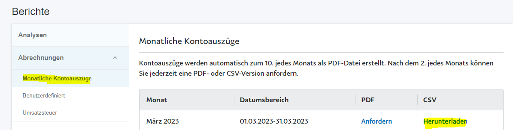

# PayPal/Freier Datenimport

<!-- source: https://amic.de/hilfe/_PayPal.htm -->

Hauptmenü > Mahn-/Zahl-/Zinswesen > Zahlungsverkehr > e-Clearing

Direktsprung **[ECL]**

Der "Freie Datenimport" und der PayPal Import unterscheiden sich nur in wenigen Punkten. Für PayPal-Kontoauszüge im CSV-Format sind das Dateiformat (\*.CSV) und die Datenbankprozedur von AMIC vorgegeben. Beim "Freien Datenimport" muss der Anwender das Dateiformat und die private Datenbankprozedur selbst festlegen.

Schritt 1: Lizenzen

Für das Einspielen von PayPal-Kontoauszügen wird neben der *e-Clearing-Lizenz eine PayPal-Lizenz* benötigt. Nutzt man den "Freien Datenimport", so ist die *Freier D**atenimport* *Lizenz* zusätzlich zur e-Clearing-Lizenz notwendig.

Schritt 2: Einrichtung

In den [e-Clearing Optionen](./optionen.md) **F10** werden alle Einrichtungen vorgenommen werden. Hier werden PayPal und der "Freie Datenimport" als [Zahlungsdienstleister](./optionen.md#Zahlungdienstleister) angelegt. Außerdem können dem Zahlungsdienstleister eine Hausbank und ein [Gebührenkonto](./optionen.md#Zahldienstl_Gebührenkonto) sowie weitere dem Zahlungsdienstleister betreffende Optionen zugeordnet werden. Die Angabe einer Hausbank sowie die private Datenbankprozedur beim "Freien Datenimport" sind zwingend erforderlich.

Schritt 3: Kontoauszug herunterladen

**PayPal**

Für **PayPal** gilt folgendes: Die Kontoauszüge sind auf der Website von PayPal unter dem Punkt “Abrechnungen” > “Monatliche Kontoauszüge” als .csv-Datei herunterzuladen.

**Freier Import**

Wo die Daten des "Freien Datenimport" herkommen muss hausintern dokumentiert werden.

Schritt 4: Kontoauszug in A.eins importieren

Mithilfe der Funktion [Datei laden](./dateien_laden.md) können die Kontoauszüge in A.eins eingespielt werden.

**PayPal**

Dazu wird die Funktion ***PayPal Datei laden*** und anschließend die zu importierende CSV-Datei ausgewählt. Vor dem Einspielen der PayPal-Kontoauszüge werden folgende Sachverhalte geprüft:

1. Wurde dem Zahlungsdienstleister eine Hausbank zugeordnet? Verfügt die Hausbank über ein Konto für die Finanzbuchhaltung?

2. Soweit die Währung geliefert wird, wird geprüft, ob die Währung der Buchwährung entspricht?

3. Anhand des Transaktionscodes wird geprüft, ob eine Transaktion bereits eingespielt wurde. Befindet sich in der Datei mindestens eine Transaktion, die bereits eingespielt wurde, so wird die gesamte Datei abgelehnt.

4. Stimmt der Anfangssaldo plus aller Bewegungen mit dem Endsaldo überein? Diese Überprüfung kann in den Optionen deaktiviert werden (siehe [Zahlungsdienstleister](./optionen.md#Zahlungdienstleister)).

Schlägt einer dieser Tests fehl, so kann eine Einspielung nicht erfolgen.

Hinweis zu PayPal ZIP-Dateien:

Ab einer Anzahl von mehr als 100.000 Zeilen teilt PayPal seine Kontoauszüge in mehrere CSV-Dateien auf. In diesem Fall werden die Kontoauszüge in einer ZIP-Datei bereitgestellt. Die ZIP-Datei muss zunächst vom Anwender entpackt werden, damit die einzelnen CSV-Dateien in A.eins eingespielt werden können.

**Freier Import**

Unter dem Menü „Datei laden“ wird die entsprechende private Funktion aufgerufen und anschließend die zu importierende Datei ausgewählt. Vor dem Einspielen werden folgende Sachverhalte geprüft:

• Optional: Stimmt der Anfangssaldo plus aller Bewegungen mit dem Endsaldo überein? Diese Überprüfung kann in den Optionen aktiviert/deaktiviert werden (siehe [Zahlungsdienstleister](./optionen.md#Zahlungdienstleister)).

• Wurde die Auszugsnummer bereits importiert. Nur wenn das Feld „DTADiskAusZug“ von der Datenbankprozedur geliefert wird.

• Ist die Währung Euro? Dieser Test findet nur statt, wenn die Währungsnummer von der Datenbankprozedur geliefert wird.

Schritt 5: Kontenerkennung und automatische Auszifferung

Mithilfe der Funktion [Kontierung/Auzifferung](./kontenerkennung_und_automatische_auszifferung.md) **F6** kann eine automatische Erkennung der Konten/Auszifferung gestartet werden. Sind die Optionen „Kontonummer über Zahlungsreferenz bestimmen“ bzw. „Zahlungsreferenz bei Auszifferung verwenden“ aktiviert, so kann eine eindeutige Zuordnung von der Zahlung zum entsprechenden offenen Posten über die Zahlungsreferenz (Transaktionscode) erfolgen. Wird über die Zahlungsreferenz kein offener Posten gefunden, so wird die Suche abgebrochen und eine entsprechende Meldung ausgegeben.

Schritt 6: Zahlungsbeleg erstellen (Buchen)

Beim [Erstellen von Zahlungsbelegen](./zahlungsbeleg_erstellen_buchen.md) werden ggf. die Gebühren des Zahlungsdienstleisters auf das ihm hinterlegte Gebührenkonto gebucht. Wurde dem Zahlungsdienstleister kein Gebührenkonto zugeordnet, so werden die Gebühren nicht gebucht. Abhängig von der Option „Gebühren des Zahlungsdienstleisters als Summe buchen“ wird entweder eine einzelne Gebührenposition erzeugt oder es wird pro Gebühr eine Gebührenposition erstellt.

